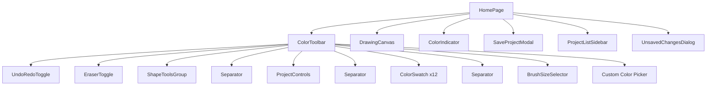
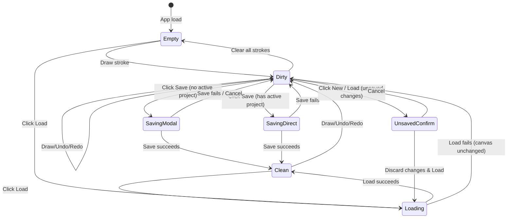
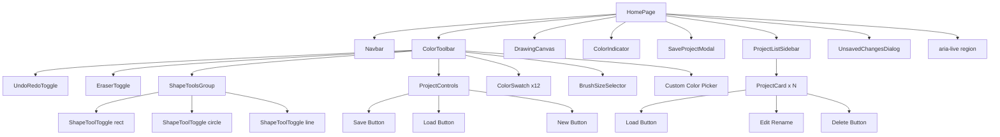
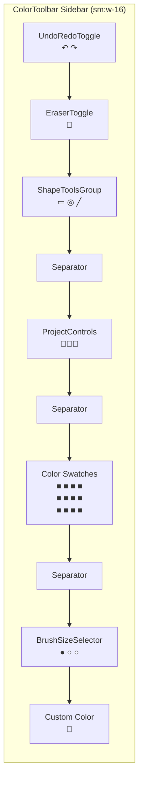
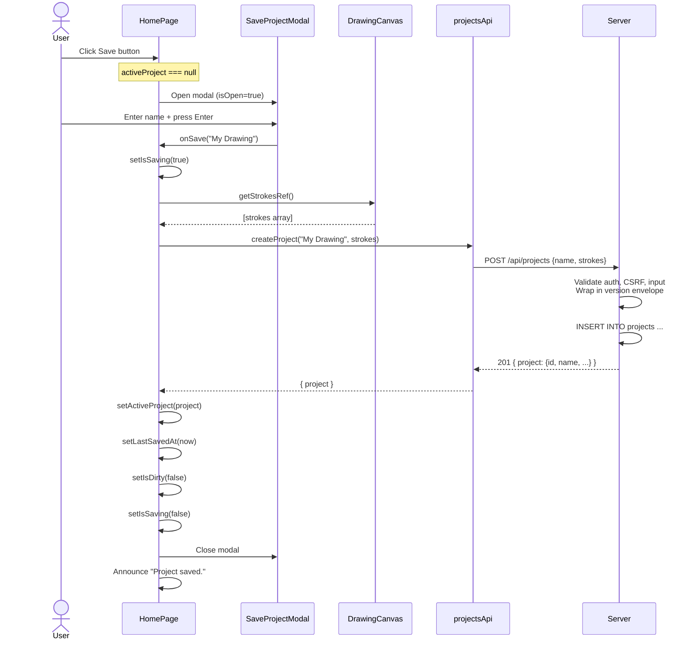
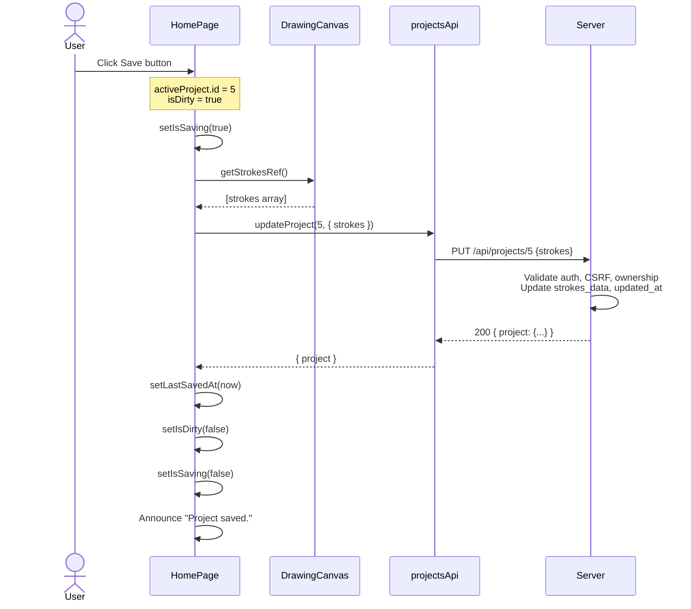
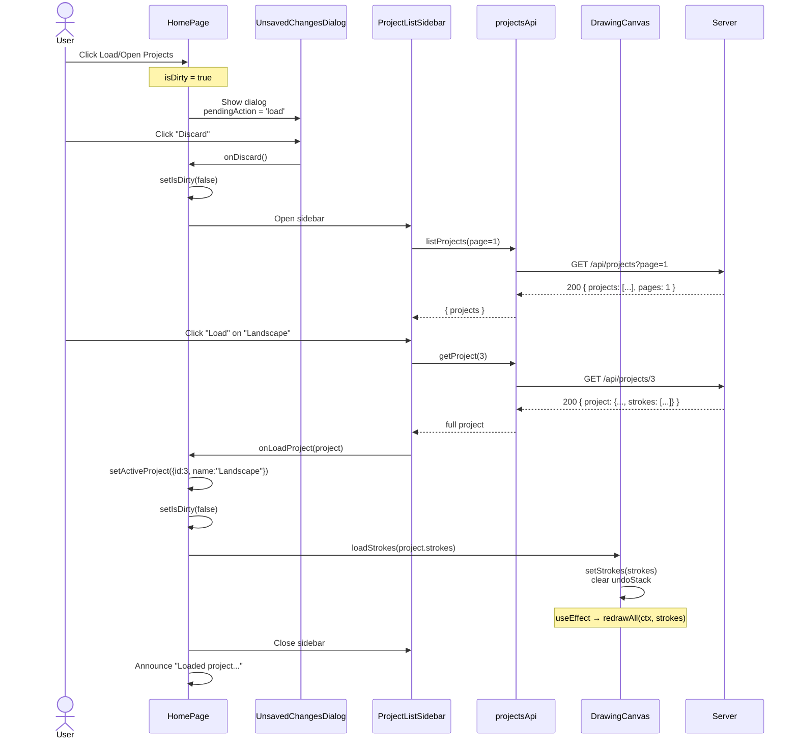
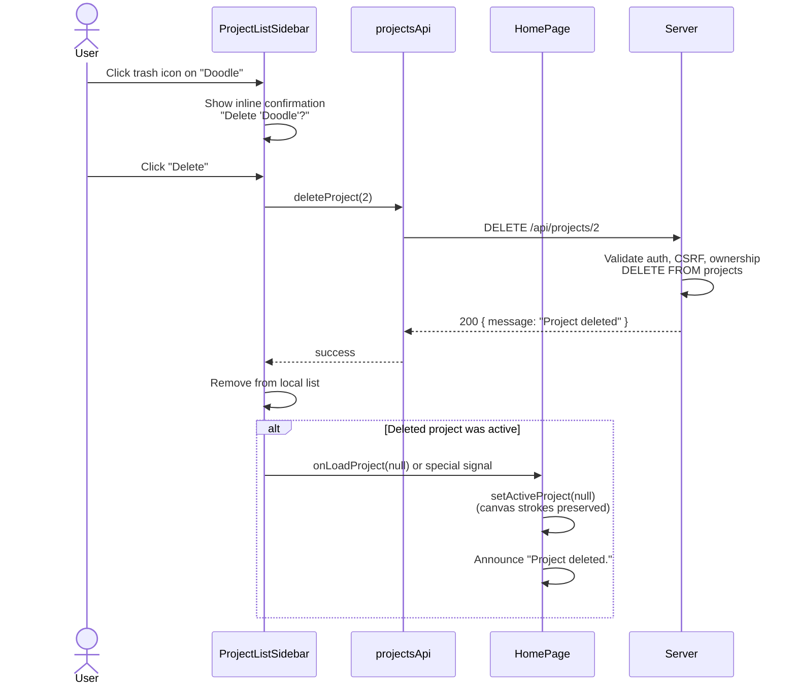
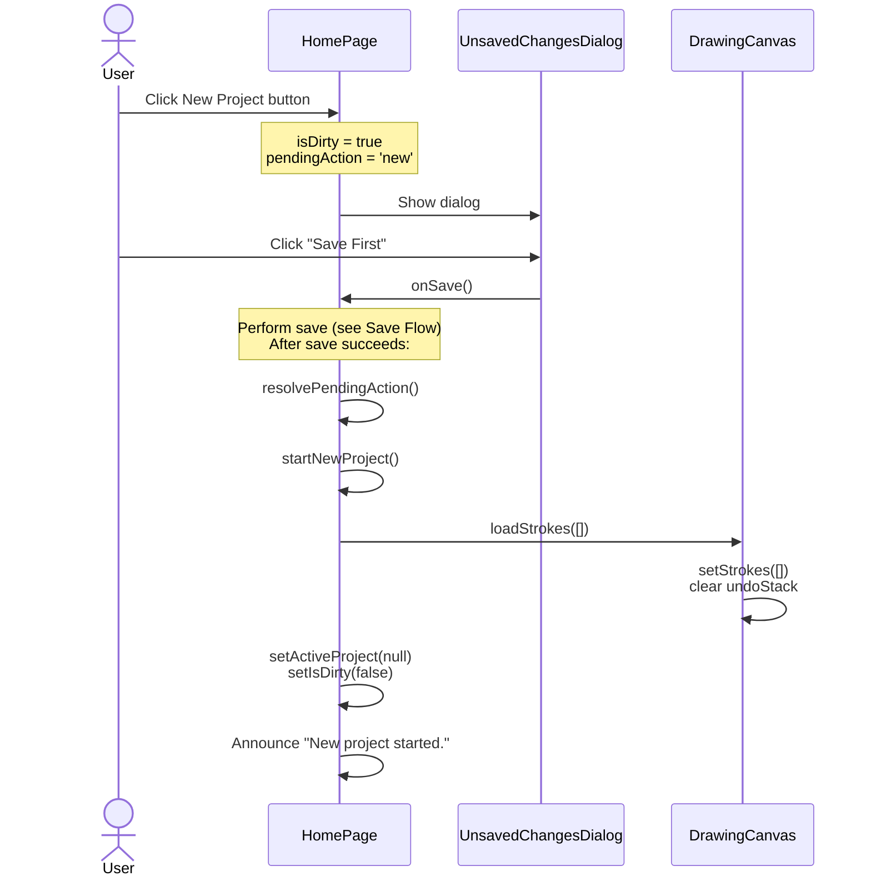

# Design Document: Project Saving & Loading

**Feature**: #8 — Project Saving & Loading
**Status**: In Design
**Date**: 2026-07-05

## 1. Design Overview

Four new UI components enable users to save, load, and manage drawing projects.
All project state lives in `HomePage`, which coordinates between the canvas
and the server. The feature follows the existing Scribble design language:
dark surface backgrounds, purple (`#6c63ff`) primary accent, 36×36 px touch
targets in the toolbar, and a slide-out panel pattern for secondary views.

### 1.1 New Components

| Component | File | Purpose |
|-----------|------|---------|
| **ProjectControls** | `client/src/components/projects/ProjectControls.jsx` | Save / Load / New Project buttons in the toolbar |
| **SaveProjectModal** | `client/src/components/projects/SaveProjectModal.jsx` | Modal dialog for naming a new project before first save |
| **ProjectListSidebar** | `client/src/components/projects/ProjectListSidebar.jsx` | Slide-out panel listing user's saved projects with load/rename/delete actions |
| **UnsavedChangesDialog** | `client/src/components/projects/UnsavedChangesDialog.jsx` | Confirmation dialog when user attempts to discard unsaved changes |

### 1.2 Component Hierarchy



### 1.3 State Machine



---

## 2. Layout

### 2.1 Toolbar Layout (Desktop — vertical sidebar)

ProjectControls sits between the shape tools group and the first color swatch
separator, directly below ShapeToolsGroup. This groups all "tool mode" controls
(undo, eraser, shapes) together, followed by project operations, then appearance
controls (colors, brush size).

```
┌────────┬─────────────────────────────────┐
│ NAVBAR                                  │
├────────┼─────────────────────────────────┤
│  ↶     │  ← Undo                        │
│  ↷     │  ← Redo                        │
│  🧹    │  ← Eraser toggle               │
│  ▭ ◎ ╱│  ← Shape tools (3 buttons)      │
│────────│  ← separator                    │
│  💾    │  ← Save button                  │
│  📂    │  ← Open/Load button             │
│  ➕    │  ← New Project button           │
│────────│  ← separator                    │
│ ■ ■    │  ← color swatches (12)          │
│ ■ ■    │                                 │
│ ■ ■    │                                 │
│ ■ ■    │                                 │
│ ■ ■    │                                 │
│ ■ ■    │                                 │
│        │                                 │
│────────│  ← separator                    │
│ ● ○ ○  │  ← Brush size selector          │
│ 🎨     │  ← custom color picker          │
├────────┴─────────────────────────────────┤
│   ┌───────────────────────────┐          │
│   │    DRAWING CANVAS          │          │
│   └───────────────────────────┘          │
│              ●  Drawing color             │
└──────────────────────────────────────────┘

Legend:
 ↶ ↷  = Undo/Redo
 🧹   = Eraser toggle
 ▭ ◎ ╱ = Shape tools (rect, circle, line)
 💾   = Save
 📂   = Open Projects
 ➕   = New Project
 ■    = Color swatch
 🎨   = Custom color picker
```

**Rationale**: ProjectControls uses 3 stacked buttons (Save, Load, New) following
the same `w-9 h-9`, `sm:flex-col` pattern as UndoRedoToggle and ShapeToolsGroup.
The sidebar width of `w-16` (64 px, 48 px usable after `px-2` padding) cannot
fit side-by-side 36 px buttons, so vertical stacking is required.

### 2.2 Toolbar Layout (Mobile — horizontal strip)

On mobile, ProjectControls sits in the horizontal scrollable strip alongside
the other toolbar items. The three project buttons sit side-by-side, separated
by vertical divider lines.

```
┌───────────────────────────────────────────────────────────────┐
│ NAVBAR                                                         │
├───────────────────────────────────────────────────────────────┤
│ ↶ ↷ │ 🧹 │ ▭ ◎ ╱ │ 💾📂➕ │ ■ ■ ■ ... │ 🎨                │
├───────────────────────────────────────────────────────────────┤
│             ┌───────────────────┐                              │
│             │  DRAWING CANVAS    │                              │
│             └───────────────────┘                              │
└───────────────────────────────────────────────────────────────┘
```

### 2.3 SaveProjectModal Layout

Centered overlay modal on a dark semi-transparent backdrop. The modal card uses
`bg-scribble-surface` with a purple accent border.

```
┌────────────────────────────────────────┐
│         (semi-transparent overlay)     │
│                                        │
│   ┌──────────────────────────────┐     │
│   │  💾  Save Project            │ X  │  ← header: icon + title + close
│   │──────────────────────────────│     │
│   │                              │     │
│   │  Project Name                │     │  ← label
│   │  ┌──────────────────────┐   │     │
│   │  │ My Awesome Drawing   │   │     │  ← text input
│   │  └──────────────────────┘   │     │
│   │  _______ 1/200 char _______ │     │  ← character count hint (optional)
│   │                              │     │
│   │  [  Cancel  ]  [  Save  ]   │     │  ← action buttons
│   │                              │     │
│   └──────────────────────────────┘     │
│                                        │
└────────────────────────────────────────┘
```

**Dimensions**:
- Modal width: `max-w-md` (448 px) on desktop, `w-[calc(100%-2rem)]` on mobile
- Backdrop: `bg-black/60`, `backdrop-blur-sm`
- Card: `bg-scribble-surface`, `border border-scribble-primary/30`, `rounded-xl`, `shadow-2xl`
- Header padding: `p-4`, Body padding: `p-6`, Footer padding: `p-4`

### 2.4 ProjectListSidebar Layout

A fixed-position slide-out panel from the right side of the screen, overlaying
a dark backdrop. The panel uses `bg-scribble-surface` and slides in/out with a
CSS transition.

```
┌──────────────────────────────────────────┬─────────────────┐
│                                          │                 │
│           MAIN CONTENT AREA              │  PROJECTS LIST  │
│                                          │                 │
│    (darkened by backdrop overlay)        │  Your Projects  │ X │ ← header
│                                          │─────────────────│
│                                          │                 │
│                                          │ ┌─────────────┐ │
│                                          │ │ Landscape    │ │
│                                          │ │ Jul 5, 2026  │ │
│                                          │ │ 42 strokes   │ │
│                                          │ │ [Load] [✏️][🗑]│ │
│                                          │ └─────────────┘ │
│                                          │                 │
│                                          │ ┌─────────────┐ │
│                                          │ │ Doodle       │ │
│                                          │ │ Jul 3, 2026  │ │
│                                          │ │ 7 strokes    │ │
│                                          │ │ [Load] [✏️][🗑]│ │
│                                          │ └─────────────┘ │
│                                          │                 │
│                                          │                 │
│                                          │  ── Load More ─ │ ← pagination
│                                          │                 │
└──────────────────────────────────────────┴─────────────────┘
```

**Dimensions**:
- Panel width: `w-80` (320 px) on desktop, `w-full` (100%) on mobile
- Slide in from right: `translate-x-full` → `translate-x-0`
- Transition: `transition-transform duration-300 ease-out`
- Backdrop: same as modal — `bg-black/60`, `backdrop-blur-sm`
- Panel bg: `bg-scribble-surface`, `border-l border-scribble-border`, `shadow-2xl`

**Empty State**:
```
┌──────────────────────────────────────────┬─────────────────┐
│                                          │                 │
│                                          │  Your Projects  │ X │
│                                          │─────────────────│
│                                          │                 │
│                                          │    (📂 icon)    │
│                                          │                 │
│                                          │ No saved projects│
│                                          │ yet. Start       │
│                                          │ drawing and save │
│                                          │ your work!       │
│                                          │                 │
│                                          │ [Start Drawing]  │
│                                          │                 │
└──────────────────────────────────────────┴─────────────────┘
```

### 2.5 UnsavedChangesDialog Layout

A confirmation dialog (smaller than SaveProjectModal) that appears when the
user attempts an action that would discard unsaved strokes.

```
┌────────────────────────────────────────┐
│         (semi-transparent overlay)     │
│                                        │
│   ┌──────────────────────────────┐     │
│   │  ⚠️  Unsaved Changes         │     │  ← warning header
│   │──────────────────────────────│     │
│   │                              │     │
│   │  You have unsaved changes.   │     │  ← body text
│   │  What would you like to do?  │     │
│   │                              │     │
│   │  ┌──────────────────────┐   │     │  ← "Save first" button (primary)
│   │  │     Save First       │   │     │
│   │  └──────────────────────┘   │     │
│   │  ┌──────────────────────┐   │     │  ← "Discard" button (secondary)
│   │  │      Discard         │   │     │
│   │  └──────────────────────┘   │     │
│   │  [      Cancel       ]     │     │  ← Cancel button (tertiary/link)
│   │                              │     │
│   └──────────────────────────────┘     │
│                                        │
└────────────────────────────────────────┘
```

**Dimensions**:
- Modal width: `max-w-sm` (384 px) on desktop, `w-[calc(100%-2rem)]` on mobile
- Same backdrop and card styling as SaveProjectModal
- Warning icon uses `text-amber-400`

---

## 3. Interaction Design

### 3.1 Save Flow (New Project)

```
User clicks Save button
  → HomePage checks: activeProject === null
  → HomePage opens SaveProjectModal
  → User types project name
  → User clicks "Save" (or presses Enter)
  → SaveProjectModal calls onSave(name)
  → HomePage sets isSaving=true
  → HomePage reads strokes from DrawingCanvas (via getStrokes callback)
  → HomePage calls projectsApi.createProject(name, strokes)
  → On success:
      → HomePage sets activeProject, clears isDirty, sets lastSavedAt
      → HomePage closes modal, shows success feedback
  → On error:
      → HomePage shows error toast, keeps modal open
```

### 3.2 Save Flow (Existing Project — Silent Save)

```
User clicks Save button
  → HomePage checks: activeProject !== null
  → HomePage sets isSaving=true
  → HomePage reads strokes from DrawingCanvas
  → HomePage calls projectsApi.updateProject(activeProject.id, { strokes })
  → On success:
      → HomePage clears isDirty, updates lastSavedAt
      → Brief visual feedback: Save button pulses or shows checkmark
  → On error:
      → HomePage shows error toast
```

### 3.3 Save Flow with Keyboard Shortcut

Similar to undo/redo keyboard handling in `HomePage.jsx`:

```
User presses Ctrl+S (or Cmd+S on macOS)
  → HomePage keydown listener fires
  → If focus is in input/textarea: ignore
  → Otherwise: trigger the same save logic as clicking the Save button
  → Prevent default browser save-dialog
```

### 3.4 Load Flow

```
User clicks Load button (or Open Projects)
  → HomePage checks: is canvas dirty?
  → If dirty: show UnsavedChangesDialog
      → "Save First": trigger save flow, then proceed to load after save
      → "Discard": proceed to load, discard current strokes
      → "Cancel": do nothing
  → If not dirty, or after user discards: open ProjectListSidebar
  → Sidebar fetches /api/projects list
  → User scrolls list, clicks "Load" on a project card
  → Sidebar shows loading spinner on that card
  → sidesbar calls projectsApi.getProject(id)
  → Sidebar calls onLoadProject(project)
  → HomePage sets activeProject, clears isDirty
  → HomePage calls DrawingCanvas loadStrokes(project.strokes)
  → Canvas clears undo stack, redraws
  → Sidebar closes
```

### 3.5 New Project Flow

```
User clicks New Project button
  → HomePage checks: is canvas dirty?
  → If dirty: show UnsavedChangesDialog
      → "Save First": trigger save, then clear canvas
      → "Discard": clear canvas, reset project state
      → "Cancel": do nothing
  → If not dirty: clear canvas
  → HomePage resets: activeProject=null, isDirty=false, lastSavedAt=null
  → Canvas clears via loadStrokes([]) or internal clear method
```

### 3.6 Delete Flow

```
User opens ProjectListSidebar
  → User clicks trash icon on a project card
  → Confirmation appears: "Delete 'Project Name'? This cannot be undone."
  → User clicks "Delete"
  → Sidebar calls projectsApi.deleteProject(id)
  → On success:
      → Project removed from sidebar list
      → If deleted project was the active project:
          → HomePage sets activeProject=null
          → Canvas strokes preserved (user hasn't lost work)
      → Sidebar updates list
  → On error: show error toast
```

### 3.7 Rename Flow (Inline in Sidebar)

```
User clicks edit (✏️) icon on a project card
  → Project name turns into an <input> field, pre-filled with current name
  → Input auto-focuses, text selected
  → User edits name, presses Enter or blurs the field
  → Sidebar calls projectsApi.updateProject(id, { name })
  → On success: name updates in card, input reverts to display text
  → On failure: show error, revert to previous name
  → User presses Escape: cancel edit, revert to previous name
```

### 3.8 Unsaved Changes Indicator

```
Stroke is added to canvas (draw, undo, redo)
  → DrawingCanvas calls onStrokesChange(strokeCount)
  → HomePage sets isDirty=true
  → Save button shows purple dot indicator (●)
  → Save button title changes: "Save changes" (vs "Save project")

User saves successfully
  → HomePage sets isDirty=false, lastSavedAt=now
  → Purple dot disappears
  → Save button title: "Save project" (or "Save 'Project Name'")

User loads a project
  → HomePage sets isDirty=false
  → Purple dot disappears

User clears canvas (new project)
  → HomePage sets isDirty=false
  → Purple dot disappears
```

### 3.9 Button State Matrix

| Canvas State | Active Project | Save Button | Load Button | New Button |
|-------------|----------------|-------------|-------------|------------|
| Empty (0 strokes) | None | Disabled (`opacity-50`, `cursor-not-allowed`) | Enabled | Disabled |
| Has strokes, not dirty | Has project | Enabled (title: "Saved") | Enabled | Enabled |
| Has strokes, dirty | Has project | Enabled (purple dot, title: "Save changes") | Enabled | Enabled |
| Has strokes, dirty | None | Enabled (purple dot) | Enabled | Enabled |
| Has strokes, not dirty | None | Enabled | Enabled | Enabled |

---

## 4. Component Specifications

### 4.1 ProjectControls

**File**: `client/src/components/projects/ProjectControls.jsx` **(NEW)**

A compact toolbar section with three stacked buttons: Save, Load (Open
Projects), and New Project. Rendered inside `ColorToolbar`. Each button
follows the existing `w-9 h-9` toolbar button pattern with `currentColor`
inline SVGs.

**Props**:

| Prop | Type | Required | Default | Description |
|------|------|----------|---------|-------------|
| `canSave` | `boolean` | Yes | — | Whether there are strokes on the canvas to save. When `false`, Save button is disabled. |
| `isDirty` | `boolean` | Yes | — | Whether there are unsaved changes. Shows purple dot indicator on Save icon. |
| `isSaving` | `boolean` | Yes | — | Whether a save operation is in progress. Replaces Save icon with spinner. |
| `hasActiveProject` | `boolean` | Yes | — | Whether a project is currently loaded (determines save-vs-save-as behavior, shown only to parent). |
| `onSave` | `function` | Yes | — | Called with no arguments when Save button is clicked. |
| `onLoad` | `function` | Yes | — | Called with no arguments when Load (Open Projects) button is clicked. |
| `onNew` | `function` | Yes | — | Called with no arguments when New Project button is clicked. |

**Return structure**:

```jsx
<div className="flex sm:flex-col items-center gap-1 shrink-0" aria-label="Project actions">
  {/* Save button */}
  <button ... />
  {/* Load / Open Projects button */}
  <button ... />
  {/* New Project button */}
  <button ... />
</div>
```

**Desktop**: Container uses `sm:flex-col` to stack vertically in the sidebar.
**Mobile**: Container uses `flex-row` (default) to arrange horizontally.

---

#### 4.1.1 Save Button

| Attribute | Value |
|-----------|-------|
| `type` | `"button"` |
| `disabled` | `!canSave` |
| `aria-label` | `isDirty ? "Save changes" : "Save project"` |
| `title` | `isDirty ? "Save changes (Ctrl+S)" : "Save project (Ctrl+S)"` |
| `onClick` | `onSave` |
| `data-testid` | `"save-project-button"` |

**Visual states**:

| State | Classes | Icon |
|-------|---------|------|
| Default (can save, not dirty) | `bg-transparent hover:bg-scribble-border/30 active:bg-scribble-border/40` | Save (floppy disk) icon in `text-scribble-muted` |
| Dirty (unsaved changes) | Same as default + purple dot overlay | Save icon + `●` indicator |
| Saving (in progress) | Same as default | Loading spinner icon, `animate-spin` |
| Disabled (no strokes) | `opacity-50 cursor-not-allowed pointer-events-none` | Save icon in `text-scribble-muted opacity-50` |
| Focus-visible | `ring-2 ring-scribble-primary ring-offset-2 ring-offset-scribble-surface` | — |

**Unsaved changes dot**: A small 6×6 px circle positioned at the top-right of
the button, colored `#6c63ff` (`bg-scribble-primary`). Rendered as an absolutely
positioned span with `rounded-full`. Uses `animate-pulse` for subtle attention.

---

#### 4.1.2 Load / Open Projects Button

| Attribute | Value |
|-----------|-------|
| `type` | `"button"` |
| `disabled` | `false` (always enabled — user can browse projects even with zero strokes) |
| `aria-label` | `"Open saved projects"` |
| `title` | `"Open saved projects"` |
| `onClick` | `onLoad` |
| `data-testid` | `"open-projects-button"` |

**Visual states**:

| State | Classes | Icon |
|-------|---------|------|
| Default | `bg-transparent hover:bg-scribble-border/30 active:bg-scribble-border/40` | Folder icon in `text-scribble-muted` |
| Sidebar open | `bg-scribble-primary/20 ring-2 ring-scribble-primary ring-offset-2 ring-offset-scribble-surface` | Folder icon in `text-purple-300` |
| Focus-visible | `ring-2 ring-scribble-primary ring-offset-2 ring-offset-scribble-surface` | — |

**Active state**: When the ProjectListSidebar is open, this button shows the
same active visual treatment as a selected shape tool (purple ring + tinted
background). The parent must track sidebar visibility and pass it down as a
prop or via a derived state.

---

#### 4.1.3 New Project Button

| Attribute | Value |
|-----------|-------|
| `type` | `"button"` |
| `disabled` | `false` (always enabled — user can start fresh anytime) |
| `aria-label` | `"New project"` |
| `title` | `"New project — clears the canvas"` |
| `onClick` | `onNew` |
| `data-testid` | `"new-project-button"` |

**Visual states**:

| State | Classes | Icon |
|-------|---------|------|
| Default | `bg-transparent hover:bg-scribble-border/30 active:bg-scribble-border/40` | Plus icon in `text-scribble-muted` |
| Focus-visible | `ring-2 ring-scribble-primary ring-offset-2 ring-offset-scribble-surface` | — |

---

### 4.2 SaveProjectModal

**File**: `client/src/components/projects/SaveProjectModal.jsx` **(NEW)**

A modal dialog for entering a project name before the first save. Renders as a
React portal to `document.body` to avoid z-index issues.

**Props**:

| Prop | Type | Required | Default | Description |
|------|------|----------|---------|-------------|
| `isOpen` | `boolean` | Yes | — | Whether the modal is visible |
| `onClose` | `function` | Yes | — | Called when modal is dismissed without saving (Cancel, Escape, backdrop click) |
| `onSave` | `function` | Yes | — | Called with `(name: string)` when user confirms save |
| `isSaving` | `boolean` | Yes | — | Whether a save operation is in progress. Disables Save button, shows spinner. |
| `initialName` | `string` | No | `""` | Optional pre-filled name (for potential "Save As" future use) |

**Internal state**:
- `name: string` — value of the text input, initialized to `initialName`

**Behavior**:
- **Open**: Modal mounts when `isOpen` transitions to `true`. Input auto-focuses on mount.
- **Close**: Calls `onClose()`.
  - Close triggers: Cancel button click, Escape key, clicking backdrop overlay.
  - Escape key handler is attached via a `useEffect` keydown listener (cleanup on unmount).
- **Save**: Trims whitespace from name, validates non-empty, then calls `onSave(trimmedName)`.
  - Save triggers: Save button click, Enter key in input.
  - Save button is disabled when: trimmed name is empty, name is >200 characters, or `isSaving` is `true`.
- **After close**: When modal re-opens, name resets to `initialName`.
- **Focus trap**: Tab cycles between input, Save button, Cancel button, close X button. Cannot escape modal.

**Return structure** (simplified):

```jsx
{isOpen && createPortal(
  <>
    {/* Backdrop */}
    <div className="fixed inset-0 z-40 bg-black/60 backdrop-blur-sm"
         onClick={onClose} aria-hidden="true" />

    {/* Modal card */}
    <div className="fixed inset-0 z-50 flex items-center justify-center p-4"
         role="dialog" aria-modal="true" aria-labelledby="save-modal-title"
         data-testid="save-project-modal">
      <div className="relative w-full max-w-md bg-scribble-surface border
                      border-scribble-primary/30 rounded-xl shadow-2xl">
        {/* Header */}
        <div className="flex items-center justify-between p-4 border-b border-scribble-border">
          <div className="flex items-center gap-2">
            {/* Save icon */}
            <h2 id="save-modal-title" className="text-lg font-semibold text-white">
              Save Project
            </h2>
          </div>
          {/* Close X button */}
          <button onClick={onClose} aria-label="Close" ... />
        </div>

        {/* Body */}
        <div className="p-6">
          <label htmlFor="project-name-input" className="block text-sm text-scribble-muted mb-2">
            Project Name
          </label>
          <input
            id="project-name-input"
            type="text"
            value={name}
            onChange={(e) => setName(e.target.value)}
            onKeyDown={(e) => { if (e.key === 'Enter' && canSave) handleSave(); }}
            placeholder="My Awesome Drawing"
            maxLength={200}
            autoFocus
            className="w-full ..."
            data-testid="project-name-input"
          />
          <p className="text-xs text-scribble-muted mt-1 text-right">
            {name.trim().length}/200
          </p>
        </div>

        {/* Footer */}
        <div className="flex justify-end gap-3 p-4 border-t border-scribble-border">
          <button onClick={onClose} disabled={isSaving} ...>
            Cancel
          </button>
          <button onClick={handleSave} disabled={!canSave || isSaving} ...>
            {isSaving ? <Spinner /> : 'Save'}
          </button>
        </div>
      </div>
    </div>
  </>,
  document.body
)}
```

**Focus management**:
- On open: focus moves to the project name `<input>`.
- On close: focus returns to the Save button that triggered the modal.
- Tab order: input → Save button → Cancel button → close X button → (cycle back to input).
- Elements outside the modal are not focusable (the backdrop captures any stray focus and redirects it into the modal).

---

### 4.3 ProjectListSidebar

**File**: `client/src/components/projects/ProjectListSidebar.jsx` **(NEW)**

A slide-out panel listing all saved projects for the current user. Supports
loading, renaming, and deleting projects. Handles pagination and empty states.

**Props**:

| Prop | Type | Required | Default | Description |
|------|------|----------|---------|-------------|
| `isOpen` | `boolean` | Yes | — | Whether the sidebar is visible |
| `onClose` | `function` | Yes | — | Called when sidebar is dismissed (Close button, Escape, backdrop click) |
| `onLoadProject` | `function` | Yes | — | Called with `(project)` (full project with strokes) when user loads a project |
| `activeProjectId` | `number \| null` | No | `null` | ID of the currently loaded project (highlighted in list) |

**Internal state**:
- `projects: Array` — list of project metadata objects
- `loading: boolean` — true while fetching initial list
- `loadingMore: boolean` — true while fetching next page
- `page: number` — current page (1-based)
- `totalPages: number` — from API pagination metadata
- `error: string | null` — last fetch error message
- `deletingId: number | null` — project ID currently being deleted (for spinner)
- `renamingId: number | null` — project ID currently in rename mode
- `renameValue: string` — rename input value

**Behavior**:
- **Mount / Open**: Fetches page 1 of project list on mount. Refetches each time sidebar opens (to pick up changes from other tabs). Shows loading skeleton during fetch.
- **Close**: Calls `onClose()`. Close triggers: Close X button, Escape key, clicking backdrop overlay.
- **Load Project**: When user clicks "Load" on a project card:
  1. Set that card to a loading state (spinner replaces Load button).
  2. Fetch full project via `projectsApi.getProject(id)`.
  3. On success: call `onLoadProject(project)`, close sidebar.
  4. On error: show error toast on the card, re-enable Load button.
- **Rename**: When user clicks the edit icon:
  1. Set `renamingId` to that project's ID.
  2. Replace project name text with an `<input>` pre-filled with current name.
  3. Auto-focus and select-all text in the input.
  4. On Enter or blur: save the new name via `projectsApi.updateProject(id, { name })`.
  5. On success: update local state, clear `renamingId`.
  6. On Escape: clear `renamingId`, revert name.
  7. Validate: trimmed name must be non-empty and ≤ 200 chars.
- **Delete**: When user clicks the trash icon:
  1. Show inline confirmation: project card expands to show "Delete 'Name'? [Cancel] [Delete]".
  2. On Confirm: set `deletingId`, call `projectsApi.deleteProject(id)`.
  3. On success: remove from local list. If page becomes empty and `page > 1`, go back a page.
  4. On error: show error, clear `deletingId`.
- **Pagination**: "Load more" button at the bottom if `page < totalPages`. Button shows spinner during fetch.
- **Empty state**: When `projects.length === 0` and `loading === false`: show illustration + message.

**Return structure** (simplified):

```jsx
{isOpen && createPortal(
  <>
    {/* Backdrop */}
    <div className="fixed inset-0 z-40 bg-black/60 backdrop-blur-sm
                    transition-opacity duration-300"
         onClick={onClose} aria-hidden="true" />

    {/* Sidebar panel */}
    <div className={`fixed top-0 right-0 z-50 h-full w-80 sm:w-80 w-full
                     bg-scribble-surface border-l border-scribble-border
                     shadow-2xl transform transition-transform duration-300
                     ease-out flex flex-col
                     ${isOpen ? 'translate-x-0' : 'translate-x-full'}`}
         role="dialog" aria-modal="true" aria-label="Saved projects"
         data-testid="project-list-sidebar">

      {/* Header */}
      <div className="flex items-center justify-between p-4 border-b border-scribble-border shrink-0">
        <h2 className="text-lg font-semibold text-white">Your Projects</h2>
        <button onClick={onClose} aria-label="Close project list" ...>
          {/* Close X icon */}
        </button>
      </div>

      {/* Scrollable list */}
      <div className="flex-1 overflow-y-auto p-3 space-y-2">
        {loading && <LoadingSkeleton />}

        {!loading && projects.length === 0 && (
          <EmptyState />
        )}

        {projects.map(project => (
          <ProjectCard
            key={project.id}
            project={project}
            isActive={project.id === activeProjectId}
            isRenaming={renamingId === project.id}
            renameValue={renameValue}
            isDeleting={deletingId === project.id}
            onLoad={() => handleLoad(project.id)}
            onRenameStart={() => startRename(project)}
            onRenameChange={setRenameValue}
            onRenameSave={() => saveRename(project.id)}
            onRenameCancel={() => cancelRename()}
            onDelete={() => handleDelete(project)}
          />
        ))}

        {page < totalPages && (
          <button onClick={loadMore} disabled={loadingMore} ...>
            {loadingMore ? <Spinner /> : 'Load more'}
          </button>
        )}
      </div>
    </div>
  </>,
  document.body
)}
```

**Project Card sub-component** (inline, not a separate file):

Displays a single project in the list with name, date, stroke count, and action
buttons. Follows `bg-scribble-bg/50` card style with `border border-scribble-border`
and `rounded-lg p-3`.

| Element | Styling |
|---------|---------|
| Card container | `bg-scribble-bg/50 border border-scribble-border rounded-lg p-3 hover:border-scribble-primary/30 transition-colors` |
| Active card | `border-scribble-primary bg-scribble-primary/10` |
| Project name (display) | `text-white font-medium text-sm truncate` |
| Project name (input, rename mode) | `w-full bg-scribble-bg border border-scribble-primary rounded px-2 py-1 text-white text-sm` |
| Meta row (date + strokes) | `flex items-center gap-3 text-xs text-scribble-muted mt-1` |
| Action buttons row | `flex items-center gap-2 mt-2` |
| Load button | Primary, compact: `bg-scribble-primary hover:bg-scribble-primary-dark text-white text-xs px-3 py-1 rounded` |
| Edit button | Icon-only: `p-1 rounded hover:bg-scribble-border/30` |
| Delete button | Icon-only: `p-1 rounded hover:bg-red-500/20 text-red-400` |

**Loading skeleton**: Three gray placeholder cards with `animate-pulse`:
```
┌─────────────────────────────┐
│ ▓▓▓▓▓▓▓▓▓▓▓▓▓▓▓    ▓▓▓▓▓▓  │
│ ▓▓▓▓▓▓▓▓▓▓▓▓▓▓             │
│ ▓▓▓▓▓▓▓▓▓  ▓▓▓▓▓▓▓▓▓▓▓     │
└─────────────────────────────┘
```

**Empty state illustration**:

```jsx
<div className="flex flex-col items-center justify-center py-12 px-4 text-center">
  {/* Folder icon - large, muted */}
  <svg className="w-16 h-16 text-scribble-border mb-4" ...>...</svg>
  <p className="text-scribble-muted text-sm mb-2">
    No saved projects yet.
  </p>
  <p className="text-scribble-muted/70 text-xs mb-4">
    Start drawing and save your work!
  </p>
  <button
    onClick={onClose}
    className="px-4 py-2 bg-scribble-primary/80 text-white text-sm rounded-lg
               hover:bg-scribble-primary transition-colors"
  >
    Start Drawing
  </button>
</div>
```

---

### 4.4 UnsavedChangesDialog

**File**: `client/src/components/projects/UnsavedChangesDialog.jsx` **(NEW)**

A confirmation modal shown when the user attempts to discard unsaved strokes
(by loading a project, starting a new project, or navigating away). Renders
as a React portal.

**Props**:

| Prop | Type | Required | Default | Description |
|------|------|----------|---------|-------------|
| `isOpen` | `boolean` | Yes | — | Whether the dialog is visible |
| `onSave` | `function` | Yes | — | Called when user clicks "Save First" |
| `onDiscard` | `function` | Yes | — | Called when user clicks "Discard" (proceed without saving) |
| `onCancel` | `function` | Yes | — | Called when user clicks "Cancel" (do nothing) |
| `title` | `string` | No | `"Unsaved Changes"` | Dialog title |
| `message` | `string` | No | `"You have unsaved changes. What would you like to do?"` | Descriptive message |
| `isSaving` | `boolean` | No | `false` | Whether save is in progress (disables Save First button) |

**Return structure** (simplified):

```jsx
{isOpen && createPortal(
  <>
    {/* Backdrop */}
    <div className="fixed inset-0 z-50 bg-black/60 backdrop-blur-sm"
         onClick={onCancel} aria-hidden="true" />

    {/* Dialog card */}
    <div className="fixed inset-0 z-50 flex items-center justify-center p-4"
         role="alertdialog" aria-modal="true"
         aria-labelledby="unsaved-dialog-title"
         data-testid="unsaved-changes-dialog">

      <div className="relative w-full max-w-sm bg-scribble-surface
                      border border-amber-500/30 rounded-xl shadow-2xl">

        {/* Header */}
        <div className="flex items-center gap-3 p-4 border-b border-scribble-border">
          {/* Warning triangle icon */}
          <svg className="w-6 h-6 text-amber-400 shrink-0" ...>...</svg>
          <h2 id="unsaved-dialog-title" className="text-lg font-semibold text-white">
            {title}
          </h2>
        </div>

        {/* Body */}
        <div className="p-4">
          <p className="text-sm text-scribble-muted">{message}</p>
        </div>

        {/* Actions */}
        <div className="flex flex-col gap-2 p-4 border-t border-scribble-border">
          <button onClick={onSave} disabled={isSaving}
                  className="w-full px-4 py-2 bg-scribble-primary hover:bg-scribble-primary-dark
                             text-white text-sm rounded-lg transition-colors
                             disabled:opacity-50"
                  data-testid="unsaved-save-button">
            {isSaving ? <Spinner /> : 'Save First'}
          </button>
          <button onClick={onDiscard}
                  className="w-full px-4 py-2 bg-transparent border border-scribble-border
                             hover:bg-red-500/10 hover:border-red-500/30
                             text-scribble-muted text-sm rounded-lg transition-colors"
                  data-testid="unsaved-discard-button">
            Discard
          </button>
          <button onClick={onCancel}
                  className="w-full px-4 py-2 bg-transparent
                             text-scribble-muted hover:text-white text-sm rounded-lg
                             transition-colors"
                  data-testid="unsaved-cancel-button">
            Cancel
          </button>
        </div>

      </div>
    </div>
  </>,
  document.body
)}
```

**Behavior**:
- **Open**: Focus goes to "Save First" (primary action, safest choice).
- **Escape key**: Calls `onCancel`.
- **Backdrop click**: Calls `onCancel`.
- **After save succeeds**: The parent (`HomePage`) closes this dialog by setting `isOpen=false`.

---

## 5. SVG Icons

All icons use `18×18` px display size inside a `24×24` viewBox, consistent
with the existing UndoRedoToggle and shape tool icons. Icons are inline SVGs
with `stroke="currentColor"`, `fill="none"`, `stroke-width="2"`,
`stroke-linecap="round"`, `stroke-linejoin="round"`, and `aria-hidden="true"`.

### 5.1 Save Icon (Floppy Disk)

Used on the Save button in ProjectControls, SaveProjectModal header.

```html
<svg xmlns="http://www.w3.org/2000/svg"
     viewBox="0 0 24 24"
     width="18" height="18"
     fill="none" stroke="currentColor"
     stroke-width="2" stroke-linecap="round" stroke-linejoin="round"
     aria-hidden="true">
  <!-- Floppy disk body -->
  <path d="M19 21H5a2 2 0 0 1-2-2V5a2 2 0 0 1 2-2h11l5 5v11a2 2 0 0 1-2 2z" />
  <!-- Inner cutout -->
  <polyline points="17 21 17 13 7 13 7 21" />
  <polyline points="7 3 7 8 15 8" />
</svg>
```

### 5.2 Folder / Projects Icon

Used on the Load/Open Projects button in ProjectControls. Adapted from
Feather Icons `folder`.

```html
<svg xmlns="http://www.w3.org/2000/svg"
     viewBox="0 0 24 24"
     width="18" height="18"
     fill="none" stroke="currentColor"
     stroke-width="2" stroke-linecap="round" stroke-linejoin="round"
     aria-hidden="true">
  <path d="M22 19a2 2 0 0 1-2 2H4a2 2 0 0 1-2-2V5a2 2 0 0 1 2-2h5l2 3h9a2 2 0 0 1 2 2z" />
</svg>
```

### 5.3 New Project Icon (Plus)

Used on the New Project button in ProjectControls. Adapted from
Feather Icons `plus`.

```html
<svg xmlns="http://www.w3.org/2000/svg"
     viewBox="0 0 24 24"
     width="18" height="18"
     fill="none" stroke="currentColor"
     stroke-width="2" stroke-linecap="round" stroke-linejoin="round"
     aria-hidden="true">
  <line x1="12" y1="5" x2="12" y2="19" />
  <line x1="5" y1="12" x2="19" y2="12" />
</svg>
```

### 5.4 Delete / Trash Icon

Used on project cards in the ProjectListSidebar for the delete action.
Adapted from Feather Icons `trash-2`.

```html
<svg xmlns="http://www.w3.org/2000/svg"
     viewBox="0 0 24 24"
     width="16" height="16"
     fill="none" stroke="currentColor"
     stroke-width="2" stroke-linecap="round" stroke-linejoin="round"
     aria-hidden="true">
  <polyline points="3 6 5 6 21 6" />
  <path d="M19 6v14a2 2 0 0 1-2 2H7a2 2 0 0 1-2-2V6m3 0V4a2 2 0 0 1 2-2h4a2 2 0 0 1 2 2v2" />
  <line x1="10" y1="11" x2="10" y2="17" />
  <line x1="14" y1="11" x2="14" y2="17" />
</svg>
```

### 5.5 Close Icon (X)

Used on modal close buttons and the sidebar close button. Adapted from
Feather Icons `x`. Displayed at 20×20 px for the larger close buttons.

```html
<svg xmlns="http://www.w3.org/2000/svg"
     viewBox="0 0 24 24"
     width="20" height="20"
     fill="none" stroke="currentColor"
     stroke-width="2" stroke-linecap="round" stroke-linejoin="round"
     aria-hidden="true">
  <line x1="18" y1="6" x2="6" y2="18" />
  <line x1="6" y1="6" x2="18" y2="18" />
</svg>
```

### 5.6 Loading Spinner Icon

Used on buttons during save/load/delete operations. An animated spinner
that replaces the button icon or sits alongside the button text.

```html
<svg xmlns="http://www.w3.org/2000/svg"
     viewBox="0 0 24 24"
     width="18" height="18"
     fill="none" stroke="currentColor"
     stroke-width="2" stroke-linecap="round" stroke-linejoin="round"
     aria-hidden="true"
     class="animate-spin">
  <path d="M21 12a9 9 0 1 1-6.219-8.56" />
</svg>
```

**Note on `animate-spin`**: Tailwind's built-in `animate-spin` class applies
a CSS keyframe animation rotating 360°. The SVG must be inline (not ``)
so the class applies correctly.

### 5.7 Edit / Rename Icon (Pencil)

Used on project cards for the rename action. Adapted from Feather Icons
`edit-2`.

```html
<svg xmlns="http://www.w3.org/2000/svg"
     viewBox="0 0 24 24"
     width="14" height="14"
     fill="none" stroke="currentColor"
     stroke-width="2" stroke-linecap="round" stroke-linejoin="round"
     aria-hidden="true">
  <path d="M17 3a2.828 2.828 0 1 1 4 4L7.5 20.5 2 22l1.5-5.5L17 3z" />
</svg>
```

### 5.8 Warning Triangle Icon

Used in the UnsavedChangesDialog header. Adapted from Feather Icons
`alert-triangle`. Displayed at 24×24 px.

```html
<svg xmlns="http://www.w3.org/2000/svg"
     viewBox="0 0 24 24"
     width="24" height="24"
     fill="none" stroke="currentColor"
     stroke-width="2" stroke-linecap="round" stroke-linejoin="round"
     aria-hidden="true"
     class="text-amber-400">
  <path d="M10.29 3.86L1.82 18a2 2 0 0 0 1.71 3h16.94a2 2 0 0 0 1.71-3L13.71 3.86a2 2 0 0 0-3.42 0z" />
  <line x1="12" y1="9" x2="12" y2="13" />
  <line x1="12" y1="17" x2="12.01" y2="17" />
</svg>
```

### 5.9 Unsaved Changes Dot

Not an SVG — a simple `<span>` element:

```
<span className="absolute top-0.5 right-0.5 w-1.5 h-1.5 bg-scribble-primary
                 rounded-full animate-pulse"
      aria-hidden="true" />
```

Positioned absolutely at the top-right of the Save button. Uses `animate-pulse`
for subtle attention-drawing animation.

---

## 6. Styling

### 6.1 Color Tokens

All colors reference the existing `scribble` palette defined in
`tailwind.config.js`. No new theme colors are introduced.

| Token | Tailwind Class | Hex | Usage |
|-------|---------------|-----|-------|
| Primary accent | `bg-scribble-primary` / `text-scribble-primary` | `#6c63ff` | Save button active indicator, active Load button ring, Load button active bg tint, primary action buttons |
| Primary hover | `hover:bg-scribble-primary-dark` | `#3f3d9e` | Primary button hover state |
| Primary tint | `bg-scribble-primary/20` | — | Active button backgrounds (Load when sidebar open), active project card highlight |
| Surface | `bg-scribble-surface` | `#16213e` | Modal cards, sidebar panel, toolbar background |
| Background | `bg-scribble-bg` | `#1a1a2e` | Overall page background, backdrop overlay tint |
| Border | `border-scribble-border` | `#0f3460` | Separator lines, panel borders, card borders |
| Muted text | `text-scribble-muted` | `#8892b0` | Icon default colors, secondary text, meta data |
| White text | `text-white` | `#ffffff` | Headings, primary labels, active icon color |
| Danger | `text-red-400` / `hover:bg-red-500/10` | — | Delete button color and hover state |
| Warning | `text-amber-400` / `border-amber-500/30` | — | UnsavedChangesDialog accent |

### 6.2 Responsive Breakpoints

All responsive behavior follows the existing Scribble conventions using
Tailwind's default breakpoints.

| Breakpoint | Width | Behavior |
|-----------|-------|----------|
| **Mobile** (default) | < 640px | Toolbar: horizontal scrollable row. ProjectControls: side-by-side buttons. Sidebar: full-width panel. Modal: full width minus 1rem padding. |
| **Desktop** (`sm:`) | ≥ 640px | Toolbar: vertical sidebar (`sm:w-16`). ProjectControls: stacked buttons (`sm:flex-col`). Sidebar: `w-80` (320px). Modal: `max-w-md` (448px). |

**ProjectControls responsive directives**:
```
flex sm:flex-col items-center gap-1 shrink-0
```

**Sidebar responsive directives**:
```
fixed top-0 right-0 z-50 h-full
w-full sm:w-80
```

**Modal card responsive directives**:
```
relative w-full max-w-md sm:max-w-md
mx-0 sm:mx-auto
```

### 6.3 Animations

| Element | Animation | Tailwind | Duration |
|---------|-----------|----------|----------|
| Sidebar slide-in | `translate-x-full` → `translate-x-0` | `transition-transform duration-300 ease-out` | 300ms |
| Sidebar slide-out | `translate-x-0` → `translate-x-full` | Same transition class | 300ms |
| Backdrop fade-in | `opacity-0` → `opacity-1` | `transition-opacity duration-300` | 300ms |
| Modal appear | Scale `95%` → `100%` + fade | `transition-all duration-200` | 200ms |
| Unsaved dot pulse | Opacity oscillation | `animate-pulse` | 2s loop |
| Loading spinner | Continuous rotation | `animate-spin` | 1s per rotation |
| Save button success | Brief scale pulse | `animate-bounce` (once, via JS) | 500ms |
| Hover transitions | Color/background changes | `transition-colors duration-150` | 150ms |

**CSS transition implementation for sidebar**:

The sidebar uses conditional Tailwind classes rather than CSS-in-JS for the
slide animation:

```jsx
className={`... transform transition-transform duration-300 ease-out
            ${isOpen ? 'translate-x-0' : 'translate-x-full'}`}
```

The backdrop uses:
```jsx
className={`fixed inset-0 z-40 bg-black/60 backdrop-blur-sm
            transition-opacity duration-300
            ${isOpen ? 'opacity-100' : 'opacity-0 pointer-events-none'}`}
```

### 6.4 Button Shared Class (Toolbar Buttons)

All toolbar buttons (Save, Load, New) share the same base class pattern
as Undo, Redo, Eraser, and Shape buttons:

```js
const buttonClasses = `
  w-9 h-9 rounded-lg cursor-pointer transition-all duration-150 outline-none
  flex items-center justify-center
  bg-transparent hover:bg-scribble-border/30 active:bg-scribble-border/40
  focus-visible:ring-2 focus-visible:ring-scribble-primary focus-visible:ring-offset-2 focus-visible:ring-offset-scribble-surface
  disabled:opacity-50 disabled:cursor-not-allowed disabled:pointer-events-none
`;
```

### 6.5 Modal Shared Classes

Both SaveProjectModal and UnsavedChangesDialog share the same card styling:

```jsx
const modalCardClasses = `
  relative w-full max-w-md sm:max-w-md
  bg-scribble-surface border border-scribble-primary/30
  rounded-xl shadow-2xl
  transition-all duration-200
`;
```

### 6.6 Input Styling

Text inputs in modals and rename fields follow a consistent dark theme style:

```jsx
className={`
  w-full bg-scribble-bg border border-scribble-border rounded-lg
  px-3 py-2 text-white text-sm placeholder:text-scribble-muted/50
  focus:outline-none focus:border-scribble-primary focus:ring-1 focus:ring-scribble-primary
  transition-colors duration-150
`}
```

### 6.7 Scrollbar Styling (Sidebar)

The ProjectListSidebar's scrollable list area uses subtle custom scrollbar
styling via Tailwind utility classes (works in WebKit browsers):

```jsx
className="flex-1 overflow-y-auto scrollbar-thin scrollbar-thumb-scribble-border
           scrollbar-track-transparent"
```

If the Tailwind scrollbar plugin is not available, fall back to a plain
`overflow-y-auto` and the browser's default scrollbar (acceptable for V1).

---

## 7. Accessibility

### 7.1 ARIA Attributes Table

| Element | Role | ARIA Attributes |
|---------|------|-----------------|
| ProjectControls container | — | `aria-label="Project actions"` |
| Save button | `button` | `aria-label="Save changes"` (dirty) or `"Save project"` (clean), `aria-disabled={!canSave}` |
| Load button | `button` | `aria-label="Open saved projects"`, `aria-expanded={isSidebarOpen}` |
| New button | `button` | `aria-label="New project"` |
| SaveProjectModal | `dialog` | `aria-modal="true"`, `aria-labelledby="save-modal-title"` |
| SaveProjectModal close | `button` | `aria-label="Close"` |
| Project name input | `textbox` | `aria-label="Project name"`, `aria-describedby="name-char-count"` (optional) |
| ProjectListSidebar | `dialog` | `aria-modal="true"`, `aria-label="Saved projects"` |
| Sidebar close | `button` | `aria-label="Close project list"` |
| Project card | `article` | `aria-label="Project: ${name}"` |
| Load button (card) | `button` | `aria-label="Load project: ${name}"` |
| Rename button (card) | `button` | `aria-label="Rename project: ${name}"` |
| Delete button (card) | `button` | `aria-label="Delete project: ${name}"` |
| UnsavedChangesDialog | `alertdialog` | `aria-modal="true"`, `aria-labelledby="unsaved-dialog-title"`, `aria-describedby="unsaved-dialog-message"` |
| Loading skeleton | — | `aria-busy="true"`, `aria-label="Loading projects"` |
| Empty state | — | `role="status"` |
| Unsaved changes dot | — | `aria-hidden="true"` (purely decorative) |
| All SVG icons | — | `aria-hidden="true"` (decorative, labels are on buttons) |

### 7.2 Focus Management

**SaveProjectModal**:
- On open: Focus moves to the project name `<input>` element.
- On close: Focus returns to the Save button in the toolbar that triggered the modal.
- Focus trap: Tab cycles through input → Save button → Cancel button → close X → input. No focus escapes to elements behind the modal.

**ProjectListSidebar**:
- On open: Focus moves to the first project card's Load button (or the empty state CTA if no projects).
- On close: Focus returns to the Load/Open Projects button in the toolbar.
- Tab order: Close X → project cards (Load → Edit → Delete for each) → Load More → Close X.

**UnsavedChangesDialog**:
- On open: Focus moves to the "Save First" button (safest default action).
- On close: Focus returns to the element that triggered the dialog (Load button, New button, or browser navigation).
- Escape key: Triggers "Cancel" action (same as clicking Cancel).

**After project loaded**: Focus moves to the canvas (so the user can immediately start drawing). Use `canvasRef.current.focus()` if the canvas has `tabIndex={-1}`, or simply don't change focus from where it was.

### 7.3 Keyboard Navigation

| Context | Keyboard Shortcut | Action |
|---------|-------------------|--------|
| Global (canvas area) | `Ctrl+S` / `Cmd+S` | Save project (prevent browser default) |
| Global (canvas area) | `Ctrl+Shift+S` / `Cmd+Shift+S` | Save As (open SaveProjectModal even if active project exists) — future, V1 skips |
| SaveProjectModal (open) | `Enter` | Save (if input has value) |
| SaveProjectModal (open) | `Escape` | Cancel (close modal) |
| ProjectListSidebar (open) | `Escape` | Close sidebar |
| UnsavedChangesDialog (open) | `Escape` | Cancel |
| UnsavedChangesDialog (open) | `Tab` | Navigate between action buttons |
| Rename input (inline) | `Enter` | Save rename |
| Rename input (inline) | `Escape` | Cancel rename, revert name |
| Delete confirmation | `Enter` | Confirm delete |
| Delete confirmation | `Escape` | Cancel delete |

**Disabled elements are removed from tab order** via `tabIndex={-1}` (where
the element's `disabled` attribute doesn't automatically handle this — all
native `<button disabled>` elements are automatically excluded from tab order
in modern browsers).

### 7.4 Screen Reader Announcements

Use an `aria-live` region (visually hidden) in `HomePage` for announcing
state changes to screen reader users. This follows the "polite" region
pattern and avoids interrupting the user.

```jsx
{/* Screen reader announcements — visually hidden */}
<div className="sr-only" role="status" aria-live="polite" aria-atomic="true">
  {announcement}
</div>
```

**Announcement triggers**:

| Event | Announcement Text |
|-------|-------------------|
| Save succeeded | `"Project 'Landscape' saved."` |
| Save failed | `"Failed to save project. Check your connection."` |
| Project loaded | `"Loaded project 'Landscape' with 42 strokes."` |
| Project deleted | `"Project 'Doodle' deleted."` |
| New project started | `"New project started. Canvas cleared."` |
| Rename succeeded | `"Project renamed to 'Landscape v2'."` |
| Sidebar opened | `"Project list opened. 3 projects found."` |
| Sidebar closed | `"Project list closed."` |
| Unsaved dialog shown | `"You have unsaved changes. Choose an action."` |

Implementation: `HomePage` maintains an `announcement` state string. Each
action handler sets the announcement text, then clears it after 2 seconds
via `setTimeout`. The `aria-live="polite"` region reads the new text
whenever it changes.

### 7.5 Color Contrast

| Foreground | Background | Contrast Ratio | WCAG Level |
|-----------|-----------|---------------|------------|
| `#ffffff` (white text) | `#16213e` (surface) | 13.5:1 | **AAA** |
| `#8892b0` (muted text) | `#16213e` (surface) | 4.6:1 | **AA** |
| `#6c63ff` (primary) | `#16213e` (surface) | 4.6:1 | **AA** |
| `#ffffff` (white text) | `#6c63ff` (primary bg) | 4.5:1 | **AA** |
| `#f87171` (red-400) | `#16213e` (surface) | 5.1:1 | **AA** |
| `#fbbf24` (amber-400) | `#16213e` (surface) | 6.8:1 | **AA** |

All interactive elements meet WCAG 2.1 Level AA contrast requirements.

---

## 8. Component Integration

### 8.1 Updated ColorToolbar

**File**: `client/src/components/toolbar/ColorToolbar.jsx` **(MODIFY)**

**New imports**:
```javascript
import ProjectControls from '../projects/ProjectControls';
```

**New props forwarded through ColorToolbar**:

| Prop | Type | Description |
|------|------|-------------|
| `canSave` | `boolean` | Whether there are strokes to save |
| `isDirty` | `boolean` | Whether there are unsaved changes |
| `isSaving` | `boolean` | Whether a save is in progress |
| `hasActiveProject` | `boolean` | Whether a project is currently loaded |
| `onProjectSave` | `function` | Called when Save is clicked |
| `onProjectLoad` | `function` | Called when Load is clicked (toggles sidebar) |
| `onProjectNew` | `function` | Called when New Project is clicked |

**Insertion point**: Between the first separator (after ShapeToolsGroup) and
the color swatches radiogroup. A new separator is added after ProjectControls
before the color swatches.

```jsx
{/* Shape tools */}
<ShapeToolsGroup ... />

{/* Separator */}
<div className="sm:w-full sm:h-px sm:my-1 w-px h-6 mx-1 bg-scribble-border shrink-0" aria-hidden="true" />

{/* Project controls — NEW */}
<ProjectControls
  canSave={canSave}
  isDirty={isDirty}
  isSaving={isSaving}
  hasActiveProject={hasActiveProject}
  onSave={onProjectSave}
  onLoad={onProjectLoad}
  onNew={onProjectNew}
/>

{/* Separator */}
<div className="sm:w-full sm:h-px sm:my-1 w-px h-6 mx-1 bg-scribble-border shrink-0" aria-hidden="true" />

{/* Scrollable content */}
<div className="sm:flex-1 sm:overflow-y-auto sm:w-full flex sm:flex-col items-center gap-1 sm:gap-0">
  {/* Color swatches */}
  ...
```

---

### 8.2 Updated HomePage

**File**: `client/src/components/HomePage.jsx` **(MODIFY)**

**New imports**:
```javascript
import { useState, useRef, useEffect, useCallback } from 'react';
import SaveProjectModal from './projects/SaveProjectModal';
import ProjectListSidebar from './projects/ProjectListSidebar';
import UnsavedChangesDialog from './projects/UnsavedChangesDialog';
import { createProject, updateProject } from '../utils/projectsApi';
```

**New state variables**:
```javascript
// Project state
const [activeProject, setActiveProject] = useState(null);
// { id: number, name: string } | null

const [isSaveModalOpen, setSaveModalOpen] = useState(false);
const [isProjectListOpen, setProjectListOpen] = useState(false);
const [isUnsavedDialogOpen, setUnsavedDialogOpen] = useState(false);
const [isDirty, setIsDirty] = useState(false);
const [isSaving, setIsSaving] = useState(false);
const [lastSavedAt, setLastSavedAt] = useState(null);

// Screen reader announcements
const [announcement, setAnnouncement] = useState('');

// Pending action for UnsavedChangesDialog resolution
const [pendingAction, setPendingAction] = useState(null);
// 'load' | 'new' | null — what to do after user resolves unsaved changes
```

**New refs**:
```javascript
const getStrokesRef = useRef(null);   // DrawingCanvas exposes getStrokes() via this
const loadStrokesRef = useRef(null);  // DrawingCanvas exposes loadStrokes() via this
const saveButtonRef = useRef(null);   // For focus return from SaveProjectModal
const loadButtonRef = useRef(null);   // For focus return from ProjectListSidebar
```

**New handlers**:
```javascript
const handleSaveClick = useCallback(() => {
  if (!activeProject) {
    setSaveModalOpen(true);
  } else {
    performSave(activeProject.id);
  }
}, [activeProject]);

const handleSaveConfirm = useCallback(async (name) => {
  setIsSaving(true);
  try {
    const strokes = getStrokesRef.current?.() || [];
    const result = await createProject(name, strokes);
    setActiveProject({ id: result.project.id, name: result.project.name });
    setLastSavedAt(new Date().toISOString());
    setIsDirty(false);
    setSaveModalOpen(false);
    announce(`Project '${result.project.name}' saved.`);
  } catch (err) {
    announce('Failed to save project. Check your connection.');
  } finally {
    setIsSaving(false);
  }
}, [announce]);

const performSave = useCallback(async (projectId) => {
  setIsSaving(true);
  try {
    const strokes = getStrokesRef.current?.() || [];
    await updateProject(projectId, { strokes });
    setLastSavedAt(new Date().toISOString());
    setIsDirty(false);
    announce('Project saved.');
  } catch (err) {
    announce('Failed to save project.');
  } finally {
    setIsSaving(false);
  }
}, [announce]);

const handleLoadClick = useCallback(() => {
  if (isDirty) {
    setPendingAction('load');
    setUnsavedDialogOpen(true);
  } else {
    setProjectListOpen(true);
  }
}, [isDirty]);

const handleNewClick = useCallback(() => {
  if (isDirty) {
    setPendingAction('new');
    setUnsavedDialogOpen(true);
  } else {
    startNewProject();
  }
}, [isDirty]);

const handleUnsavedSave = useCallback(() => {
  // Save first, then proceed with pending action
  setUnsavedDialogOpen(false);
  if (!activeProject) {
    setSaveModalOpen(true); // Will handle pending action after save
  } else {
    performSave(activeProject.id).then(() => {
      resolvePendingAction();
    });
  }
}, [activeProject, performSave]);

const handleUnsavedDiscard = useCallback(() => {
  setUnsavedDialogOpen(false);
  setIsDirty(false);
  resolvePendingAction();
}, []);

const handleUnsavedCancel = useCallback(() => {
  setUnsavedDialogOpen(false);
  setPendingAction(null);
}, []);

const resolvePendingAction = useCallback(() => {
  if (pendingAction === 'load') {
    setProjectListOpen(true);
  } else if (pendingAction === 'new') {
    startNewProject();
  }
  setPendingAction(null);
}, [pendingAction]);

const startNewProject = useCallback(() => {
  setActiveProject(null);
  setLastSavedAt(null);
  setIsDirty(false);
  loadStrokesRef.current?.([]);
  announce('New project started. Canvas cleared.');
}, [announce]);

const handleLoadProject = useCallback((project) => {
  setActiveProject({ id: project.id, name: project.name });
  setLastSavedAt(new Date().toISOString());
  setIsDirty(false);
  loadStrokesRef.current?.(project.strokes);
  setProjectListOpen(false);
  announce(`Loaded project '${project.name}' with ${project.stroke_count} strokes.`);
}, [announce]);

const handleStrokesChange = useCallback((strokeCount) => {
  // Only mark dirty if there are strokes and we have a reference point
  if (strokeCount > 0) {
    setIsDirty(true);
  } else {
    setIsDirty(false);
  }
}, []);

const announce = (message) => {
  setAnnouncement(message);
  setTimeout(() => setAnnouncement(''), 2000);
};
```

**Keyboard shortcut (Ctrl+S / Cmd+S)**: Add to the existing `useEffect`
keydown listener in `HomePage.jsx` (alongside the Ctrl+Z/Ctrl+Shift+Z
shortcuts):

```javascript
// Inside the existing keyboard useEffect:
if (mod && e.key.toLowerCase() === 's' && !e.shiftKey) {
  e.preventDefault();
  handleSaveClick();
}
```

**Updated JSX return** — add wrappers and new components:

```jsx
return (
  <div className="min-h-screen flex flex-col bg-scribble-bg">
    <Navbar />
    <div className="flex flex-1 overflow-hidden">
      <ColorToolbar
        currentColor={activeColor}
        onColorChange={handleColorChange}
        eraserMode={eraserMode}
        onEraserToggle={handleEraserToggle}
        eraserSize={eraserSize}
        onEraserSizeChange={handleEraserSizeChange}
        brushSize={brushSize}
        onBrushSizeChange={handleBrushSizeChange}
        canUndo={canUndo}
        canRedo={canRedo}
        onUndo={handleUndo}
        onRedo={handleRedo}
        shapeMode={shapeMode}
        onShapeModeChange={handleShapeModeChange}
        // ─── NEW PROJECT PROPS ───
        canSave={strokeCount > 0}
        isDirty={isDirty}
        isSaving={isSaving}
        hasActiveProject={activeProject !== null}
        onProjectSave={handleSaveClick}
        onProjectLoad={handleLoadClick}
        onProjectNew={handleNewClick}
      />
      <main className="flex-1 flex flex-col items-center justify-center px-4 py-8">
        <DrawingCanvas
          colorRef={colorRef}
          eraserModeRef={eraserModeRef}
          eraserSizeRef={eraserSizeRef}
          brushSizeRef={brushSizeRef}
          shapeModeRef={shapeModeRef}
          onUndoReady={(fn) => { undoRef.current = fn; }}
          onRedoReady={(fn) => { redoRef.current = fn; }}
          onCanUndoChange={setCanUndo}
          onCanRedoChange={setCanRedo}
          // ─── NEW PROJECT PROPS ───
          onGetStrokesReady={(fn) => { getStrokesRef.current = fn; }}
          onLoadStrokesReady={(fn) => { loadStrokesRef.current = fn; }}
          onStrokesChange={handleStrokesChange}
        />
        <ColorIndicator color={activeColor} />
      </main>
    </div>

    {/* Screen reader announcements */}
    <div className="sr-only" role="status" aria-live="polite" aria-atomic="true">
      {announcement}
    </div>

    {/* Project modals and sidebar */}
    <SaveProjectModal
      isOpen={isSaveModalOpen}
      onClose={() => setSaveModalOpen(false)}
      onSave={handleSaveConfirm}
      isSaving={isSaving}
    />

    <ProjectListSidebar
      isOpen={isProjectListOpen}
      onClose={() => setProjectListOpen(false)}
      onLoadProject={handleLoadProject}
      activeProjectId={activeProject?.id ?? null}
    />

    <UnsavedChangesDialog
      isOpen={isUnsavedDialogOpen}
      onSave={handleUnsavedSave}
      onDiscard={handleUnsavedDiscard}
      onCancel={handleUnsavedCancel}
      isSaving={isSaving}
    />
  </div>
);
```

---

### 8.3 Updated DrawingCanvas

**File**: `client/src/components/canvas/DrawingCanvas.jsx` **(MODIFY)**

**Three new props**:

| Prop | Type | Description |
|------|------|-------------|
| `onGetStrokesReady` | `(fn: () => Array) => void` | Exposes a `getStrokes()` function that returns the current strokes array. HomePage calls this when it needs to save. |
| `onLoadStrokesReady` | `(fn: (strokes: Array) => void) => void` | Exposes a `loadStrokes(strokes)` function. HomePage calls this to inject loaded strokes into the canvas. |
| `onStrokesChange` | `(strokeCount: number) => void` | Called whenever the strokes array changes, for dirty tracking. |

**Implementation**:

```javascript
// Keep a ref that mirrors the latest strokes for read-only access
const latestStrokesRef = useRef([]);

// Expose getStrokes() — returns current strokes synchronously
useEffect(() => {
  if (onGetStrokesReady) {
    onGetStrokesReady(() => latestStrokesRef.current);
  }
}, [onGetStrokesReady]);

// Expose loadStrokes() — injects strokes and repaints
const loadStrokes = useCallback((loadedStrokes) => {
  setStrokes(loadedStrokes);
  setUndoStack([]);  // Clear redo history
  // redrawAll will be called by the useEffect watching strokes
}, []);

useEffect(() => {
  if (onLoadStrokesReady) {
    onLoadStrokesReady(loadStrokes);
  }
}, [onLoadStrokesReady, loadStrokes]);

// Notify parent when strokes change
useEffect(() => {
  latestStrokesRef.current = strokes;
  if (onStrokesChange) {
    onStrokesChange(strokes.length);
  }
}, [strokes, onStrokesChange]);
```

**Note**: The `onGetStrokesReady` and `onLoadStrokesReady` callbacks must be
stable (not recreated on every render). They are wrapped in `useCallback` in
HomePage. The DrawingCanvas exposes them on mount and cleans up on unmount.

**Undo/Redo interaction**: `loadStrokes()` sets the strokes directly AND
clears the undo stack. This is correct — loading a project is a new
starting point, not an undoable action.

---

## 9. Mermaid Diagrams

### 9.1 Component Tree



### 9.2 Toolbar Layout (Desktop)



### 9.3 Save Flow Sequence (New Project)



### 9.4 Save Flow Sequence (Existing Project)



### 9.5 Load Flow Sequence



### 9.6 Delete Flow Sequence



### 9.7 New Project with Unsaved Changes Flow



---

## 10. File Change Summary

| File | Action | Purpose |
|------|--------|---------|
| `client/src/utils/projectsApi.js` | **NEW** | CRUD API functions for `/api/projects` |
| `client/src/components/projects/ProjectControls.jsx` | **NEW** | Save / Load / New buttons in toolbar |
| `client/src/components/projects/SaveProjectModal.jsx` | **NEW** | Modal for naming a new project |
| `client/src/components/projects/ProjectListSidebar.jsx` | **NEW** | Slide-out panel listing saved projects |
| `client/src/components/projects/UnsavedChangesDialog.jsx` | **NEW** | Confirmation dialog for discarding unsaved changes |
| `client/src/components/HomePage.jsx` | **MODIFY** | Add project state management, integrate all new components, add Ctrl+S shortcut |
| `client/src/components/canvas/DrawingCanvas.jsx` | **MODIFY** | Expose `getStrokes()` / `loadStrokes()`, fire `onStrokesChange` |
| `client/src/components/toolbar/ColorToolbar.jsx` | **MODIFY** | Render ProjectControls, forward 7 new props |

**No changes to**: `App.jsx`, `Navbar.jsx`, `AuthContext.jsx`, `api.js`, or
any auth/verification components. All project UI is rendered inside `HomePage`.

---

## 11. Implementation Notes

### 11.1 Stroke Export/Import Contract

The DrawingCanvas exposes two functions via callback refs and one prop
callback:

1. **`getStrokes()`** — synchronous function returning `strokes[]` (the
   current React state). Must NOT be called during a render — only in event
   handlers or effects.

2. **`loadStrokes(strokes)`** — replaces current strokes, clears undo stack,
   triggers redraw via the existing `useEffect(strokes, redrawAll)`.

3. **`onStrokesChange(strokeCount)`** — called on every strokes change.
   The parent uses this for dirty tracking (not for reading stroke data).

### 11.2 Keyboard Shortcut Precedence

The `Ctrl+S` handler added to the existing `useEffect` in HomePage must
NOT fire when focus is in an `<input>`, `<textarea>`, `<select>`, or
`contentEditable` element. This is the same guard used by the Ctrl+Z
handler:

```javascript
const target = e.target;
const tag = target.tagName;
if (tag === 'INPUT' || tag === 'TEXTAREA' || tag === 'SELECT' || target.isContentEditable) {
  return;
}
```

### 11.3 ProjectListSidebar — Stale Data Handling

When the sidebar opens, it fetches the project list. This list can become
stale if the user modifies projects in another tab. The fetch-on-open pattern
mitigates this. For real-time sync across tabs, consider adding a focus
listener (`window.addEventListener('focus', refetch)`) — this is a nice-to-have
for V1+.

### 11.4 Save Button Click Guard

Double-clicking the Save button must not trigger two saves. The `isSaving`
guard in HomePage prevents this:

```javascript
const handleSaveClick = useCallback(() => {
  if (isSaving) return;  // Guard
  // ... proceed with save
}, [isSaving, activeProject]);
```

### 11.5 Delete Active Project

When the user deletes the currently active project, the canvas strokes are
preserved. The user hasn't lost their work — they can save as a new project.
This is a deliberate UX decision: deleting a project should not erase the
canvas.

### 11.6 UnsavedChangesDialog — Modal vs AlertDialog

The UnsavedChangesDialog uses `role="alertdialog"` instead of `role="dialog"`.
This is semantically correct because it interrupts the user's workflow to
deliver an important message that requires a response. Screen readers
announce it immediately upon opening.

---

## 12. Out of Scope (V1)

Design elements intentionally deferred to future iterations:

- **Thumbnail previews** on project cards (canvas snapshot via `canvas.toDataURL()`)
- **"Save As..."** / project duplication workflow
- **Auto-save** with debounce
- **Export to image/PDF**
- **Project search / filter / sort options**
- **Bulk delete**
- **Drag-and-drop reorder** of project list
- **Offline support** (local storage / IndexedDB caching)
- **Browser tab/window close confirmation** for unsaved changes (`beforeunload` event)
- **Share / collaboration features**
- **"Last opened" tracking** or recently-opened projects list
