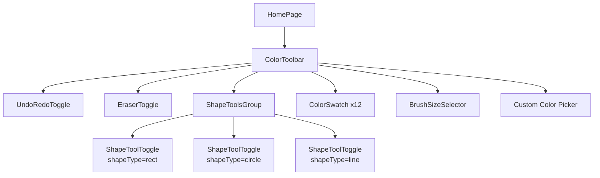
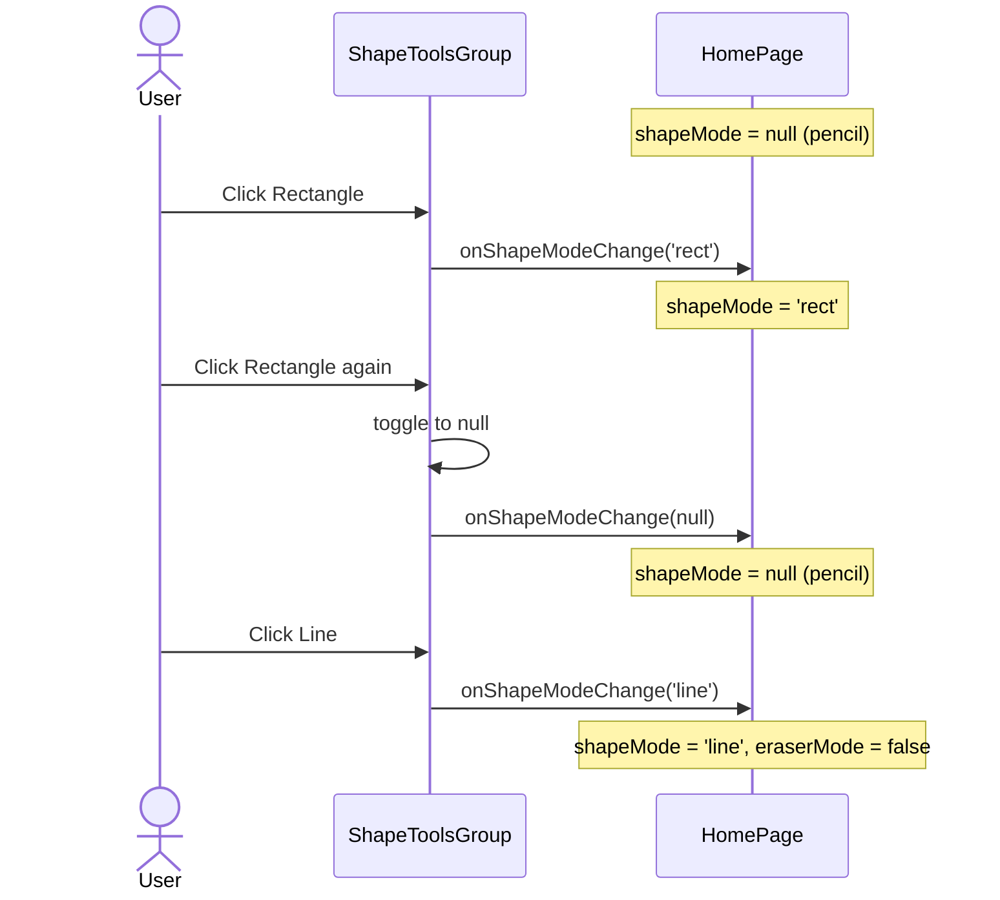

# Design Document: Shape Tools

**Feature**: Shape Tools (Rectangle, Circle, Line)
**Status**: In Design
**Date**: 2026-07-05

## 1. Design Overview

Add three shape drawing tools — Rectangle, Circle, and Line — to the Scribble
drawing toolbar. Each shape tool is a toggle button in the ColorToolbar
sidebar. The three tools form a **radio group**: only one shape (or none) can
be active at a time. Activating a shape also deactivates the eraser and pencil
modes.

When a shape tool is active, dragging on the canvas draws that shape
(rather than freehand pencil strokes). Clicking the same shape again
deactivates it, returning the tool to default pencil mode.

---

## 2. Layout

### 2.1 Placement in Toolbar

The ShapeToolsGroup is inserted between the EraserToggle and the first
separator:

```
Position 1: UndoRedoToggle  (↶ ↷)
Position 2: EraserToggle    (eraser icon)
Position 3: ShapeToolsGroup (▭ ◎ ╱)   ← NEW
Position 4: Separator
Position 5: Color swatches  (12 colors)
Position 6: Separator
Position 7: BrushSizeSelector
Position 8: Custom color picker
```

### 2.2 Desktop Layout (vertical sidebar, `sm:flex-col`)

On desktop, the three shape buttons are stacked **vertically** with `gap-1`
spacing. Each button is `w-9 h-9` (36×36px touch target), matching the
EraserToggle and UndoRedoToggle dimensions.

### 2.3 Mobile Layout (horizontal toolbar strip, `flex-row`)

On mobile, the three shape buttons sit **side-by-side horizontally** in the
scrollable toolbar strip.

---

## 3. Interaction Design

### 3.1 Tool Exclusivity Rules

| Action | Eraser | Rectangle | Circle | Line | Pencil |
|--------|--------|-----------|--------|------|--------|
| Click Rectangle (inactive) | OFF | **ON** | OFF | OFF | OFF |
| Click Circle (inactive) | OFF | OFF | **ON** | OFF | OFF |
| Click Line (inactive) | OFF | OFF | OFF | **ON** | OFF |
| Click Rectangle (active) | OFF | OFF | OFF | OFF | ON |
| Click Eraser | **ON** | OFF | OFF | OFF | OFF |
| Click a different shape | OFF | *switches active shape* | | | |
| Click color swatch | OFF | *shape stays active* | | | |

### 3.2 State Transitions

```
shapeMode: null (pencil)
  ├── click Rectangle → shapeMode: 'rect'
  ├── click Circle    → shapeMode: 'circle'
  └── click Line      → shapeMode: 'line'

shapeMode: 'rect'
  ├── click Rectangle → shapeMode: null (pencil)
  ├── click Circle    → shapeMode: 'circle'
  └── click Line      → shapeMode: 'line'
```

---

## 4. Component Specifications

### 4.1 ShapeToolsGroup

**File**: `client/src/components/toolbar/ShapeToolsGroup.jsx` **(NEW)**

**Props**:

| Prop               | Type                            | Required | Description |
|--------------------|---------------------------------|----------|-------------|
| `shapeMode`        | `'rect' \| 'circle' \| 'line' \| null` | Yes | Currently active shape |
| `onShapeModeChange`| `(newMode) => void`             | Yes | Shape mode change handler |

**Toggle-off logic**: When the active shape is clicked again, calls `onShapeModeChange(null)`.

### 4.2 ShapeToolToggle

**File**: `client/src/components/toolbar/ShapeToolToggle.jsx` **(NEW)**

**Props**:

| Prop        | Type                                           | Required | Description |
|-------------|------------------------------------------------|----------|-------------|
| `shapeType` | `'rect' \| 'circle' \| 'line'`                 | Yes      | Which shape |
| `active`    | `boolean`                                      | Yes      | Whether selected |
| `onClick`   | `() => void`                                   | Yes      | Click handler |
| `label`     | `string`                                       | Yes      | Accessible label |

**Button attributes**: `type="button"`, `role="radio"`, `aria-checked={active}`, `aria-label={label}`

**Visual states**:

| State | Classes |
|-------|---------|
| Default (inactive) | `bg-transparent hover:bg-scribble-border/30` |
| Active | `bg-scribble-primary/20 ring-2 ring-scribble-primary ring-offset-2 ring-offset-scribble-surface` |
| Focus-visible | `focus-visible:ring-2 focus-visible:ring-scribble-primary focus-visible:ring-offset-2 focus-visible:ring-offset-scribble-surface` |

**Full className**:
```jsx
className={`
  w-9 h-9 rounded-lg cursor-pointer transition-all duration-150 outline-none
  flex items-center justify-center
  focus-visible:ring-2 focus-visible:ring-scribble-primary focus-visible:ring-offset-2 focus-visible:ring-offset-scribble-surface
  ${active
    ? 'bg-scribble-primary/20 ring-2 ring-scribble-primary ring-offset-2 ring-offset-scribble-surface'
    : 'bg-transparent hover:bg-scribble-border/30'
  }
`}
```

Icon colors: Inactive = `text-scribble-muted`, Active = `text-purple-300`.

---

## 5. Shape Icons (Inline SVG)

All icons use: 18×18px, 24×24 viewBox, `fill="none"`, `stroke="currentColor"`,
`stroke-width="2"`, `stroke-linecap="round"`, `stroke-linejoin="round"`,
`aria-hidden="true"`.

**Rectangle icon (▭)**:
```html
<svg xmlns="http://www.w3.org/2000/svg" viewBox="0 0 24 24" width="18" height="18" fill="none" stroke="currentColor" stroke-width="2" stroke-linecap="round" stroke-linejoin="round" aria-hidden="true">
  <rect x="4" y="5" width="16" height="14" rx="1" />
</svg>
```

**Circle icon (◎)**:
```html
<svg xmlns="http://www.w3.org/2000/svg" viewBox="0 0 24 24" width="18" height="18" fill="none" stroke="currentColor" stroke-width="2" stroke-linecap="round" stroke-linejoin="round" aria-hidden="true">
  <circle cx="12" cy="12" r="8" />
</svg>
```

**Line icon (╱)**:
```html
<svg xmlns="http://www.w3.org/2000/svg" viewBox="0 0 24 24" width="18" height="18" fill="none" stroke="currentColor" stroke-width="2" stroke-linecap="round" stroke-linejoin="round" aria-hidden="true">
  <line x1="6" y1="18" x2="18" y2="6" />
</svg>
```

---

## 6. Accessibility

| Element | Role | ARIA |
|---------|------|------|
| ShapeToolsGroup container | `radiogroup` | `aria-label="Shape tools"` |
| ShapeToolToggle (each) | `radio` | `aria-checked={active}`, `aria-label={label}` |

Tooltips: `title="Rectangle tool"`, `title="Circle tool"`, `title="Line tool"`.

---

## 7. Mermaid Diagrams

### Component Tree



### Shape Tool Interaction Flow



---

## 8. Component Integration

### Updated ColorToolbar

New props: `shapeMode`, `onShapeModeChange`

Insert `<ShapeToolsGroup>` between the eraser section and the first separator.

### Updated HomePage

New state: `shapeMode` (default `null`)
New handler: `handleShapeModeChange(newMode)` — sets shape mode, clears eraser mode
New ref: `shapeModeRef`

---

## 9. File Summary

| File | Action |
|------|--------|
| `client/src/components/toolbar/ShapeToolsGroup.jsx` | **NEW** |
| `client/src/components/toolbar/ShapeToolToggle.jsx` | **NEW** |
| `client/src/components/toolbar/ColorToolbar.jsx` | MODIFY |
| `client/src/components/HomePage.jsx` | MODIFY |
| `client/src/components/canvas/DrawingCanvas.jsx` | MODIFY |
| `client/src/components/toolbar/__tests__/ShapeToolsGroup.test.jsx` | **NEW** |
| `client/src/components/toolbar/__tests__/ShapeToolToggle.test.jsx` | **NEW** |

## 10. Out of Scope (V1)

- Filled shapes (V1 outlined only)
- Keyboard shortcuts for shape tools
- Shape rotation or resizing after placement
- Shift-constrain (perfect squares/circles)
- Shape selection and manipulation
