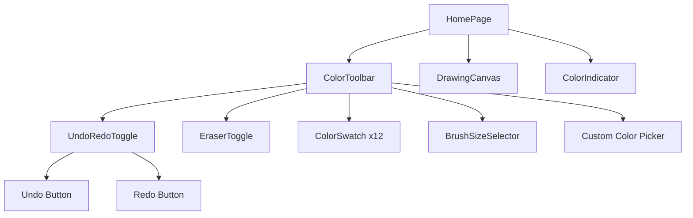
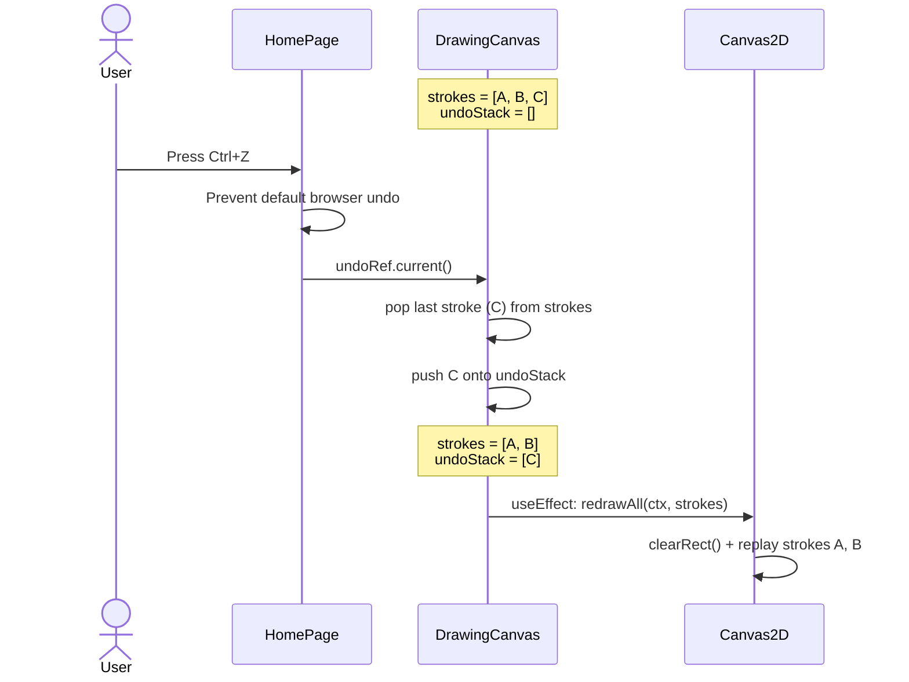

# Design Document: Undo/Redo

**Feature**: Undo/Redo
**Status**: In Design
**Date**: 2026-07-05

## 1. Design Overview

Add Undo and Redo buttons to the toolbar sidebar. These are two compact,
paired action buttons that let users revert and restore drawing strokes.
Keyboard shortcuts (Ctrl+Z / Ctrl+Shift+Z) provide an alternative to
clicking. When the respective history stack is empty, the button disables
visually.

The buttons follow the existing EraserToggle visual language: square
`w-9 h-9` targets with SVG icons using `currentColor`, focus-visible ring
pattern, and hover background transitions.

---

## 2. Layout

### 2.1 Placement Rationale

The Undo/Redo buttons are placed **at the very top** of the toolbar sidebar,
above the Eraser toggle. This follows industry convention (Figma, Photoshop,
Illustrator, Excalidraw all place undo/redo at the far left/top of their
toolbars). Users universally expect these actions in a predictable position.

### 2.2 Desktop Layout (vertical sidebar, `sm:w-16`, `sm:flex-col`)

```
┌────────┬─────────────────────────────────┐
│ NAVBAR                                  │
├────────┼─────────────────────────────────┤
│  ↶     │  ← Undo (top)                   │
│  ↷     │  ← Redo (below Undo)            │
│  🧹    │  ← Eraser toggle                │
│────────│  ← separator                    │
│ ■ ■    │  ← color swatches               │
│ ■ ■    │                                 │
│ ■ ■    │                                 │
│ ■ ■    │                                 │
│ ■ ■    │                                 │
│ ■ ■    │                                 │
│        │                                 │
│────────│  ← separator                    │
│ ● ○ ○  │  ← Brush size selector          │
│ 🎨     │  ← custom color picker          │
├────────┴─────────────────────────────────┤
│              ●  Drawing color             │
│   ┌───────────────────────────┐          │
│   │    DRAWING CANVAS          │          │
│   └───────────────────────────┘          │
└──────────────────────────────────────────┘

Legend:
 ↶ = Undo button
 ↷ = Redo button
 🧹 = Eraser toggle
 ■ = Color swatch
 🎨 = Custom color picker
```

**Reasoning for vertical stacking on desktop**: The toolbar sidebar is only
`w-16` (64px). With `px-2` (8px padding on each side), the usable width is
48px. Two 36px buttons side-by-side would be 76px — they don't fit. Stacking
them vertically preserves the 36px target size and keeps the layout clean.

### 2.3 Mobile Layout (horizontal toolbar strip, `flex-row`)

```
┌─────────────────────────────────────────────────┐
│ NAVBAR                                           │
├─────────────────────────────────────────────────┤
│ ↶ ↷ │ 🧹 │ ■ ■ ■ ■ ■ ■ ... │  🎨              │
├─────────────────────────────────────────────────┤
│             ┌───────────────────┐                │
│             │  DRAWING CANVAS    │                │
│             └───────────────────┘                │
└─────────────────────────────────────────────────┘

Legend:
 ↶ ↷ = Undo / Redo (side-by-side horizontally)
 🧹   = Eraser toggle
 ■   = Color swatches
 🎨   = Custom color picker
```

On mobile, Undo and Redo sit **side-by-side** at the start of the horizontal
scrollable strip. The wider layout has plenty of horizontal space, so
side-by-side minimizes vertical height consumption.

---

## 3. Component Specifications

### 3.1 UndoRedoToggle

**File**: `client/src/components/toolbar/UndoRedoToggle.jsx` **(NEW)**

A single component that renders both Undo and Redo buttons as a pair.

**Props**:

| Prop       | Type       | Required | Default | Description                                |
|------------|------------|----------|---------|--------------------------------------------|
| `canUndo`  | `boolean`  | Yes      | —       | Whether there is at least one action to undo |
| `canRedo`  | `boolean`  | Yes      | —       | Whether there is at least one action to redo |
| `onUndo`   | `function` | Yes      | —       | Called with no arguments on undo click     |
| `onRedo`   | `function` | Yes      | —       | Called with no arguments on redo click     |

**Behavior**:

- When `canUndo` is `false`, the Undo button is disabled (`disabled` attribute,
  `opacity-50`, `cursor-not-allowed`, `pointer-events-none`).
- When `canRedo` is `false`, the Redo button is disabled (same treatment).
- Clicking an enabled button calls the corresponding `onUndo` / `onRedo` handler.

**Return structure**:

```jsx
<div className="flex sm:flex-col items-center gap-1 shrink-0" aria-label="Undo/Redo actions">
  {/* Undo button */}
  <button ... />
  {/* Redo button */}
  <button ... />
</div>
```

**Desktop**: The container uses `sm:flex-col` to stack vertically in the sidebar.
**Mobile**: The container uses `flex-row` (default) to arrange horizontally in the strip.

### 3.2 Undo Button (inside UndoRedoToggle)

A single `<button>` element with the following characteristics:

| Attribute       | Value                                                          |
|-----------------|----------------------------------------------------------------|
| `type`          | `"button"`                                                     |
| `disabled`      | `!canUndo`                                                     |
| `aria-label`    | `"Undo last stroke"`                                           |
| `title`         | `"Undo (Ctrl+Z)"`                                              |
| `onClick`       | `onUndo`                                                       |

### 3.3 Redo Button (inside UndoRedoToggle)

A single `<button>` element with the following characteristics:

| Attribute       | Value                                                          |
|-----------------|----------------------------------------------------------------|
| `type`          | `"button"`                                                     |
| `disabled`      | `!canRedo`                                                     |
| `aria-label`    | `"Redo last undone stroke"`                                    |
| `title`         | `"Redo (Ctrl+Shift+Z)"`                                        |
| `onClick`       | `onRedo`                                                       |

---

## 4. Icon Design

### 4.1 Undo Icon

An SVG depicting a curved arrow pointing left/counterclockwise, adapted from
Feather Icons (`rotate-ccw`):

```html
<svg xmlns="http://www.w3.org/2000/svg" viewBox="0 0 24 24"
     width="18" height="18" fill="none" stroke="currentColor"
     stroke-width="2" stroke-linecap="round" stroke-linejoin="round"
     aria-hidden="true">
  <path d="M3 7v6h6" />
  <path d="M21 17a9 9 0 0 0-9-9 9 9 0 0 0-6 2.3L3 13" />
</svg>
```

### 4.2 Redo Icon

An SVG depicting a curved arrow pointing right/clockwise — the mirror image
of the Undo icon, adapted from Feather Icons (`rotate-cw`):

```html
<svg xmlns="http://www.w3.org/2000/svg" viewBox="0 0 24 24"
     width="18" height="18" fill="none" stroke="currentColor"
     stroke-width="2" stroke-linecap="round" stroke-linejoin="round"
     aria-hidden="true">
  <path d="M21 7v6h-6" />
  <path d="M3 17a9 9 0 0 1 9-9 9 9 0 0 1 6 2.3L21 13" />
</svg>
```

### 4.3 Icon Dimensions

| Property     | Desktop      | Mobile       | Rationale                              |
|-------------|-------------|-------------|----------------------------------------|
| SVG viewBox | `0 0 24 24` | `0 0 24 24` | Standard icon grid                     |
| SVG width   | `18`        | `18`        | Same as EraserToggle icon (18px)       |
| SVG height  | `18`        | `18`        | Same as EraserToggle icon (18px)       |
| Button size | `w-9 h-9`   | `w-9 h-9`   | 36x36px touch target — matches EraserToggle |

---

## 5. Visual States

Each button (Undo and Redo independently) follows the existing EraserToggle
visual pattern, extended with a disabled state.

### 5.1 State Table

| State            | Background               | Ring/Border          | Icon Color           | Cursor  |
|------------------|--------------------------|----------------------|----------------------|---------|
| Default (enabled)| `bg-transparent`         | none                 | `text-scribble-muted`| pointer |
| Hover (enabled)  | `bg-scribble-border/30`  | none                 | `text-scribble-muted`| pointer |
| Active/Pressed   | `bg-scribble-border/40`  | none                 | `text-scribble-muted`| pointer |
| Focus-visible    | `bg-transparent` (or hover) | `ring-2 ring-scribble-primary ring-offset-2 ring-offset-scribble-surface` | `text-scribble-muted` | pointer |
| Disabled         | `bg-transparent`         | none                 | `text-scribble-muted opacity-50` | `cursor-not-allowed` |

**Key distinction**: Undo/Redo buttons are **momentary actions**, not toggle states.
They do NOT have a persistent "active" visual state (no purple ring/background).

### 5.2 Tailwind Classes

Each button uses:

```
w-9 h-9 rounded-lg cursor-pointer transition-all duration-150 outline-none
flex items-center justify-center
bg-transparent hover:bg-scribble-border/30 active:bg-scribble-border/40
focus-visible:ring-2 focus-visible:ring-scribble-primary focus-visible:ring-offset-2 focus-visible:ring-offset-scribble-surface
disabled:opacity-50 disabled:cursor-not-allowed disabled:pointer-events-none
```

---

## 6. Interaction Design

### 6.1 Click Undo

When the user clicks Undo, the last stroke is removed from the canvas and the
Redo button becomes enabled (if it was disabled). If no strokes remain, the
Undo button becomes disabled.

### 6.2 Click Redo

When the user clicks Redo, the last undone stroke is restored. If no more
undone strokes exist, the Redo button becomes disabled.

### 6.3 New Stroke Clears Redo Stack

If the user undoes some strokes and then draws a new stroke, the redo stack
is cleared and the Redo button becomes disabled immediately.

### 6.4 Keyboard Shortcuts

| Shortcut                        | Action |
|---------------------------------|--------|
| `Ctrl+Z` (Windows/Linux)       | Undo   |
| `Cmd+Z` (macOS)                | Undo   |
| `Ctrl+Shift+Z` (Windows/Linux) | Redo   |
| `Cmd+Shift+Z` (macOS)          | Redo   |
| `Ctrl+Y` (Windows/Linux)       | Redo   |

Keyboard shortcuts are handled by a `useEffect` keydown listener in
`HomePage.jsx`, NOT within the `UndoRedoToggle` component. The listener must
NOT fire when focus is inside an input/textarea.

---

## 7. Component Integration

### 7.1 Updated ColorToolbar

**File**: `client/src/components/toolbar/ColorToolbar.jsx` **(MODIFY)**

Add `UndoRedoToggle` at the top of the toolbar, before the eraser toggle.

**New props forwarded through ColorToolbar**:

| Prop        | Type       | Description                          |
|-------------|------------|--------------------------------------|
| `canUndo`   | `boolean`  | Whether undo is available            |
| `canRedo`   | `boolean`  | Whether redo is available            |
| `onUndo`    | `function` | Called on undo click                 |
| `onRedo`    | `function` | Called on redo click                 |

### 7.2 Updated HomePage

**File**: `client/src/components/HomePage.jsx` **(MODIFY)**

**New state variables**: `canUndo`, `canRedo`
**New handler functions**: `handleUndo()`, `handleRedo()`
**New effect**: Global keyboard shortcut listener (`useEffect`).
**Updated props to ColorToolbar**: Add `canUndo`, `canRedo`, `onUndo`, `onRedo`.

### 7.3 Updated DrawingCanvas

**File**: `client/src/components/canvas/DrawingCanvas.jsx` **(MODIFY)**

- `undo()` — removes the most recent stroke from the strokes array and
  pushes it onto a redo stack, then redraws.
- `redo()` — pops from the redo stack back onto the strokes array, then redraws.
- A new stroke pushes to the strokes array and **clears the redo stack**.
- `canUndo` / `canRedo` derive from `strokes.length > 0` and
  `redoStack.length > 0`.
- Exposes functions via callback refs (`onUndoReady`, `onRedoReady`) to HomePage.

---

## 8. Accessibility

### 8.1 ARIA Attributes

| Element               | ARIA Attributes                                                    |
|-----------------------|--------------------------------------------------------------------|
| UndoRedoToggle container | `aria-label="Undo/Redo actions"`                               |
| Undo button           | `aria-label="Undo last stroke"`, `aria-disabled` (when disabled)   |
| Redo button           | `aria-label="Redo last undone stroke"`, `aria-disabled` (when disabled) |

### 8.2 Keyboard Navigation

- **Tab order**: Undo → Redo → Eraser → swatches → brush sizes → color picker.
- **Activation**: `Enter` or `Space` on a focused button triggers the action.
- **Disabled buttons**: Removed from tab order (`tabIndex={-1}`).

### 8.3 Focus Management

- After undo/redo, focus **remains on the button**. Do NOT move focus.
- Focus-visible ring uses: `focus-visible:ring-2 focus-visible:ring-scribble-primary focus-visible:ring-offset-2 focus-visible:ring-offset-scribble-surface`

---

## 9. Mermaid Diagrams

### 9.1 Component Tree



### 9.2 Interaction Flow



---

## 10. Implementation Notes

### 10.1 SVG Icons

Inlined SVGs (not imported images) to ensure `currentColor` works:

**Undo**:
```html
<svg xmlns="http://www.w3.org/2000/svg" viewBox="0 0 24 24"
     width="18" height="18" fill="none" stroke="currentColor"
     stroke-width="2" stroke-linecap="round" stroke-linejoin="round"
     aria-hidden="true">
  <path d="M3 7v6h6" />
  <path d="M21 17a9 9 0 0 0-9-9 9 9 0 0 0-6 2.3L3 13" />
</svg>
```

**Redo**:
```html
<svg xmlns="http://www.w3.org/2000/svg" viewBox="0 0 24 24"
     width="18" height="18" fill="none" stroke="currentColor"
     stroke-width="2" stroke-linecap="round" stroke-linejoin="round"
     aria-hidden="true">
  <path d="M21 7v6h-6" />
  <path d="M3 17a9 9 0 0 1 9-9 9 9 0 0 1 6 2.3L21 13" />
</svg>
```

### 10.2 File Change Summary

| File | Action | Purpose |
|------|--------|---------|
| `client/src/components/toolbar/UndoRedoToggle.jsx` | **NEW** | Undo/Redo paired buttons component |
| `client/src/components/toolbar/ColorToolbar.jsx` | MODIFY | Accept & render UndoRedoToggle, forward props |
| `client/src/components/HomePage.jsx` | MODIFY | Add canUndo/canRedo state, handlers, keyboard listener |
| `client/src/components/canvas/DrawingCanvas.jsx` | MODIFY | Add undo/redo stacks, expose undo()/redo() methods |
| `client/src/components/toolbar/__tests__/UndoRedoToggle.test.jsx` | **NEW** | Unit tests |
| `client/src/components/canvas/__tests__/DrawingCanvas.test.jsx` | MODIFY | Tests for undo/redo logic |
| `client/src/components/__tests__/HomePage.test.jsx` | MODIFY | Tests for keyboard shortcuts |
