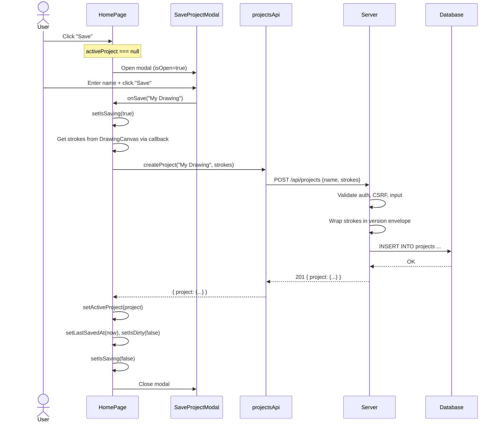
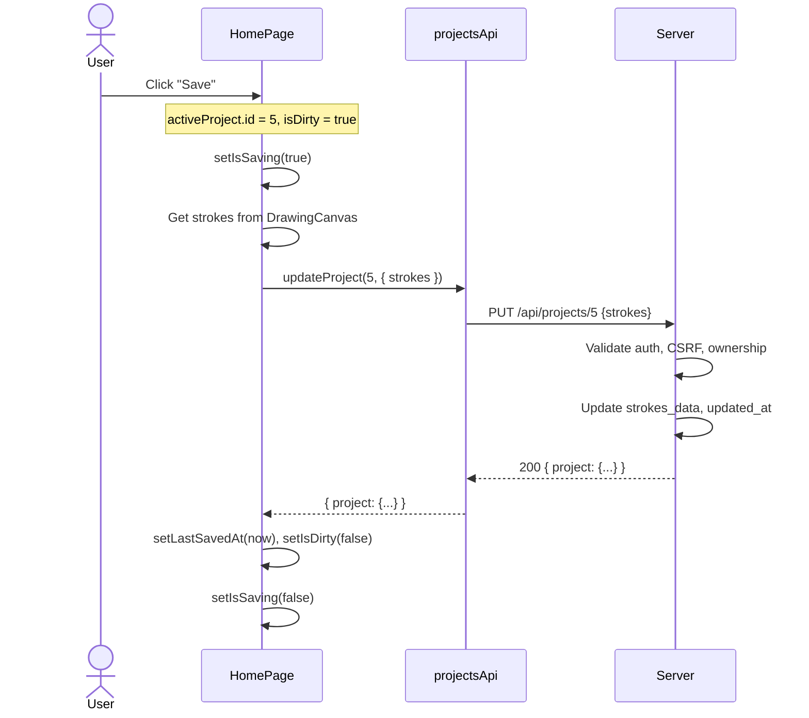
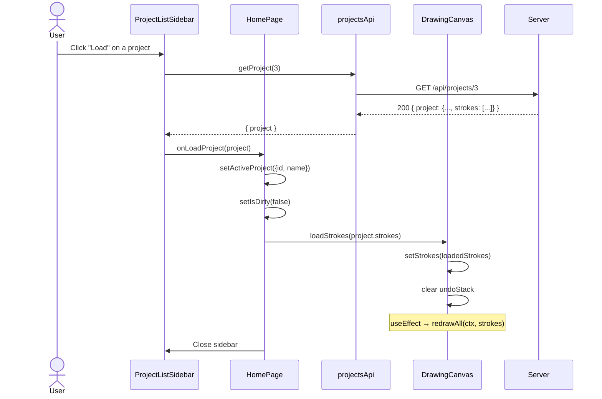
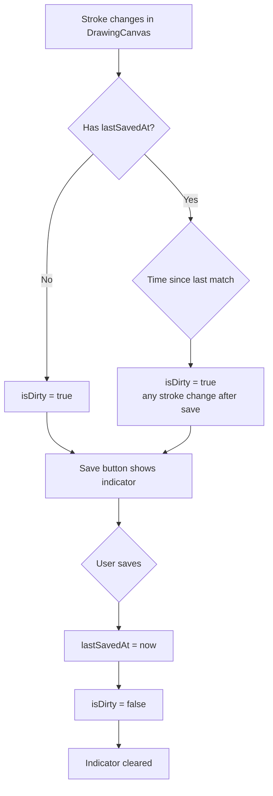
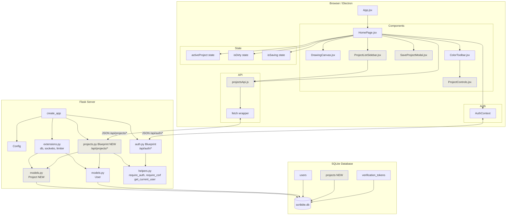
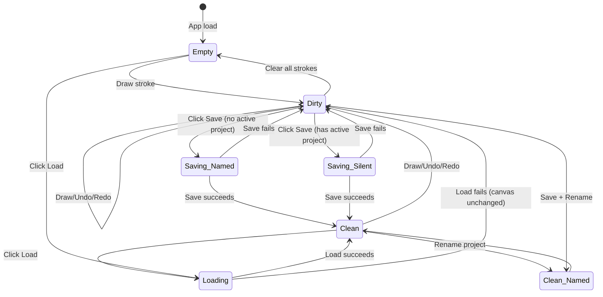

# Tech Spec: Project Saving & Loading

**Status**: In Planning
**Feature**: #8 — Project Saving & Loading
**Author**: Business Analyst
**Date**: 2026-07-05

---

## 1. Overview

This feature enables users to persist their drawings as named *projects* in the database
and reload them later. A project captures the complete drawing state — every stroke
(freehand, eraser, and shape) with its color, brush size, and tool metadata — so the user
can resume work exactly where they left off.

The feature exposes a RESTful `/api/projects` endpoint family (create, list, load, update,
delete) and adds corresponding UI: a **Save button** in the toolbar, a **SaveProjectModal**
for naming, a **ProjectListSidebar** for browsing saved projects, and a **Load** action
that restores strokes into the canvas. This is a single-user feature — each project is
private to its owner. Multi-user collaboration and project sharing are out of scope.

### Why This Is Needed

- Users lose their work when they close the browser. Saving is fundamental to any creative tool.
- Users need to iterate on drawings across sessions without starting from scratch.
- This lays the foundation for future auto-save, export, and shared projects.

### Stroke Data Size Context

A typical drawing session with 20-50 strokes contains 500–3,000 coordinate pairs. At
roughly 60 bytes per point as JSON, a dense drawing is ≈180 KB. Stored as a JSON TEXT
column in SQLite, this is well within limits. A `thumbnail` column (optional PNG data-URL,
max 64 KB) gives visual previews without re-rendering the full canvas.

---

## 2. Requirements

| ID    | Requirement |
|-------|-------------|
| R8.1  | **Save a new project** — User clicks "Save", sees a modal to enter a project name, and on confirm the current drawing (all strokes) is persisted to the server with a name, owner, and timestamp. The Save button is disabled when there are no strokes on the canvas. |
| R8.2  | **Save over an existing project** — If the user is editing a previously loaded project, clicking "Save" overwrites that project silently (no modal). A "Save As..." option (or a renamed save via the project list) creates a new project. |
| R8.3  | **Load a project** — User opens the project list sidebar, clicks a project, and the canvas is instantly redrawn with the saved strokes. The current drawing state (if any) is discarded, and the loaded project becomes the "active" project for subsequent saves. |
| R8.4  | **List user's projects** — A sidebar panel shows all projects owned by the current user, sorted by most-recently-updated, each displaying its name and last-modified date. |
| R8.5  | **Delete a project** — User can delete a project from the sidebar. A confirmation dialog prevents accidental deletion. Deleted projects are permanently removed from the database. |
| R8.6  | **Rename a project** — User can rename a project inline from the sidebar. The update is sent to the server immediately. |
| R8.7  | **Full-stroke fidelity** — Saving and loading preserve every stroke attribute: freehand `points[]`, `color`, `lineWidth`; eraser `points[]`, `eraserSize`; shape `type`, `startPoint`, `endPoint`, `lineWidth`, `color`. The loaded drawing is visually identical to when it was saved. |
| R8.8  | **Unsaved changes indicator** — A visual indicator (e.g., dot on the Save button, or "Unsaved" label) appears when the current strokes differ from the last saved state. Saving clears the indicator. Loading a project resets the indicator. |
| R8.9  | **Empty-state handling** — When the canvas is empty, the Save button is disabled. The ProjectListSidebar shows an encouraging empty-state message when the user has no saved projects. |

---

## 3. Database Model

### 3.1 `Project` Table

| Column         | Type             | Constraints                        | Notes |
|----------------|------------------|------------------------------------|-------|
| `id`           | `INTEGER`        | `PRIMARY KEY`                      | Auto-increment |
| `user_id`      | `INTEGER`        | `FOREIGN KEY users.id, NOT NULL, INDEX` | Owning user |
| `name`         | `VARCHAR(200)`   | `NOT NULL`                         | User-chosen project name (1–200 chars, trimmed) |
| `strokes_data` | `TEXT`           | `NOT NULL`                         | JSON string — the entire `strokes[]` array serialized |
| `created_at`   | `DATETIME`       | `NOT NULL`                         | UTC timestamp of first save |
| `updated_at`   | `DATETIME`       | `NOT NULL`                         | UTC timestamp of last save / update |

### 3.2 SQLAlchemy Model (`server/models.py` addition)

```python
class Project(db.Model):
    """A user's drawing project, storing the full strokes array as JSON."""

    __tablename__ = "projects"

    id = db.Column(db.Integer, primary_key=True)
    user_id = db.Column(
        db.Integer, db.ForeignKey("users.id", ondelete="CASCADE"),
        nullable=False, index=True,
    )
    name = db.Column(db.String(200), nullable=False)
    strokes_data = db.Column(db.Text, nullable=False)
    created_at = db.Column(
        db.DateTime,
        default=lambda: datetime.now(timezone.utc),
        nullable=False,
    )
    updated_at = db.Column(
        db.DateTime,
        default=lambda: datetime.now(timezone.utc),
        onupdate=lambda: datetime.now(timezone.utc),
        nullable=False,
    )

    # Relationship
    user = db.relationship("User", backref=db.backref("projects", cascade="all, delete-orphan"))

    def to_dict(self, include_strokes: bool = False) -> dict:
        """Return a JSON-safe dictionary representing this project.

        ``strokes_data`` is included only when ``include_strokes`` is True
        (i.e., when a single project is loaded, not when listing).
        """
        result = {
            "id": self.id,
            "name": self.name,
            "stroke_count": self._stroke_count(),
            "created_at": self.created_at.isoformat(),
            "updated_at": self.updated_at.isoformat(),
        }
        if include_strokes:
            import json as _json
            result["strokes"] = _json.loads(self.strokes_data)
        return result

    def _stroke_count(self) -> int:
        """Return the number of strokes (fast estimate from JSON array length).
        Falls back to counting actual parsed elements if needed."""
        import json as _json
        try:
            data = _json.loads(self.strokes_data)
            return len(data) if isinstance(data, list) else 0
        except (_json.JSONDecodeError, TypeError):
            return 0
```

### 3.3 Constraints

- **`user_id`** is NOT NULL — every project belongs to exactly one user. Deleted users cascade-delete their projects.
- **`name`** max 200 chars, trimmed. No uniqueness constraint per user — users can have multiple projects with the same name (they will differentiate by timestamp).
- **`strokes_data`** stores the full JSON string. On save, the client sends a JSON array; the server validates it is a list, then stores it verbatim. On load, the server returns it as a parsed JSON array inside the response.
- **`updated_at`** uses SQLAlchemy's `onupdate` to auto-refresh on every save.

### 3.4 Migration

`db.create_all()` in `create_app()` creates the new `projects` table automatically. No Alembic migration needed at this stage. Existing `users` table is untouched.

---

## 4. Stroke Serialization

### 4.1 Stroke Format (Existing — No Changes)

The frontend already stores strokes in a JSON-compatible format. The save/load feature transports this array as-is. No transformation is performed on the server.

**Freehand stroke:**
```json
{
  "points": [{"x": 10.5, "y": 20.3}, {"x": 12.0, "y": 22.1}],
  "color": "#7c3aed",
  "lineWidth": 3
}
```

**Eraser stroke:**
```json
{
  "type": "erase",
  "points": [{"x": 50, "y": 60}],
  "eraserSize": 15
}
```

**Shape strokes:**
```json
{
  "type": "rect",
  "startPoint": {"x": 50, "y": 50},
  "endPoint": {"x": 200, "y": 150},
  "color": "#3b82f6",
  "lineWidth": 3,
  "filled": false
}
```

### 4.2 Serialization Pipeline

```
Save:  strokes[] (JS array) → JSON.stringify() → POST body → server stores as TEXT
Load:  server reads TEXT → json.loads() → API response → JSON.parse() → strokes[] (JS array) → setStrokes()
```

### 4.3 Version Field (Future-Proofing)

Each serialized strokes array is wrapped in a tiny envelope on save:

```json
{
  "version": 1,
  "strokes": [ ... ]
}
```

The server stores this envelope. On load, the client reads `version` to decide
how to interpret the strokes. Currently only version 1 exists; future schema
changes (e.g., new stroke types, layer data) will bump the version. The server
is version-agnostic — it stores and returns the envelope as-opaque JSON.

### 4.4 Size Limits

- **Maximum strokes payload**: 5 MB (enforced server-side). A drawing of 10,000 strokes ≈ 300 KB; the 5 MB limit provides ~15x headroom.
- **Project name**: 1–200 characters.
- **Maximum projects per user**: No hard limit. Pagination (20 per page) handles large lists.

---

## 5. Backend Changes

### 5.1 New Blueprint: `server/projects.py`

A Flask `Blueprint` at prefix `/api/projects` with the following routes:

| Method   | Path                     | Handler             | Auth Required | Purpose |
|----------|--------------------------|---------------------|---------------|---------|
| `POST`   | `/api/projects`          | `create_project()`  | Yes (+ CSRF)  | Save a new project |
| `GET`    | `/api/projects`          | `list_projects()`   | Yes           | List user's projects (paginated) |
| `GET`    | `/api/projects/<id>`     | `get_project()`     | Yes           | Load a single project (with strokes) |
| `PUT`    | `/api/projects/<id>`     | `update_project()`  | Yes (+ CSRF)  | Save over an existing project |
| `DELETE` | `/api/projects/<id>`     | `delete_project()`  | Yes (+ CSRF)  | Delete a project |

All routes re-use the existing `@_require_auth`, `@_require_csrf`, and `_get_current_user()` helpers — imported from `auth.py` or extracted into a shared utility module.

**Note on shared helpers**: The decorators `_require_auth`, `_require_csrf`, and the function `_get_current_user` are currently module-private in `auth.py` (prefixed with `_`). They will be refactored to a shared `server/helpers.py` module (or imported directly from `auth` by renaming them to public names). This is a small refactor that keeps the codebase clean without duplication. The developer will decide the exact approach during implementation.

### 5.2 Shared Helpers Module (`server/helpers.py`)

```python
"""Shared decorators and helper functions used by multiple blueprints."""

from functools import wraps
from flask import jsonify, request, session
from models import User
from extensions import db

def get_current_user() -> User | None:
    """Load the currently-authenticated user from the session, or None."""
    # ... (moved from auth.py)

def require_auth(f):
    """Decorator: require a valid session. Returns 401 otherwise."""
    # ... (moved from auth.py)

def require_csrf(f):
    """Decorator: validate CSRF token for state-changing requests."""
    # ... (moved from auth.py)

def error_response(message: str, status: int):
    """Return a standard JSON error response."""
    return jsonify({"error": message}), status
```

If extracting helpers is deemed too large a change for this feature, the projects blueprint can import the private helpers from `auth` directly (Python convention allows this even with underscore-prefixed names). The developer will document the choice.

### 5.3 Endpoint Details

#### 5.3.1 `POST /api/projects` — Create Project

Creates a new project owned by the authenticated user.

**Request:**
```json
{
  "name": "My Cool Drawing",
  "strokes": [ ... ]
}
```

**Validation:**
- `name`: required, string, 1–200 chars after trimming. Return `400` if missing or empty.
- `strokes`: required, must be a JSON array. Return `400` if missing, not an array, or exceeds 5 MB raw body size.

**Processing:**
1. Wrap strokes in version envelope: `{"version": 1, "strokes": strokes}`
2. Serialize envelope to JSON string
3. Create `Project` row with `user_id = current_user.id`
4. Commit

**Response 201:**
```json
{
  "project": {
    "id": 1,
    "name": "My Cool Drawing",
    "stroke_count": 15,
    "created_at": "2026-07-05T14:30:00+00:00",
    "updated_at": "2026-07-05T14:30:00+00:00"
  }
}
```

**Errors:**
- `400` — Missing name: `{"error": "Project name is required"}`
- `400` — Name too long: `{"error": "Project name must be at most 200 characters"}`
- `400` — Missing strokes: `{"error": "Strokes data is required"}`
- `400` — Invalid strokes: `{"error": "Strokes must be a JSON array"}`
- `413` — Payload too large: `{"error": "Drawing data exceeds the 5 MB limit"}`
- `401` — Unauthenticated
- `403` — Missing/invalid CSRF token

#### 5.3.2 `GET /api/projects` — List Projects

Returns a paginated list of the authenticated user's projects (newest first).

**Query Parameters:**
| Param    | Type    | Default | Description |
|----------|---------|---------|-------------|
| `page`   | integer | `1`     | Page number (1-based) |
| `per_page` | integer | `20`  | Items per page (max 50) |

**Response 200:**
```json
{
  "projects": [
    {
      "id": 3,
      "name": "Landscape sketch",
      "stroke_count": 42,
      "created_at": "2026-07-04T10:00:00+00:00",
      "updated_at": "2026-07-05T14:30:00+00:00"
    },
    {
      "id": 2,
      "name": "Doodle",
      "stroke_count": 7,
      "created_at": "2026-07-03T08:15:00+00:00",
      "updated_at": "2026-07-03T09:00:00+00:00"
    }
  ],
  "page": 1,
  "per_page": 20,
  "total": 2,
  "pages": 1
}
```

**Note:** `strokes` are NOT included in list responses — only metadata. The full strokes array is returned only by the single-project GET endpoint.

**Errors:**
- `401` — Unauthenticated

#### 5.3.3 `GET /api/projects/<id>` — Get Single Project

Returns a project with its full strokes array.

**Response 200:**
```json
{
  "project": {
    "id": 3,
    "name": "Landscape sketch",
    "stroke_count": 42,
    "strokes": [
      {"points": [{"x": 10, "y": 20}, ...], "color": "#7c3aed", "lineWidth": 3},
      {"type": "erase", "points": [{"x": 50, "y": 60}], "eraserSize": 15},
      {"type": "rect", "startPoint": {"x": 100, "y": 100}, "endPoint": {"x": 300, "y": 200}, "color": "#3b82f6", "lineWidth": 5, "filled": false}
    ],
    "created_at": "2026-07-04T10:00:00+00:00",
    "updated_at": "2026-07-05T14:30:00+00:00"
  }
}
```

**Errors:**
- `401` — Unauthenticated
- `403` — Project belongs to a different user: `{"error": "Project not found"}` (don't reveal existence)
- `404` — Project doesn't exist: `{"error": "Project not found"}`

#### 5.3.4 `PUT /api/projects/<id>` — Update Project

Saves new strokes (and optionally a new name) to an existing project. Used for both "Save" (overwrite existing) and "Rename".

**Request:**
```json
{
  "name": "Landscape sketch v2",
  "strokes": [ ... ]
}
```

At least one of `name` or `strokes` must be provided. Both can be provided together. Providing only `name` performs a rename. Providing only `strokes` performs a save. Providing both renames and saves.

**Validation:**
- `name` (if provided): 1–200 chars trimmed
- `strokes` (if provided): must be a JSON array, ≤ 5 MB
- Ownership: project must belong to current user

**Response 200:**
```json
{
  "project": {
    "id": 3,
    "name": "Landscape sketch v2",
    "stroke_count": 48,
    "created_at": "2026-07-04T10:00:00+00:00",
    "updated_at": "2026-07-05T15:00:00+00:00"
  }
}
```

**Errors:**
- `400` — No fields provided: `{"error": "At least one of 'name' or 'strokes' must be provided"}`
- `400` — Validation errors (same as POST)
- `401` — Unauthenticated
- `403` — Missing/invalid CSRF token, or project belongs to different user
- `404` — Project not found

#### 5.3.5 `DELETE /api/projects/<id>` — Delete Project

Permanently deletes a project. Requires authentication, CSRF, and ownership.

**Request:** Empty body.

**Response 200:**
```json
{
  "message": "Project deleted successfully"
}
```

**Errors:**
- `401` — Unauthenticated
- `403` — Missing/invalid CSRF token, or project belongs to different user
- `404` — Project not found

### 5.4 App Factory Changes (`server/app.py`)

Two additions to `create_app()`:

1. **Register the projects blueprint** (after `auth_bp`):
   ```python
   from projects import projects_bp
   app.register_blueprint(projects_bp)
   ```

2. **Body size limit** (optional, defense-in-depth):
   ```python
   app.config["MAX_CONTENT_LENGTH"] = 6 * 1024 * 1024  # 6 MB (slightly larger than 5 MB strokes limit)
   ```

### 5.5 File Change Summary — Backend

| File | Change |
|------|--------|
| `server/models.py` | **MODIFY** — Add `Project` model class |
| `server/projects.py` | **NEW** — Projects blueprint with all 5 endpoints |
| `server/app.py` | **MODIFY** — Register projects blueprint, set `MAX_CONTENT_LENGTH` |
| `server/auth.py` | **MODIFY** — Rename `_require_auth`, `_require_csrf`, `_get_current_user`, `_error` to public names (remove underscore prefix) so `projects.py` can import them |
| (Alternative to auth.py change) | **NEW** `server/helpers.py` — Extract shared helpers if that approach is preferred |

**Design decision**: The helper extraction approach is cleaner but touchier (modifies auth.py imports, requiring test updates). The developer implementing this feature will choose the least-disruptive approach and document it in the implementation PR.

---

## 6. Frontend Changes

### 6.1 New File: `client/src/utils/projectsApi.js`

API module for project CRUD operations, following the same pattern as `api.js`.

```javascript
const API_BASE = '/api/projects';

export async function createProject(name, strokes) { ... }
export async function listProjects(page = 1, perPage = 20) { ... }
export async function getProject(id) { ... }
export async function updateProject(id, { name, strokes }) { ... }
export async function deleteProject(id) { ... }
```

All functions use the same `fetch()` pattern as `api.js`: `credentials: 'include'`, `X-CSRF-Token` header for state-changing methods, JSON `Content-Type`, error parsing.

### 6.2 New File: `client/src/components/projects/SaveProjectModal.jsx`

A modal dialog for naming a new project before saving.

**Behavior:**
- Appears when the user clicks "Save" and there is no active project (first save).
- Contains a text input for the project name, a "Save" button, and a "Cancel" button.
- Title: "Save Project"
- Input placeholder: "My Awesome Drawing"
- "Save" button is disabled when the input is empty or whitespace-only.
- On Save: calls `createProject()`, then closes the modal. The parent receives the new project data.
- On Cancel: closes the modal, no action.
- Pressing Enter in the input triggers Save.
- Pressing Escape closes the modal.
- Uses the Scribble dark theme (`bg-scribble-surface`, `border-scribble-border`, etc.)
- Has a `data-testid="save-project-modal"` for testing.

**Props:**
| Prop          | Type       | Description |
|---------------|------------|-------------|
| `isOpen`      | `boolean`  | Whether the modal is visible |
| `onClose`     | `function` | Called when modal is dismissed without saving |
| `onSave`      | `function` | Called with `(name)` when user confirms save |
| `isSaving`    | `boolean`  | Whether a save operation is in progress (shows spinner/disabled state) |

### 6.3 New File: `client/src/components/projects/ProjectListSidebar.jsx`

A slide-out sidebar panel listing the user's saved projects.

**Layout:**
- Fixed-position panel sliding in from the right side of the screen (or left, on top of the existing toolbar).
- Header: "Your Projects" with a close (X) button.
- Scrollable list of project cards, each showing:
  - Project name (bold)
  - Updated date (relative or formatted: "Jul 5, 2026")
  - Stroke count badge ("42 strokes")
  - Action buttons: **Load** (primary), **Rename** (inline edit), **Delete** (with confirmation)

**Behavior:**
- Loads projects on mount via `listProjects()`.
- Shows a loading skeleton while fetching.
- Shows an empty state with illustration/message when no projects exist: "No saved projects yet. Start drawing and save your work!"
- Clicking "Load" calls `getProject(id)`, then passes the full project (with strokes) to a parent callback. The sidebar closes.
- Clicking "Rename" turns the project name into an inline editable input. On blur or Enter, calls `updateProject(id, { name })`. On Escape, cancels.
- Clicking "Delete" shows a confirmation prompt. On confirm, calls `deleteProject(id)` and removes the project from the list.
- Shows error toasts/notifications for failed API calls.
- Pagination: "Load more" button at the bottom if there are more pages.
- Has a `data-testid="project-list-sidebar"` for testing.

**Props:**
| Prop            | Type       | Description |
|-----------------|------------|-------------|
| `isOpen`        | `boolean`  | Whether the sidebar is visible |
| `onClose`       | `function` | Called when sidebar is dismissed |
| `onLoadProject` | `function` | Called with `(project)` (full project with strokes) when user loads a project |
| `activeProjectId` | `number|null` | ID of the currently loaded project (highlighted in list) |

### 6.4 New File: `client/src/components/projects/ProjectControls.jsx`

A compact toolbar section containing Save and Load buttons. Rendered inside the existing `ColorToolbar`.

**Layout:**
- Two buttons stacked vertically (matching toolbar style):
  - **Save** (💾 icon) — primary action
  - **Load** (📂 icon) — toggles ProjectListSidebar
- "Unsaved changes" indicator: a small purple dot on the Save button when `isDirty` is true.

**Props:**
| Prop            | Type       | Description |
|-----------------|------------|-------------|
| `canSave`       | `boolean`  | Whether there are strokes to save |
| `isDirty`       | `boolean`  | Whether there are unsaved changes |
| `isSaving`      | `boolean`  | Whether a save is in progress |
| `hasActiveProject` | `boolean` | Whether a project is currently loaded |
| `onSave`        | `function` | Called when Save is clicked |
| `onLoad`        | `function` | Called when Load is clicked (toggles sidebar) |

### 6.5 Modified File: `client/src/components/HomePage.jsx`

Adds project state management and integrates all new components.

**New State:**
```javascript
// Project state
const [activeProject, setActiveProject] = useState(null); // { id, name } or null
const [isSaveModalOpen, setSaveModalOpen] = useState(false);
const [isProjectListOpen, setProjectListOpen] = useState(false);
const [isDirty, setIsDirty] = useState(false);
const [isSaving, setIsSaving] = useState(false);
const [lastSavedAt, setLastSavedAt] = useState(null); // ISO timestamp of last save
```

**New Logic:**
- **isDirty tracking**: Whenever strokes change (via a `useEffect` on a stroke count or a callback from `DrawingCanvas`), compare against `lastSavedAt`. If strokes changed after last save, set `isDirty = true`. Save clears `isDirty`. Load sets `isDirty = false`.
- **Handle Save**: If `activeProject` is null → open `SaveProjectModal`. If `activeProject` is set → call `updateProject()` directly (silent save). On success, update `activeProject` and `lastSavedAt`, set `isDirty = false`.
- **Handle Load**: Call `getProject(id)`, call `loadStrokes()` on DrawingCanvas (via a new ref callback), set `activeProject`, set `isDirty = false`.
- **Handle Delete**: After delete, if the deleted project was the active one, clear the active project (but keep the canvas strokes — user hasn't lost work, it's just no longer associated with a project).

**Refactored DrawingCanvas Interface:**
- New prop: `onStrokesReady((strokes) => {})` — called when HomePage needs to read strokes for save.
- New prop via ref: `loadStrokes(strokes)` — HomePage calls this to inject loaded strokes.
- New prop: `onStrokesChange((strokeCount) => {})` — called whenever strokes array changes (for dirty tracking).

### 6.6 Modified File: `client/src/components/canvas/DrawingCanvas.jsx`

Adds two capabilities: exporting current strokes and accepting loaded strokes.

**New additions:**
- `onStrokesReady` callback: When HomePage needs to save, it signals DrawingCanvas, which responds with the current `strokes` array. This avoids exposing strokes React state directly to the parent.
- `loadStrokes(strokes)` function exposed via a ref callback: Clears the canvas and `undoStack`, then calls `setStrokes(loadedStrokes)`. The existing `useEffect` on `strokes` repaints the canvas.
- `onStrokesChange` callback: Called in the `useEffect` that watches `strokes`, passing `strokes.length` to HomePage for dirty tracking.

**Implementation approach (pull model):**
```javascript
// HomePage requests strokes when saving
const strokesRef = useRef(null);
const onStrokesReady = useCallback((callback) => {
  // Use functional setStrokes pattern to get current value
  setStrokes((currentStrokes) => {
    strokesRef.current = currentStrokes;
    return currentStrokes; // No change
  });
  // Schedule the callback after state settles
  setTimeout(() => callback(strokesRef.current), 0);
}, []);
```

Better approach (less hacky): Store a ref that tracks the latest strokes:
```javascript
const latestStrokesRef = useRef([]);
// Update in the same effect/function that calls setStrokes
// Then onStrokesReady just reads latestStrokesRef.current
```

The developer will implement the cleanest pattern during development.

### 6.7 Modified File: `client/src/components/toolbar/ColorToolbar.jsx`

Adds `ProjectControls` component to the toolbar layout.

**New toolbar order (top to bottom on desktop):**
1. UndoRedoToggle
2. EraserToggle
3. ShapeToolsGroup
4. Separator
5. **ProjectControls (Save, Load)** ← NEW
6. Separator
7. 12 Color swatches
8. Separator
9. BrushSizeSelector
10. Custom color picker

### 6.8 Modified File: `client/src/App.jsx`

No route changes needed. All project UI is rendered inside `HomePage` (modals, sidebars).

### 6.9 File Change Summary — Frontend

| File | Change |
|------|--------|
| `client/src/utils/projectsApi.js` | **NEW** — CRUD functions for `/api/projects` |
| `client/src/components/projects/SaveProjectModal.jsx` | **NEW** — Modal for naming a new project |
| `client/src/components/projects/ProjectListSidebar.jsx` | **NEW** — Sidebar listing saved projects |
| `client/src/components/projects/ProjectControls.jsx` | **NEW** — Save/Load buttons in toolbar |
| `client/src/components/HomePage.jsx` | **MODIFY** — Add project state management, integrate new components |
| `client/src/components/canvas/DrawingCanvas.jsx` | **MODIFY** — Expose strokes export/import, strokes-change callback |
| `client/src/components/toolbar/ColorToolbar.jsx` | **MODIFY** — Add ProjectControls to toolbar layout |
| `client/src/App.jsx` | No changes needed |
| `client/src/utils/api.js` | No changes needed (projectsApi.js is separate) |

---

## 7. API Design — Full Request/Response Reference

### 7.1 POST `/api/projects` — Create

**Request:**
```
POST /api/projects HTTP/1.1
Content-Type: application/json
Cookie: session=<signed>
X-CSRF-Token: a1b2c3d4...
```
```json
{
  "name": "My Cool Drawing",
  "strokes": [
    {"points": [{"x": 10, "y": 20}, {"x": 15, "y": 25}], "color": "#7c3aed", "lineWidth": 3},
    {"type": "erase", "points": [{"x": 100, "y": 100}], "eraserSize": 15}
  ]
}
```

**Response 201:**
```json
{
  "project": {
    "id": 1,
    "name": "My Cool Drawing",
    "stroke_count": 2,
    "created_at": "2026-07-05T14:30:00+00:00",
    "updated_at": "2026-07-05T14:30:00+00:00"
  }
}
```

### 7.2 GET `/api/projects` — List

**Request:**
```
GET /api/projects?page=1&per_page=20 HTTP/1.1
Cookie: session=<signed>
```

**Response 200:**
```json
{
  "projects": [
    {
      "id": 2,
      "name": "Doodle",
      "stroke_count": 7,
      "created_at": "2026-07-03T08:15:00+00:00",
      "updated_at": "2026-07-03T09:00:00+00:00"
    },
    {
      "id": 1,
      "name": "My Cool Drawing",
      "stroke_count": 2,
      "created_at": "2026-07-05T14:30:00+00:00",
      "updated_at": "2026-07-05T14:30:00+00:00"
    }
  ],
  "page": 1,
  "per_page": 20,
  "total": 2,
  "pages": 1
}
```

### 7.3 GET `/api/projects/1` — Get Single

**Response 200:**
```json
{
  "project": {
    "id": 1,
    "name": "My Cool Drawing",
    "stroke_count": 2,
    "strokes": [
      {"points": [{"x": 10, "y": 20}, {"x": 15, "y": 25}], "color": "#7c3aed", "lineWidth": 3},
      {"type": "erase", "points": [{"x": 100, "y": 100}], "eraserSize": 15}
    ],
    "created_at": "2026-07-05T14:30:00+00:00",
    "updated_at": "2026-07-05T14:30:00+00:00"
  }
}
```

### 7.4 PUT `/api/projects/1` — Update

**Request:**
```
PUT /api/projects/1 HTTP/1.1
Content-Type: application/json
Cookie: session=<signed>
X-CSRF-Token: a1b2c3d4...
```
```json
{
  "name": "My Cool Drawing v2",
  "strokes": [ ... ]
}
```

**Response 200:**
```json
{
  "project": {
    "id": 1,
    "name": "My Cool Drawing v2",
    "stroke_count": 2,
    "created_at": "2026-07-05T14:30:00+00:00",
    "updated_at": "2026-07-05T15:00:00+00:00"
  }
}
```

### 7.5 DELETE `/api/projects/1` — Delete

**Response 200:**
```json
{
  "message": "Project deleted successfully"
}
```

---

## 8. Data Flow

### 8.1 Save New Project Flow



### 8.2 Save Over Existing Project Flow



### 8.3 Load Project Flow



### 8.4 Unsaved Changes Detection Flow



---

## 9. Edge Cases & Error Handling

### 9.1 Save

| Scenario | Expected Behavior |
|----------|-------------------|
| Save with empty canvas (0 strokes) | Save button disabled; nothing happens |
| Save with very large drawing (>5 MB) | Server returns 413; frontend shows error toast: "Drawing is too large to save" |
| Save while already saving (double-click) | Button shows spinner; second click is ignored via `isSaving` guard |
| Save with network failure | Error toast: "Failed to save. Check your connection and try again." Strokes remain on canvas. |
| Save with expired session | Server returns 401; frontend redirects to login (existing AuthContext behavior) |
| Project name with only whitespace | Client-side validation rejects; "Save" button stays disabled |
| Project name with special characters | Allowed (stored as-is); no XSS risk because React escapes output |
| Concurrent save from two tabs | Last-write-wins. Both saves succeed; the later `updated_at` prevails |
| Save after loading but before modifying | `isDirty` is false; Save button should still work but be a no-op (or disabled — UX decision) |

### 9.2 Load

| Scenario | Expected Behavior |
|----------|-------------------|
| Load with unsaved changes on canvas | Load discards current strokes silently. Future: show "Discard unsaved changes?" confirmation. (V1: just discard — the user explicitly chose to load.) |
| Load a deleted project (stale UI) | Server returns 404; show error toast: "This project no longer exists" |
| Load a project with corrupted strokes JSON | Server returns 500; show error toast: "Failed to load drawing data" |
| Load with empty strokes (valid but 0 strokes) | Canvas clears; empty canvas shown |
| Load while a stroke is mid-draw | `isDrawingRef.current` check prevents loading mid-stroke; load is queued |
| Load from another user's project | Server returns 403 (as 404 for security); show "Project not found" |

### 9.3 Delete

| Scenario | Expected Behavior |
|----------|-------------------|
| Delete the currently active project | Project deleted from server; `activeProject` set to null; canvas strokes preserved (user can save as new project) |
| Delete a non-active project | Removed from sidebar list; no effect on canvas |
| Delete confirmation cancelled | No action taken |
| Delete with network failure | Error toast; project remains in list |
| Delete after project already deleted elsewhere | Server returns 404; remove from local list silently |

### 9.4 Rename

| Scenario | Expected Behavior |
|----------|-------------------|
| Rename to empty string | Client-side validation rejects; name reverts to previous |
| Rename to same name | No-op (server still processes but no visible change) |
| Rename with Enter key | Saves the new name |
| Rename with Escape key | Cancels edit; reverts to previous name |
| Rename active project | Name updates in both sidebar and active project state |

### 9.5 Security

| Concern | Mitigation |
|---------|------------|
| **Cross-user access** | Every endpoint checks `project.user_id == session["user_id"]`. Returns 404 (not 403) to prevent user enumeration. |
| **SQL injection** | SQLAlchemy ORM parameterized queries throughout. |
| **JSON injection** | Strokes stored as JSON TEXT, never parsed server-side. Returned as-is in API responses. |
| **XSS in project names** | React auto-escapes JSX output. `dangerouslySetInnerHTML` is never used. |
| **Mass assignment** | Only `name` and `strokes` fields are accepted from request body; `user_id` is always derived from session. |
| **CSRF** | `@require_csrf` on POST, PUT, DELETE. GET is read-only so exempt. |
| **Large payload DOS** | Flask `MAX_CONTENT_LENGTH` set to 6 MB. Request bodies over this limit get a 413 response. |

---

## 10. Testing Strategy

### 10.1 Backend Tests (pytest — `tests/`)

**Test files:**
- `tests/test_models_project.py` — Project model unit tests
- `tests/test_projects_api.py` — Projects blueprint endpoint tests

#### Model Tests (`tests/test_models_project.py`) — 8 tests

| # | Test | Description |
|---|------|-------------|
| 1 | `test_create_project_success` | Create project with valid data; assert fields |
| 2 | `test_project_user_relationship` | Project.user returns the owner; User.projects includes the project |
| 3 | `test_project_to_dict_without_strokes` | `to_dict()` omits strokes, includes stroke_count |
| 4 | `test_project_to_dict_with_strokes` | `to_dict(include_strokes=True)` includes parsed strokes array |
| 5 | `test_project_stroke_count` | `_stroke_count()` returns correct count for valid JSON array |
| 6 | `test_project_stroke_count_invalid_json` | `_stroke_count()` returns 0 for malformed JSON |
| 7 | `test_project_cascade_delete` | Deleting a user deletes their projects |
| 8 | `test_project_updated_at_auto_update` | `updated_at` changes on save |

#### API Endpoint Tests (`tests/test_projects_api.py`) — 22 tests

**POST `/api/projects`:**
| # | Test | Expected |
|---|------|----------|
| 1 | Create project with valid name and strokes | 201, project returned |
| 2 | Create project with empty strokes array | 201, stroke_count = 0 |
| 3 | Missing name | 400 |
| 4 | Empty name (whitespace only) | 400 |
| 5 | Name exceeds 200 characters | 400 |
| 6 | Missing strokes field | 400 |
| 7 | Strokes is not an array (string) | 400 |
| 8 | Unauthenticated request | 401 |
| 9 | Missing CSRF token | 403 |
| 10 | Wrong CSRF token | 403 |
| 11 | Oversized payload (>5 MB) | 413 |

**GET `/api/projects`:**
| # | Test | Expected |
|---|------|----------|
| 12 | List projects for authenticated user | 200, projects array |
| 13 | List is paginated | 200, pagination metadata correct |
| 14 | List excludes strokes_data | each project has no `strokes` field |
| 15 | List for user with no projects | 200, empty projects array |
| 16 | Unauthenticated | 401 |

**GET `/api/projects/<id>`:**
| # | Test | Expected |
|---|------|----------|
| 17 | Get own project | 200, includes strokes |
| 18 | Get non-existent project | 404 |
| 19 | Get another user's project | 404 (not 403) |
| 20 | Unauthenticated | 401 |

**PUT `/api/projects/<id>`:**
| # | Test | Expected |
|---|------|----------|
| 21 | Update strokes only | 200, strokes updated |
| 22 | Update name only (rename) | 200, name updated |
| 23 | Update both name and strokes | 200, both updated |
| 24 | No fields provided | 400 |
| 25 | Update another user's project | 404 |
| 26 | Update non-existent project | 404 |
| 27 | Unauthenticated | 401 |
| 28 | Invalid CSRF | 403 |
| 29 | `updated_at` changes after update | timestamp differs from `created_at` |

**DELETE `/api/projects/<id>`:**
| # | Test | Expected |
|---|------|----------|
| 30 | Delete own project | 200, message returned |
| 31 | Delete non-existent project | 404 |
| 32 | Delete another user's project | 404 |
| 33 | Unauthenticated | 401 |
| 34 | Invalid CSRF | 403 |
| 35 | Project deleted from database | GET after delete returns 404 |

**Total: ~35 backend tests** (8 model + 27 endpoint, some may be combined).

### 10.2 Frontend Tests (Jest + RTL — `client/src/__tests__/`)

**Test files:**
- `projects/projectsApi.test.js` — API function mocks
- `projects/SaveProjectModal.test.jsx` — Modal component
- `projects/ProjectListSidebar.test.jsx` — Sidebar component
- `projects/ProjectControls.test.jsx` — Controls component
- `HomePage.test.jsx` — Existing file, add project tests
- `canvas/DrawingCanvas.test.jsx` — Existing file, add stroke export/import tests

#### API Function Tests (`projects/projectsApi.test.js`) — 5 tests

| # | Test |
|---|------|
| 1 | `createProject` sends correct POST body and returns project |
| 2 | `listProjects` sends GET with pagination params |
| 3 | `getProject` sends GET and returns project with strokes |
| 4 | `updateProject` sends PUT with name and/or strokes |
| 5 | `deleteProject` sends DELETE and returns success message |

#### SaveProjectModal Tests — 7 tests

| # | Test |
|---|------|
| 1 | Renders when `isOpen` is true |
| 2 | Does not render when `isOpen` is false |
| 3 | Input field accepts project name |
| 4 | Save button disabled when input is empty |
| 5 | Save button calls `onSave` with entered name |
| 6 | Cancel button calls `onClose` |
| 7 | Pressing Enter triggers save |

#### ProjectListSidebar Tests — 8 tests

| # | Test |
|---|------|
| 1 | Renders sidebar when `isOpen` is true |
| 2 | Fetches projects on mount |
| 3 | Shows loading state while fetching |
| 4 | Shows empty state when no projects exist |
| 5 | Renders project cards with name, date, stroke count |
| 6 | Clicking "Load" calls `onLoadProject` with project data |
| 7 | Clicking "Delete" shows confirmation |
| 8 | Close button calls `onClose` |

#### ProjectControls Tests — 5 tests

| # | Test |
|---|------|
| 1 | Save button disabled when `canSave` is false |
| 2 | Save button triggers `onSave` when clicked |
| 3 | Load button triggers `onLoad` when clicked |
| 4 | Shows unsaved indicator when `isDirty` is true |
| 5 | Shows saving spinner when `isSaving` is true |

#### HomePage Project Integration Tests — 5 tests

| # | Test |
|---|------|
| 1 | Save button opens modal when no active project |
| 2 | Save button saves directly when active project exists |
| 3 | Load project injects strokes into canvas |
| 4 | Unsaved indicator appears after drawing new stroke |
| 5 | Unsaved indicator clears after save |

#### DrawingCanvas Stroke Export/Import Tests — 5 tests

| # | Test |
|---|------|
| 1 | Exports current strokes via callback |
| 2 | `loadStrokes` replaces strokes and repaints canvas |
| 3 | `loadStrokes` clears undo stack |
| 4 | `onStrokesChange` fires when strokes change |
| 5 | Empty strokes array exports correctly |

**Total: ~35 frontend tests**

### 10.3 Regression

All existing ~327 tests must continue to pass. No existing API routes or component behaviors should break.

---

## 11. Architecture Diagram



### Project State Machine



---

## 12. Dependencies

### 12.1 Backend (Python)

No new packages required. All functionality uses existing dependencies:
- `flask` — routing, request handling, sessions
- `flask-sqlalchemy` — ORM (already installed)
- `werkzeug` — not directly used by projects feature
- `json` — standard library

### 12.2 Frontend (JavaScript)

No new packages required. All functionality uses existing dependencies:
- `react` — component state, effects, refs
- `react-router-dom` — already installed (no new routes needed for projects)
- `tailwindcss` — styling

---

## 13. Out of Scope

- **Auto-save** — User must explicitly click Save. Auto-save with debounce is a future enhancement.
- **Thumbnail previews** — Project cards show metadata only (name, date, stroke count). Canvas snapshot thumbnails (via `canvas.toDataURL()`) are a future enhancement.
- **Project sharing / collaboration** — Projects are single-user only. Multi-user access and real-time collaboration on a shared project are separate features.
- **Export to image / file** — Saving the drawing as PNG/SVG/PDF is out of scope.
- **Project duplication** — "Save As..." that copies a project is out of scope for V1.
- **Version history** — No undo history for project saves. Each save overwrites the previous state.
- **Drag-and-drop reorder** in project list — Static sort by `updated_at` descending.
- **Search / filter projects** — Full list with pagination only.
- **Project descriptions or tags** — Name only.
- **Confirmation on load with unsaved changes** — V1 silently discards current strokes when loading a project. A confirmation dialog ("You have unsaved changes. Discard?") is future UX polish.
- **Offline support** — No local storage or IndexedDB caching. All persistence requires a server connection.
- **Bulk delete** — Delete projects one at a time.

---

## 14. Key Decisions Summary

| Decision | Choice | Rationale |
|----------|--------|-----------|
| Stroke storage format | JSON TEXT column in SQLite | Simple, human-readable, no serialization library needed. JSON is the native format already used by the frontend. |
| Version envelope | `{"version": 1, "strokes": [...]}` wrapper | Future-proofs against schema changes. The server never parses stroke internals — it's purely a transport. |
| Save model | Explicit save (not auto-save) | Gives user control. Auto-save can be added later without changing the API. |
| Stroke in list vs. single GET | List omits strokes; single GET includes them | Avoids sending large payloads (thousands of points) on every list fetch. Single project load is infrequent and needs full data. |
| Helpers extraction | Move `require_auth`/`require_csrf` to `helpers.py` | Avoids circular imports between blueprints. Cleaner than exposing private `_` prefixed functions across modules. |
| Pagination | 20 items per page | Standard UX pattern. Large project lists won't block the UI or the server. |
| isDirty tracking | Simple flag set on stroke change, cleared on save | Sufficient for V1. No diffing of stroke data — any stroke change after save marks dirty. |
| Delete vs. soft-delete | Hard delete | Simpler model. No trash/recovery feature needed yet. Users confirm before deletion. |
| Project ownership | `user_id` FK with cascade delete | Standard relational pattern. Deleting a user cleans up their projects. |
| Simultaneous saves (two tabs) | Last-write-wins | Acceptable for single-user tool. No conflict resolution needed. |

---

## 15. Acceptance Criteria Checklist

- [ ] User can save a new project — modal appears, name entered, project created on server
- [ ] User can save over an existing project — silent save, no modal
- [ ] Save button is disabled when the canvas is empty (0 strokes)
- [ ] Unsaved changes indicator (purple dot) appears after drawing a stroke
- [ ] Unsaved changes indicator clears after successful save
- [ ] User can open the project list sidebar and see all saved projects
- [ ] Project list shows name, last-modified date, and stroke count for each project
- [ ] Project list shows empty state when user has no projects
- [ ] User can load a project — sidebar closes, canvas redraws with saved strokes
- [ ] Loaded drawing is visually identical to when it was saved (all stroke types: freehand, eraser, shapes)
- [ ] User can rename a project inline from the sidebar
- [ ] User can delete a project with confirmation dialog
- [ ] Deleting an inactive project removes it from the list; deleting the active project clears the active state but preserves canvas strokes
- [ ] Server enforces authentication on all `/api/projects/*` endpoints
- [ ] Server enforces CSRF protection on POST/PUT/DELETE
- [ ] Server enforces ownership — cannot access/update/delete another user's projects
- [ ] Over-size drawings (>5 MB) return 413 error with clear message
- [ ] All backend tests pass (pytest — ~35 new tests)
- [ ] All frontend tests pass (Jest + RTL — ~35 new tests)
- [ ] All existing tests continue to pass (~327 tests)
- [ ] Frontend builds successfully (`cd client && npm run build`)
- [ ] Works in both development (Vite proxy) and production (same-origin) modes
- [ ] Electron desktop app works with project saving/loading (same React app)

---

## 16. Implementation Notes

### 16.1 DrawingCanvas Interface Contract

The `DrawingCanvas` component will expose the following additions to support project save/load:

1. **`onStrokesReady(callback)`** — prop (or ref-based). Called by HomePage to retrieve the current strokes array for saving. Signature: `(strokes: Array) => void`.
2. **`loadStrokes(strokes)`** — exposed via a ref callback prop like `onLoadReady(fn)`. Replaces the current strokes and repaints. Also clears the undo stack.
3. **`onStrokesChange((strokeCount) => {})`** — prop. Called whenever strokes array changes, for dirty tracking in HomePage.

These additions must not break the existing undo/redo, tool selection, or drawing behavior. The existing `strokes` state remains the source of truth for the canvas — save/load simply reads from or writes to it.

### 16.2 Helpers Extraction Decision

The developer implementing this feature must decide between two approaches:

**Approach A — Extract to `helpers.py` (recommended):**
- Create `server/helpers.py` with `get_current_user`, `require_auth`, `require_csrf`, `error_response`.
- Update `auth.py` to import from `helpers` instead of defining them inline.
- `projects.py` imports from `helpers`.
- Pro: Clean, idiomatic architecture. No underscore-prefixed imports.
- Con: Touches `auth.py` and requires updating auth test imports.

**Approach B — Import from auth.py directly:**
- In `projects.py`: `from auth import _require_auth, _require_csrf, _get_current_user`
- Pro: Minimal changes. `auth.py` untouched.
- Con: Imports private names (Python convention violation, though technically allowed).

The tech spec recommends Approach A. If the developer chooses Approach B, they must document the reason in the implementation PR.

### 16.3 Rate Limiting

The projects endpoints should be rate-limited to prevent abuse:

| Endpoint | Limit |
|----------|-------|
| `POST /api/projects` | 10 per minute |
| `PUT /api/projects/<id>` | 10 per minute |
| `DELETE /api/projects/<id>` | 10 per minute |
| `GET /api/projects` | 30 per minute |
| `GET /api/projects/<id>` | 30 per minute |

Use the existing `flask-limiter` extension (already configured in `extensions.py`).

### 16.4 Database Index

An index on `projects.user_id` is declared in the model. Additionally, consider a composite index `(user_id, updated_at DESC)` for efficient listing queries:

```python
__table_args__ = (
    db.Index("ix_projects_user_updated", "user_id", db.text("updated_at DESC")),
)
```

This index is optional for V1 with small data volumes but recommended for production readiness.
