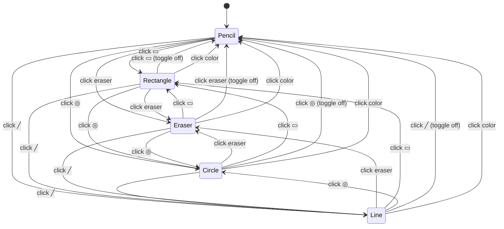
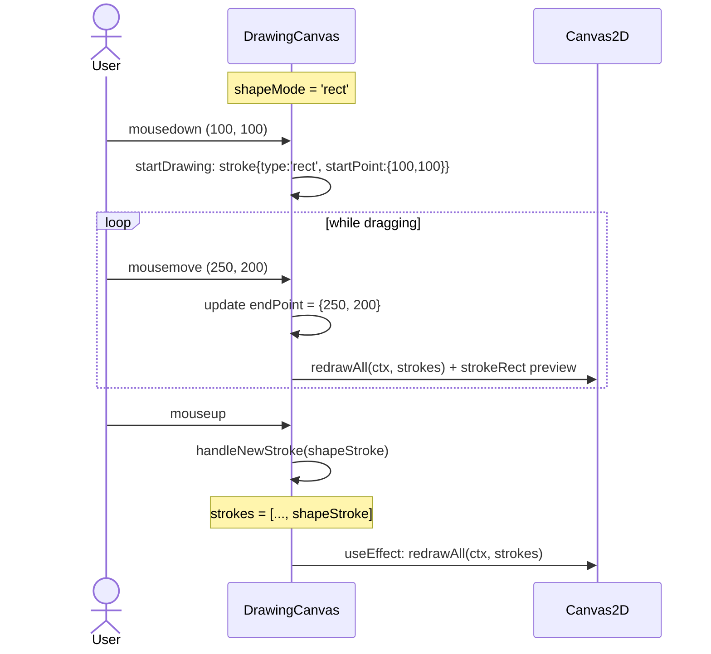

# Tech Spec: Shape Tools

**Status**: Planned
**Feature**: #7 — Shape Tools (Rectangle, Circle, Line)
**Date**: 2026-07-05

## 1. Overview

Add rectangle, circle, and line drawing tools to Scribble. These complement
the existing freehand pencil, brush, and eraser by letting users draw precise
geometric shapes. Each shape tool uses a click-and-drag interaction: the user
presses at the start point, drags to define the shape bounds, and a live
preview renders in real time. On mouseup, the shape is finalized and stored
as a stroke in the `strokes[]` array — fully compatible with undo/redo and
`redrawAll()`.

Shapes in V1 are **outlined only** (stroke, no fill), use the current color
and brush size for line width, and store a compact `{ startPoint, endPoint }`
representation instead of a full `points[]` array. This keeps strokes small
and enables potential future editing (resize handles, fill toggles).

No backend changes are required — this is a purely client-side feature.

## 2. Requirements

| ID   | Requirement |
|------|-------------|
| R7.1 | **Rectangle tool** — Click and drag to draw an outlined rectangle. Bounding box defined by diagonally opposite corners (startPoint → endPoint). Uses current color and brush size for stroke width. |
| R7.2 | **Circle tool** — Click and drag to draw an outlined circle (ellipse). The bounding rectangle defined by startPoint → endPoint determines the ellipse dimensions. Uses current color and brush size for stroke width. |
| R7.3 | **Line tool** — Click and drag to draw a straight line segment from startPoint to endPoint. Uses current color and brush size. |
| R7.4 | **Live preview** — While dragging, a temporary preview of the shape is rendered on the canvas in real time so the user can see the final result before committing. |
| R7.5 | **Toolbar buttons** — Three buttons in the ColorToolbar sidebar (one per shape: □ ○ ╱) for switching to each shape tool. These sit between the eraser toggle and the color swatches. Only one shape tool can be active at a time. |
| R7.6 | **Tool exclusivity** — Selecting a shape tool exits eraser mode. Selecting the eraser exits shape mode (returns to pencil). Selecting a color exits shape mode (returns to pencil). Clicking the active shape button again deselects it (returns to pencil). |
| R7.7 | **Shape stroke storage** — Completed shapes are stored in `strokes[]` as `{ type, startPoint, endPoint, color, lineWidth }` objects. No `points[]` array. Undo/redo handles these identically to draw/erase strokes. |
| R7.8 | **redrawAll integration** — `redrawAll()` replays shape strokes using the Canvas 2D API (`strokeRect`, `ellipse` + `stroke`, `moveTo`/`lineTo` + `stroke`). Shapes replay in chronological order intermixed with draw and erase strokes. |
| R7.9 | **Undo/redo compatibility** — Shape strokes participate in undo/redo identically to freehand strokes. Undoing a shape removes it; redoing restores it with its original type, dimensions, color, and line width. |
| R7.10 | **Mouse + touch parity** — Shape drawing works identically with both mouse and touch input, following the same `preventDefault()` pattern used by freehand drawing. |

## 3. Data Model

### 3.1 Stroke Type Comparison

| Field         | Draw stroke           | Erase stroke          | Shape stroke                          |
|---------------|-----------------------|-----------------------|---------------------------------------|
| `type`        | *(absent/implicit)*   | `'erase'`             | `'rect'`, `'circle'`, or `'line'`    |
| `points`      | `[{x,y}, ...]`        | `[{x,y}, ...]`        | *(absent)*                            |
| `startPoint`  | *(absent)*            | *(absent)*            | `{x, y}`                              |
| `endPoint`    | *(absent)*            | *(absent)*            | `{x, y}`                              |
| `color`       | `'#7c3aed'`           | *(absent)*            | `'#7c3aed'`                           |
| `lineWidth`   | `3`                   | *(absent)*            | `3`                                   |
| `eraserSize`  | *(absent)*            | `15`                  | *(absent)*                            |
| `filled`      | *(absent)*            | *(absent)*            | `false` (V1, always outlined)         |

### 3.2 Example Shape Strokes

```js
// Rectangle
{ type: 'rect', startPoint: { x: 50, y: 50 }, endPoint: { x: 200, y: 150 }, color: '#3b82f6', lineWidth: 3, filled: false }

// Circle
{ type: 'circle', startPoint: { x: 100, y: 80 }, endPoint: { x: 300, y: 280 }, color: '#ef4444', lineWidth: 5, filled: false }

// Line
{ type: 'line', startPoint: { x: 10, y: 20 }, endPoint: { x: 400, y: 300 }, color: '#000000', lineWidth: 2, filled: false }
```

### 3.3 Why startPoint/endPoint Instead of points[]

- **Compactness**: Two coordinate pairs vs. potentially hundreds of objects.
- **Semantic clarity**: A rectangle IS defined by diagonal corners; a line IS defined by endpoints.
- **Future editing**: Resize handles and fill toggles are trivial with explicit geometry.
- **Correctness**: A points[]-based rectangle would be a stair-stepped polyline, not a crisp rectangle.

## 4. Tool Mode System

### 4.1 State

| State          | Type                              | Default | Description                                    |
|----------------|-----------------------------------|---------|------------------------------------------------|
| `eraserMode`   | `boolean`                         | `false` | Existing — eraser toggle                       |
| `shapeMode`    | `'rect' \| 'circle' \| 'line' \| null` | `null` | Which shape tool is active, or `null` = pencil |

### 4.2 State Transitions

```
Pencil (default)           → Click shape button  →  shapeMode = type, eraserMode = false
Shape mode active          → Click eraser         →  eraserMode = true, shapeMode = null
Eraser mode active         → Click shape button   →  shapeMode = type, eraserMode = false
Shape mode active          → Click same button    →  shapeMode = null (toggle off → pencil)
Shape mode active          → Click different btn  →  shapeMode = new type (switch)
Any non-pencil mode        → Click color          →  shapeMode = null, eraserMode = false (→ pencil)
```

### 4.3 DrawingCanvas Tool Resolution

```js
const startDrawing = (clientX, clientY) => {
  const point = getPoint(clientX, clientY);
  isDrawingRef.current = true;
  lastPointRef.current = point;

  if (eraserModeRef.current) {
    currentStrokeRef.current = { type: 'erase', points: [point], eraserSize: eraserSizeRef.current };
  } else if (shapeModeRef.current) {
    currentStrokeRef.current = {
      type: shapeModeRef.current, startPoint: point, endPoint: point,
      color: colorRef.current, lineWidth: brushSizeRef.current, filled: false,
    };
  } else {
    currentStrokeRef.current = { points: [point], color: colorRef.current, lineWidth: brushSizeRef.current };
  }
};
```

## 5. Drawing Flow

### 5.1 Sequence

```
mousedown → startDrawing: record startPoint
mousemove → drawShapePreview: update endPoint, redrawAll + draw preview on top
mouseup   → endDrawing → handleNewStroke(completedStroke)
```

### 5.2 Preview Rendering

```js
const drawShapePreview = (ctx, stroke) => {
  const { startPoint, endPoint, type, color, lineWidth } = stroke;
  ctx.save();
  ctx.strokeStyle = color;
  ctx.lineWidth = lineWidth;
  ctx.lineCap = 'butt';
  ctx.lineJoin = 'miter';
  const x = Math.min(startPoint.x, endPoint.x);
  const y = Math.min(startPoint.y, endPoint.y);
  const w = Math.abs(endPoint.x - startPoint.x);
  const h = Math.abs(endPoint.y - startPoint.y);

  switch (type) {
    case 'rect': ctx.strokeRect(x, y, w, h); break;
    case 'circle':
      ctx.beginPath();
      ctx.ellipse(x + w / 2, y + h / 2, w / 2, h / 2, 0, 0, Math.PI * 2);
      ctx.stroke();
      break;
    case 'line':
      ctx.beginPath();
      ctx.moveTo(startPoint.x, startPoint.y);
      ctx.lineTo(endPoint.x, endPoint.y);
      ctx.stroke();
      break;
  }
  ctx.restore();
};
```

## 6. Redraw Integration

`redrawAll()` adds a new branch for shape types:

```
if (stroke.type === 'erase')     → destination-out erasure (unchanged)
else if (stroke.type is shape)   → strokeRect / ellipse / line (NEW)
else if (stroke.points)          → freehand draw (unchanged, now guarded)
```

Shape strokes use `lineCap = 'butt'`, `lineJoin = 'miter'` for crisp geometric corners.

## 7. Component Changes

### NEW Files
- `client/src/components/toolbar/ShapeToolToggle.jsx` — Individual shape button
- `client/src/components/toolbar/ShapeToolsGroup.jsx` — Radio group of 3 shape buttons
- `client/src/components/toolbar/__tests__/ShapeToolToggle.test.jsx`
- `client/src/components/toolbar/__tests__/ShapeToolsGroup.test.jsx`

### MODIFIED Files
- `client/src/components/HomePage.jsx` — shapeMode state + ref, exclusivity handlers
- `client/src/components/toolbar/ColorToolbar.jsx` — render ShapeToolsGroup, new props
- `client/src/components/canvas/DrawingCanvas.jsx` — shape drawing, preview, redrawAll branch
- Test files for DrawingCanvas, HomePage

## 8. Toolbar Layout

Top to bottom on desktop:
1. UndoRedoToggle
2. EraserToggle
3. **ShapeToolsGroup** (▭ ◎ ╱) ← NEW
4. Separator
5. 12 Color swatches
6. Separator
7. BrushSizeSelector
8. Custom color picker

## 9. Edge Cases

| Scenario | Expected Behavior |
|----------|-------------------|
| Single-click (no drag) | Zero-size shape stored; renders as nothing for rect/circle, dot for line |
| Shape extending off-canvas | Canvas auto-clips; stored coords may be out-of-bounds — harmless |
| Any drag direction | Bounding-box math handles all quadrants |
| Undo/redo shapes | Identical to freehand — shapes in strokes[], undoStack |
| Eraser over shape | Interleaved replay handles correctly |
| Switch tool mid-drag | isDrawingRef blocks; stroke completes with original type |
| Canvas resize during drag | Preview lost (same as freehand); completed shapes survive |
| Shape stroke width | Uses brushSizeRef, always ≥ 1 |

## 10. Test Strategy

### Unit Tests — ShapeToolToggle (7 tests)
Render, onClick, active/inactive styling, aria attributes, keyboard focus

### Unit Tests — ShapeToolsGroup (6 tests)
3 buttons rendered, exclusivity, deselect, switching

### Integration Tests — DrawingCanvas (14 tests)
Shape stroke format, redrawAll shape replay, mixed strokes, preview flow, undo/redo compatibility, eraser+shape interaction

### Integration Tests — HomePage (7 tests)
State management, exclusivity enforcement, ref sync

### Regression
All 295 existing tests must continue to pass.

## 11. Architecture Diagrams

### Tool Mode State Machine



### Shape Drawing Sequence



## 12. Out of Scope

- Filled shapes (V1 outlined only; `filled: false` reserved)
- Shape selection/editing (move, resize)
- Shift-constrain (perfect squares/circles)
- Rounded rectangles
- Dash/dot stroke styles
- Dedicated preview canvas overlay (redrawAll-based for V1)
- Shape-specific line width (uses global brush size)

## 13. Summary of Key Decisions

| Decision | Choice | Rationale |
|----------|--------|-----------|
| Shape storage | `{ type, startPoint, endPoint }` (no points[]) | Compact, semantically correct, future-edit-friendly |
| Tool exclusivity | `eraserMode` bool + `shapeMode` string | Simple state model, easy enforcement |
| Preview technique | redrawAll + preview draw per frame | Simple, correct, no overlay canvas |
| Filled vs outlined | Outlined only (V1) | Matches pencil aesthetic |
| Shape line width | Uses brush size | Consistent, no new UI |
| Undo/redo | Inherits existing machinery | Zero new code |
| Line caps | butt + miter (not round) | Sharp geometric corners |
