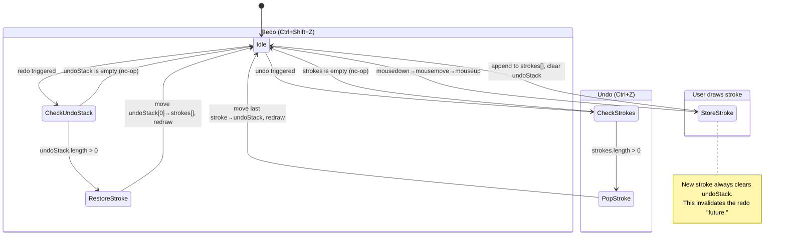
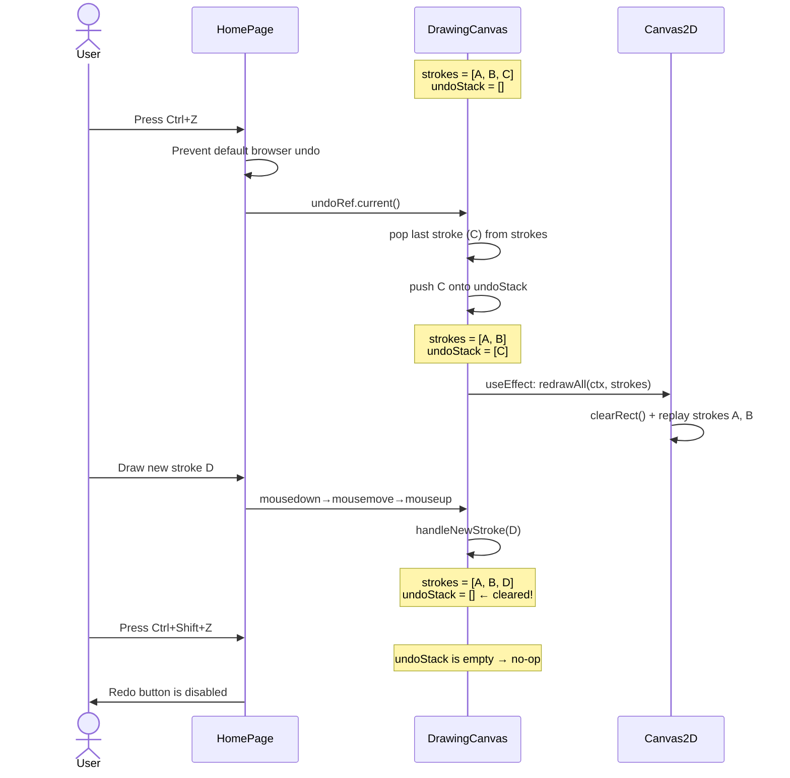

# Tech Spec: Undo/Redo

**Status**: Planned
**Feature**: #6 — Undo/Redo
**Date**: 2026-07-05

## 1. Overview

Add undo and redo capabilities to Scribble so users can revert mistaken strokes
and restore them if needed. Each undo/redo operation works on **whole strokes**
(the full mousedown→mousemove→mouseup or touch equivalent sequence). Undo
removes the last stroke from the canvas; redo restores a previously undone
stroke. A keyboard shortcut (Ctrl+Z / Ctrl+Shift+Z) and toolbar buttons are
provided. Drawing a new stroke after undoing clears the redo stack — you cannot
redo into a "different future."

Eraser strokes participate in undo/redo identically to draw strokes; no special
handling is required because both are stored uniformly in the `strokes` array.

No backend changes are required — this is a purely client-side feature.

## 2. Requirements

| ID    | Requirement |
|-------|-------------|
| R6.1  | **Undo** — Removes the most recent stroke from the canvas and redraws. An undo stack tracks removed strokes for potential redo. |
| R6.2  | **Redo** — Restores the most recently undone stroke, reappending it to the canvas. |
| R6.3  | **Keyboard shortcuts** — `Ctrl+Z` (undo), `Ctrl+Shift+Z` or `Ctrl+Y` (redo). Mac: `Cmd+Z`, `Cmd+Shift+Z`. The browser's default undo behavior within the canvas area must be prevented. |
| R6.4  | **Toolbar buttons** — Undo and Redo icon buttons in the ColorToolbar sidebar, visually disabled when their respective stacks are empty. |
| R6.5  | **Redo stack invalidation** — Drawing a new stroke after undoing clears the redo (undo) stack entirely. The user cannot redo strokes from a discarded timeline branch. |
| R6.6  | **Whole-stroke granularity** — Undo/redo operates on complete strokes, not individual points within a stroke. One stroke = one undo step. |
| R6.7  | **Eraser stroke parity** — Eraser strokes (`type: 'erase'`) are undoable/redoable exactly like draw strokes. |
| R6.8  | **Canvas resize resilience** — After any undo/redo, `redrawAll()` replays only the `strokes` array, which always reflects the correct state. No separate resize handling needed. |

## 3. Technical Approach

### 3.1 State Model

Undo/redo state lives in `DrawingCanvas` alongside the existing `strokes` state.
This keeps the data and the undo/redo actions co-located and avoids unnecessary
prop drilling. The component exposes undo/redo functions via a callback ref
pattern so that `HomePage` can wire keyboard events to them.

**New state variables** in `DrawingCanvas`:

| State          | Type       | Initial | Description                                      |
|----------------|------------|---------|--------------------------------------------------|
| `strokes`      | `array`    | `[]`    | Already exists — the current stroke history       |
| `undoStack`    | `array`    | `[]`    | Strokes removed by undo, newest first. Acts as the redo stack. |

The `undoStack` is the **redo stack**. When the user undoes, the popped stroke
is pushed onto `undoStack`. When the user redoes, the popped stroke from
`undoStack` is pushed back onto `strokes`.

**Example state transitions:**

```
Initial:              strokes=[A, B, C]  undoStack=[]
After undo (Ctrl+Z):  strokes=[A, B]     undoStack=[C]
After undo again:     strokes=[A]        undoStack=[B, C]   ← top of stack = most recently undone
After redo:           strokes=[A, B]     undoStack=[C]
After new stroke D:   strokes=[A, B, D]  undoStack=[]       ← redo history cleared
```

### 3.2 Undo / Redo Functions

All undo/redo logic is implemented as callbacks inside `DrawingCanvas`:

```js
const undo = useCallback(() => {
  setStrokes((prev) => {
    if (prev.length === 0) return prev;
    const lastStroke = prev[prev.length - 1];
    setUndoStack((s) => [lastStroke, ...s]); // push to top of undo stack
    return prev.slice(0, -1);
  });
}, []);

const redo = useCallback(() => {
  setUndoStack((prevUndo) => {
    if (prevUndo.length === 0) return prevUndo;
    const restoredStroke = prevUndo[0];
    setStrokes((prevStrokes) => [...prevStrokes, restoredStroke]);
    return prevUndo.slice(1); // pop from undo stack
  });
}, []);

const handleNewStroke = useCallback((completedStroke) => {
  setStrokes((prev) => [...prev, completedStroke]);
  setUndoStack([]); // invalidate redo history on new stroke
}, []);
```

> **Note on `setUndoStack([])`:** This is the redo stack invalidation from
> R6.5. When the user draws a new stroke (after potentially undoing some),
> the redo/undo stack is cleared because the new stroke creates a divergent
> timeline.

### 3.3 Redraw After Undo/Redo

Every `setStrokes` call triggers a re-render. A `useEffect` watches the
`strokes` array and calls `redrawAll()` whenever it changes:

```js
useEffect(() => {
  const ctx = ctxRef.current;
  if (ctx) redrawAll(ctx, strokes);
}, [strokes, redrawAll]);
```

This replaces the current pattern where `redrawAll` is triggered indirectly
by adding a stroke. With undo/redo, we need explicit reactivity on the
`strokes` array.

> **⚠️ Important:** The current codebase triggers redraws via `setStrokes`
> in `endDrawing`, which causes the canvas to re-render. However, there is
> currently no dedicated `useEffect` watching `strokes` for redraw.
> With undo/redo, we need to add one. This also means the `endDrawing`
> function should NOT call `redrawAll` directly — it should only update
> state and let the effect handle the redraw. The drawing of the current
> stroke's visual feedback (the `draw()` function painting directly to
> canvas in real time) remains unchanged.

### 3.4 Exposing Undo/Redo to HomePage

The `undo` and `redo` functions and the stack emptiness booleans need to be
accessible from `HomePage` for keyboard event binding and button rendering.

**Pattern: callback ref**

`DrawingCanvas` accepts callback props to expose its undo/redo functions:

```js
// HomePage creates refs for undo/redo functions
const undoRef = useRef(null);
const redoRef = useRef(null);

// DrawingCanvas assigns them on mount via prop callbacks
<DrawingCanvas
  onUndoReady={(fn) => { undoRef.current = fn; }}
  onRedoReady={(fn) => { redoRef.current = fn; }}
/>
```

This mirrors the existing `colorRef` / `eraserModeRef` pattern already
used in the codebase. This is the idiomatic approach for the project.

### 3.5 Keyboard Event Handling

`HomePage` adds a `keydown` event listener at the document level that checks
for undo/redo key combos:

```
Ctrl+Z / Cmd+Z          → undoRef.current?.()
Ctrl+Shift+Z / Cmd+Shift+Z → redoRef.current?.()
Ctrl+Y                  → redoRef.current?.()
```

The handler must call `e.preventDefault()` to stop the browser's native undo
behavior. The listener should be attached to `window` or `document` to work
even when the canvas is not focused. It must NOT intercept undo when the
user is typing in an INPUT, TEXTAREA, or contenteditable element.

```js
useEffect(() => {
  const handleKeyDown = (e) => {
    const target = e.target;
    if (target.tagName === 'INPUT' || target.tagName === 'TEXTAREA' || target.isContentEditable) {
      return;
    }
    const mod = e.metaKey || e.ctrlKey;
    if (!mod) return;

    if (e.key === 'z' && e.shiftKey) {
      e.preventDefault();
      redoRef.current?.();
    } else if (e.key === 'z') {
      e.preventDefault();
      undoRef.current?.();
    } else if (e.key === 'y') {
      e.preventDefault();
      redoRef.current?.();
    }
  };

  window.addEventListener('keydown', handleKeyDown);
  return () => window.removeEventListener('keydown', handleKeyDown);
}, []);
```

## 4. Data Flow

```
User presses Ctrl+Z (or clicks Undo button)
  → undoRef.current()
    → setStrokes(prev => prev without last stroke)
    → setUndoStack(s => [lastStroke, ...s])
    → useEffect strokes watch triggers redrawAll(ctx, strokes)
    → setCanUndo / setCanRedo update button disabled states

User presses Ctrl+Shift+Z (or clicks Redo button)
  → redoRef.current()
    → setUndoStack(prev => prev without first item)
    → setStrokes(prev => [...prev, restoredStroke])
    → useEffect strokes watch triggers redrawAll(ctx, strokes)

User draws a new stroke (mouseup/touchend → endDrawing)
  → handleNewStroke(completedStroke)
    → setStrokes(prev => [...prev, completedStroke])
    → setUndoStack([])                              ← redo history cleared
    → useEffect strokes watch triggers redrawAll(ctx, strokes)
```

### Mermaid: Undo/Redo State Machine



## 5. API Design

No REST endpoints or WebSocket events are added. This is a client-only
feature. Undo/redo is local to the current drawing session.

When collaborative features are added in the future, undo/redo will need
to be scoped per-user (each user undoes their own strokes) or per-session
(with operational transforms). That is out of scope for this feature.

## 6. Database Schema

No database changes are needed. Strokes and undo history are held in React
component state only and are not persisted to the server.

## 7. Files

### NEW

| File | Purpose |
|------|---------|
| `client/src/components/toolbar/UndoRedoToggle.jsx` | Undo + Redo icon buttons with disabled state when respective stacks are empty |

### MODIFY

| File | Changes |
|------|---------|
| `client/src/components/canvas/DrawingCanvas.jsx` | Add `strokes`-reactive `useEffect` for `redrawAll`; add `undoStack` state; implement `undo()`, `redo()`, `handleNewStroke()`; expose undo/redo functions + canUndo/canRedo via callback refs; modify `endDrawing` to use `handleNewStroke` instead of direct `setStrokes` |
| `client/src/components/HomePage.jsx` | Add keyboard event listener (`keydown`) for Ctrl+Z / Ctrl+Shift+Z / Ctrl+Y; create `undoRef` and `redoRef`; pass `onUndoReady` / `onRedoReady` callbacks to `DrawingCanvas`; pass `canUndo`/`canRedo` + handler props to `ColorToolbar` |
| `client/src/components/toolbar/ColorToolbar.jsx` | Render `UndoRedoToggle` component with undo/redo handlers and disabled states; accept new props |
| `client/src/components/canvas/__tests__/DrawingCanvas.test.jsx` | Add tests for undo, redo, redo stack invalidation on new stroke, empty stack edge cases |
| `client/src/components/__tests__/HomePage.test.jsx` | Add tests for keyboard shortcut handling, undo/redo button integration |
| `client/src/components/toolbar/__tests__/UndoRedoToggle.test.jsx` | Unit tests for the UndoRedoToggle component |

## 8. Dependencies

No new Python or JavaScript packages are needed. All functionality uses
standard React `useState` / `useCallback` / `useEffect` and native DOM
keyboard events.

## 9. Design Considerations

### 9.1 Undo/Redo Button Placement

The Undo and Redo buttons should sit in the `ColorToolbar` sidebar, positioned
**below** the Eraser toggle and **above** the color swatches (at the top of
the toolbar). This matches the convention in most drawing applications where
action buttons (undo, redo, save) are at the top of the toolbar.

Button layout:
- Side by side horizontally on desktop (vertical sidebar)
- Side by side horizontally on mobile (horizontal toolbar strip)
- Both are the same size as the EraserToggle button
- Use standard icons: ↶ for Undo, ↷ for Redo (as SVG icons)
- **Disabled state**: Gray/muted styling with `opacity-50` and
  `pointer-events-none` when the respective stack is empty
- **Enabled state**: Same visual treatment as the EraserToggle in active mode
  (with hover/active transitions)

### 9.2 Maximum History Depth

**Recommendation for V1:** No limit on undo depth. The `strokes` array stores
only point coordinates (a few floats per point) and metadata, so memory
pressure is minimal even with thousands of strokes.

### 9.3 Active Color and Eraser Handling

Undo/redo does not interact with the currently active tool (pencil/eraser)
or color. When a stroke is undone:
- The stroke is removed from the canvas and pushed to the undo stack
- The active color, eraser mode, and brush/eraser sizes remain unchanged

When a stroke is redone:
- The stroke is restored to the canvas with its original properties (color,
  lineWidth, eraserSize) because those are stored on the stroke object itself
- `redrawAll()` replays the stroke with its stored properties

### 9.4 Visual Feedback

No animation for undo/redo in V1. The canvas is redrawn synchronously via
`redrawAll()`. The visual effect is a near-instant replacement of the canvas
content.

### 9.5 Accessibility

Undo/Redo buttons must have:
- `aria-label="Undo (Ctrl+Z)"` and `aria-label="Redo (Ctrl+Shift+Z)"`
- `aria-disabled="true"` when the stack is empty
- `role="button"` and be keyboard-focusable
- Visible focus ring matching the existing `focus-visible:ring` pattern

## 10. Edge Cases

| Scenario | Expected Behavior |
|----------|-------------------|
| **Undo on empty canvas (0 strokes)** | No-op. Undo button is disabled. |
| **Redo with empty undo stack** | No-op. Redo button is disabled. |
| **Rapid Ctrl+Z presses** | Each press pops one stroke. Functional updaters prevent stale closures. |
| **Draw after undoing 3 strokes** | The new stroke is appended to `strokes`, the `undoStack` is cleared. The 3 undone strokes are permanently lost. |
| **Undo, then redo, then undo again** | Works cyclically. The undo stack is only cleared on a new drawing action. |
| **Undo all strokes, then redo all** | Canvas goes blank, then all strokes are restored in original order. |
| **Canvas resize during undo/redo sequence** | `redrawAll()` replays only the current `strokes` array. Fully transparent. |
| **Eraser stroke undo** | An erase stroke is removed from the canvas on undo. Redoing it re-applies the erasure. |
| **Undo while a stroke is in progress (mid-draw)** | Keyboard shortcuts blocked during active drawing. |
| **Browser undo (Ctrl+Z in a text input outside canvas)** | Handler checks event target and skips if INPUT, TEXTAREA, or contentEditable. |
| **Mac vs. Windows modifier keys** | `e.metaKey \|\| e.ctrlKey` covers both. |
| **Touch-only devices** | Toolbar buttons provide the sole undo/redo mechanism. |
| **New stroke with zero-length movement** | Single-point strokes are still undoable/redoable. |

## 11. Test Strategy

### 11.1 Unit Tests — UndoRedoToggle

| Test | What it verifies |
|------|------------------|
| Renders Undo and Redo buttons | Both buttons present in DOM |
| Undo button calls onUndo handler | `fireEvent.click` triggers handler |
| Redo button calls onRedo handler | `fireEvent.click` triggers handler |
| Undo button disabled when `canUndo={false}` | `aria-disabled="true"` |
| Redo button disabled when `canRedo={false}` | `aria-disabled="true"` |
| Buttons enabled when flags are true | Neither disabled |
| Accessible labels present | `aria-label` includes shortcut info |
| Focus-visible ring on keyboard nav | Focus ring visible on Tab |

### 11.2 Integration Tests — DrawingCanvas

| Test | What it verifies |
|------|------------------|
| Undo removes last stroke and redraws | Draw 2 strokes, undo, verify strokes length 1 |
| Redo restores undone stroke | Draw 1, undo, redo, verify restored |
| Undo on empty canvas is no-op | Undo with 0 strokes, no error |
| Redo with empty undo stack is no-op | Redo with empty stack, no error |
| New stroke clears undo stack | Draw, undo, draw new, verify undoStack empty |
| Multiple undo/redo cycles | Draw 3, undo 2, redo 1, verify correct |
| Eraser stroke undo/redo | Pencil + eraser strokes undo/redo correctly |
| Canvas resize after undo | Undo, resize, verify redraw correct |
| Mid-stroke undo blocked | isDrawingRef=true, undo no-ops |
| Undo via Ctrl+Z on canvas target | Keyboard event triggers undo |

### 11.3 Integration Tests — HomePage

| Test | What it verifies |
|------|------------------|
| Ctrl+Z triggers undo | Keydown simulation calls undo |
| Ctrl+Shift+Z triggers redo | Keydown simulation calls redo |
| Ctrl+Y triggers redo | Keydown simulation calls redo |
| Cmd+Z on Mac | metaKey+Z calls undo |
| Undo button in toolbar wired | Click undo button, stroke count decreases |
| Redo button in toolbar wired | Undo then click redo, stroke restored |
| Buttons disabled when stacks empty | Fresh load, both disabled |
| Ctrl+Z not intercepted in input | Focus input, Ctrl+Z, no canvas undo |
| Unrelated keys do nothing | Random key, no side effects |

### 11.4 Manual Verification Checklist

- [ ] Undo (Ctrl+Z) removes last stroke, canvas updates immediately
- [ ] Redo (Ctrl+Shift+Z) restores last undone stroke
- [ ] Drawing after undo clears redo history
- [ ] Undo button disabled when no strokes exist
- [ ] Redo button disabled when nothing undone
- [ ] Eraser strokes undoable/redoable
- [ ] Canvas resize doesn't break undo/redo
- [ ] Rapid undo/redo no visual glitches
- [ ] Keyboard shortcuts don't interfere with text inputs
- [ ] Mac Cmd+Z / Cmd+Shift+Z work
- [ ] All existing tests still pass (regression)
- [ ] Touch: toolbar buttons work for undo/redo

## 12. Out of Scope

- Collaborative undo/redo (future)
- Persistent undo history (lost on page refresh)
- Undo history visualizer / timeline
- Per-stroke redo branching
- Undo grouping (rapid strokes into one step)
- Undo across network
- Undo animation

## 13. Risks

| Risk | Mitigation |
|------|------------|
| **Performance with large stroke counts** | V1 stroke counts expected modest. Future: canvas snapshot optimization. |
| **Stale closure in keyboard handler** | Functional updaters (`setStrokes((prev) => ...)`) used consistently. |
| **Browser default undo behavior conflict** | Handler checks `e.target.tagName`, skips INPUT/TEXTAREA. |
| **Race: drawing while undo executes** | `isDrawingRef.current` guard blocks drawing during undo/redo. |

## 14. Architecture Diagram



## 15. Summary of Key Design Decisions

| Decision | Choice | Rationale |
|----------|--------|-----------|
| State location | `DrawingCanvas` | Co-located with `strokes`; no prop-drilling benefit from lifting |
| Granularity | Whole strokes | Matches user expectation; one mousedown→mouseup = one action |
| Max undo depth | Unlimited (V1) | Memory per stroke is tiny; limit can be added later |
| Redo stack model | `undoStack` array | Simple; popped strokes pushed onto it; new stroke clears it |
| Redraw trigger | `useEffect` watching `strokes` | Reactive; every state change causes correct redraw |
| Exposing to HomePage | Callback ref pattern | Mirrors existing `colorRef` / `eraserModeRef` pattern |
| Keyboard event target | `window` level with input guard | Works without canvas focus; doesn't steal from text inputs |
| Eraser strokes | Same as draw strokes | Stored uniformly in `strokes`; `redrawAll` handles replay |
