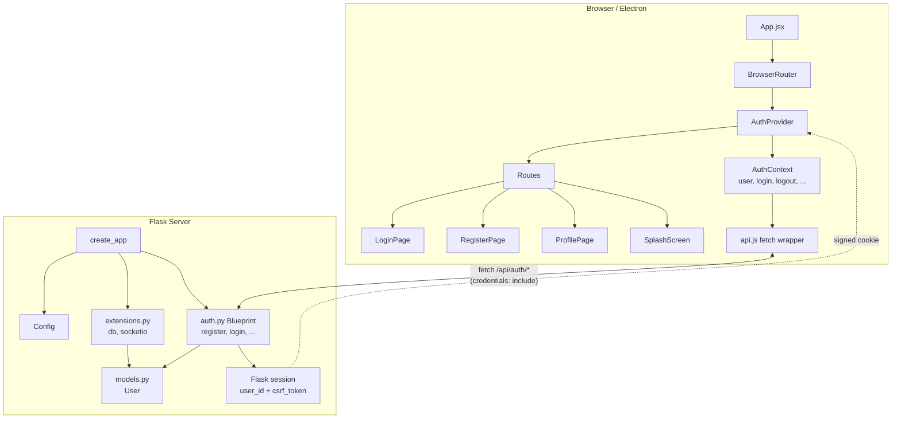

# Tech Spec: User Authentication & Profile System

**Status**: In Planning  
**Feature**: #2 — User Authentication & Profile System  
**Author**: Business Analyst  
**Date**: 2026-07-04

---

## 1. Overview

This feature adds user accounts to Scribble — allowing users to register, log in, manage their profile, and log out. Authentication is session-based (Flask signed cookies), not JWT — keeping the implementation straightforward. This is a prerequisite for all multi-user features (collaborative drawing, shared projects) because user identity must be established first.

### Why This Is Needed
- Users need persistent identities to associate drawings and projects with them.
- Real-time collaboration requires knowing who is who.
- Session-based auth is simpler to implement and debug than JWT for a SPA served from the same origin (production) or proxied (development).

### Authentication Model
- **Session-based**: Flask's built-in `session` object (signed cookie). On login, the user ID is stored in the session. On logout, the session is cleared.
- **Password hashing**: `werkzeug.security.generate_password_hash()` / `check_password_hash()` (already available as a Flask dependency).
- **CSRF protection**: A simple per-session CSRF token pattern using the `double-submit cookie` approach — the server sets a `csrf_token` in the session and the SPA reads it from a dedicated endpoint and includes it as an `X-CSRF-Token` header on state-changing requests.

---

## 2. User Stories

| ID | Role | Need | Acceptance Criteria |
|----|------|------|---------------------|
| US-2.1 | New User | Create an account | Visit `/register`, fill in name, username, email, password, confirm password. On success, automatically logged in and redirected to `/profile`. |
| US-2.2 | Returning User | Log into my account | Visit `/login`, enter username or email + password. On success, redirected to `/profile`. |
| US-2.3 | Authenticated User | View my profile | Visit `/profile` shows my name, username, email, and member-since date. |
| US-2.4 | Authenticated User | Change my password | On `/profile`, fill in current password, new password, confirm. On success, stay logged in. |
| US-2.5 | Authenticated User | Change my email | On `/profile`, enter new email and current password. On success, profile updates. |
| US-2.6 | Authenticated User | Change my display name or username | On `/profile`, update name and/or username. Username must still be unique. |
| US-2.7 | Authenticated User | Log out of my account | Click "Logout", session is cleared, redirected to `/login`. |
| US-2.8 | Unauthenticated User | Be prevented from accessing protected pages | Visiting `/profile` while logged out redirects to `/login`. |
| US-2.9 | Logged-in User | Be redirected away from auth pages | Visiting `/login` or `/register` while already authenticated redirects to `/profile`. |

---

## 3. Technical Approach

### 3.1 Server-Side Architecture

The current `server/app.py` is a single-file Flask app factory with inline routes. This feature introduces modularity:

```
server/
├── app.py              # Modified: create_app() imports & registers blueprints, db
├── extensions.py       # NEW: db = SQLAlchemy(), socketio = SocketIO()
├── models.py           # NEW: User model
├── auth.py             # NEW: auth blueprint with all /api/auth/* routes
├── config.py           # NEW: Config classes
├── requirements.txt    # Modified: add flask-sqlalchemy
├── pyproject.toml      # Modified: add flask-sqlalchemy
└── .env.example        # Modified: add SECRET_KEY, DATABASE_URL
```

#### 3.1.1 Extensions Module (`server/extensions.py`)

```python
from flask_sqlalchemy import SQLAlchemy
from flask_socketio import SocketIO

db = SQLAlchemy()
socketio = SocketIO()
```

Both are instantiated at module level (unbound) and initialized with `init_app(app)` inside `create_app()`. This avoids circular imports — `models.py` imports `db` from `extensions.py`, and `app.py` imports both.

#### 3.1.2 Config Module (`server/config.py`)

```python
import os

class Config:
    SECRET_KEY = os.getenv("SECRET_KEY", "dev-secret-change-in-production")
    SQLALCHEMY_DATABASE_URI = os.getenv(
        "DATABASE_URL", "sqlite:///" + os.path.join(os.path.dirname(__file__), "instance", "scribble.db")
    )
    SQLALCHEMY_TRACK_MODIFICATIONS = False
    SESSION_COOKIE_HTTPONLY = True
    SESSION_COOKIE_SAMESITE = "Lax"
```

#### 3.1.3 User Model (`server/models.py`)

```python
from datetime import datetime, timezone
from extensions import db

class User(db.Model):
    __tablename__ = "users"

    id = db.Column(db.Integer, primary_key=True)
    name = db.Column(db.String(100), nullable=False)
    username = db.Column(db.String(50), unique=True, nullable=False, index=True)
    email = db.Column(db.String(120), unique=True, nullable=False, index=True)
    password_hash = db.Column(db.String(256), nullable=False)
    created_at = db.Column(db.DateTime, default=lambda: datetime.now(timezone.utc))

    def set_password(self, password: str) -> None:
        from werkzeug.security import generate_password_hash
        self.password_hash = generate_password_hash(password)

    def check_password(self, password: str) -> bool:
        from werkzeug.security import check_password_hash
        return check_password_hash(self.password_hash, password)

    def to_dict(self) -> dict:
        return {
            "id": self.id,
            "name": self.name,
            "username": self.username,
            "email": self.email,
            "created_at": self.created_at.isoformat(),
        }
```

**Constraints:**
- `username`: unique, max 50 chars, indexed for login lookup
- `email`: unique, max 120 chars, indexed for login lookup
- `password_hash`: never exposed in API responses (omitted from `to_dict()`)

#### 3.1.4 Auth Blueprint (`server/auth.py`)

A Flask `Blueprint` at prefix `/api/auth` with the following routes:

| Method | Path | Handler | Auth Required |
|--------|------|---------|---------------|
| POST | `/api/auth/register` | `register()` | No |
| POST | `/api/auth/login` | `login()` | No |
| POST | `/api/auth/logout` | `logout()` | Yes |
| GET | `/api/auth/me` | `get_current_user()` | Yes |
| PUT | `/api/auth/password` | `change_password()` | Yes |
| PUT | `/api/auth/email` | `change_email()` | Yes |
| PUT | `/api/auth/profile` | `update_profile()` | Yes |
| GET | `/api/auth/csrf` | `get_csrf_token()` | No |

**Decorators:**
- `@require_auth` — checks `session.get("user_id")`, returns 401 if missing
- `@require_csrf` — validates `X-CSRF-Token` header against `session["csrf_token"]` for POST/PUT/DELETE requests

#### 3.1.5 App Factory Changes (`server/app.py`)

The `create_app()` function shall be modified to:
1. Load configuration from `config.py`
2. Initialize extensions (`db.init_app(app)`, `socketio.init_app(app)`)
3. Register the `auth` blueprint
4. Create the database tables on first request (using `with app.app_context(): db.create_all()`)
5. Keep existing CORS, static serving, SocketIO, and SPA fallback logic

The module-level `app, socketio = create_app()` call at the bottom stays.

#### 3.1.6 CSRF Protection

Since the React SPA makes `fetch()` calls, standard Flask form CSRF doesn't apply. We use a lightweight approach:

1. **GET `/api/auth/csrf`** generates/returns a CSRF token stored in the Flask session.
2. The frontend calls this endpoint on app load and includes the token as `X-CSRF-Token` header in all state-changing requests.
3. The `@require_csrf` decorator on POST/PUT routes compares the header value against `session["csrf_token"]`.
4. CSRF token is regenerated on login (session rotation) to prevent session fixation.

For same-origin production deployments, this is adequate. For future cross-origin deployments, this can be upgraded.

---

### 3.2 Frontend Architecture

```
client/src/
├── App.jsx                    # MODIFIED: BrowserRouter, Routes, AuthProvider wrapper
├── main.jsx                   # Unchanged
├── index.css                  # Unchanged
├── contexts/
│   └── AuthContext.jsx         # NEW: createContext, AuthProvider, useAuth hook
├── components/
│   ├── SplashScreen.jsx        # Existing (no changes)
│   ├── auth/
│   │   ├── LoginPage.jsx       # NEW: login form page
│   │   ├── RegisterPage.jsx    # NEW: registration form page
│   │   ├── ProtectedRoute.jsx  # NEW: redirect wrapper
│   │   └── GuestRoute.jsx      # NEW: inverse of ProtectedRoute (redirect if logged in)
│   ├── layout/
│   │   └── Navbar.jsx          # NEW: top nav with logo, profile link, logout button
│   └── profile/
│       └── ProfilePage.jsx     # NEW: user info display + change password/email forms
└── utils/
    └── api.js                  # NEW: fetch wrapper with CSRF and auth handling
```

#### 3.2.1 Auth Context (`contexts/AuthContext.jsx`)

Provides:
- `user` — current user object (null when not authenticated)
- `loading` — true during initial auth check (prevent flash of login page)
- `login(identifier, password)` — calls POST `/api/auth/login`, updates state
- `register(name, username, email, password)` — calls POST `/api/auth/register`
- `logout()` — calls POST `/api/auth/logout`, clears state
- `updateProfile(data)` — calls PUT `/api/auth/profile`, updates user state
- `changePassword(current, new)` — calls PUT `/api/auth/password`
- `changeEmail(newEmail, password)` — calls PUT `/api/auth/email`
- `refreshUser()` — calls GET `/api/auth/me` to re-fetch user (used on mount)

On app mount, `AuthProvider`:
1. Fetches the CSRF token (GET `/api/auth/csrf`)
2. Fetches the current user (GET `/api/auth/me`)
3. Sets `loading = false` when done

**Note:** The `SplashScreen` component can be shown while `loading === true` to avoid a jarring redirect.

#### 3.2.2 API Utility (`utils/api.js`)

```javascript
const API_BASE = '/api/auth';

async function apiRequest(path, options = {}) {
  const headers = {
    'Content-Type': 'application/json',
    ...options.headers,
  };
  
  // Include CSRF token for state-changing methods
  const csrfToken = getCsrfToken(); // from sessionStorage or memory
  if (csrfToken && ['POST', 'PUT', 'DELETE'].includes(options.method || 'GET')) {
    headers['X-CSRF-Token'] = csrfToken;
  }
  
  const response = await fetch(`${API_BASE}${path}`, {
    ...options,
    headers,
    credentials: 'include', // send cookies
  });
  
  if (!response.ok) {
    const error = await response.json().catch(() => ({ error: 'Request failed' }));
    throw new ApiError(response.status, error.error || error.message || 'Unknown error');
  }
  
  return response.json();
}

class ApiError extends Error {
  constructor(status, message) {
    super(message);
    this.status = status;
  }
}
```

#### 3.2.3 Routing (`App.jsx` modified)

```jsx
import { BrowserRouter, Routes, Route, Navigate } from 'react-router-dom';
import { AuthProvider } from './contexts/AuthContext';
import ProtectedRoute from './components/auth/ProtectedRoute';
import GuestRoute from './components/auth/GuestRoute';
import SplashScreen from './components/SplashScreen';
import LoginPage from './components/auth/LoginPage';
import RegisterPage from './components/auth/RegisterPage';
import ProfilePage from './components/profile/ProfilePage';

function App() {
  return (
    <BrowserRouter>
      <AuthProvider>
        <Routes>
          <Route path="/" element={<SplashScreen />} />
          <Route path="/login" element={<GuestRoute><LoginPage /></GuestRoute>} />
          <Route path="/register" element={<GuestRoute><RegisterPage /></GuestRoute>} />
          <Route path="/profile" element={<ProtectedRoute><ProfilePage /></ProtectedRoute>} />
          <Route path="*" element={<Navigate to="/" replace />} />
        </Routes>
      </AuthProvider>
    </BrowserRouter>
  );
}
```

#### 3.2.4 Protected & Guest Routes

**`ProtectedRoute.jsx`**: If `user` is null and `loading` is false, redirect to `/login`. Otherwise render children. While loading, show nothing (or a small spinner — SplashScreen is handled at the App level instead).

**`GuestRoute.jsx`**: If `user` is not null, redirect to `/profile`. Otherwise render children.

#### 3.2.5 Login Page (`components/auth/LoginPage.jsx`)

- Fields: username or email (single input label: "Username or Email"), password
- Error display area for wrong credentials / server errors
- Link to register page: "Don't have an account? Sign up"
- On submit: calls `login()` from AuthContext → on success, `navigate('/profile')`
- Form validation: both fields required, trimmed

#### 3.2.6 Register Page (`components/auth/RegisterPage.jsx`)

- Fields: name, username, email, password, confirm password
- Error display for:
  - Username already taken (409)
  - Email already taken (409)
  - Passwords don't match (client-side)
  - Validation errors (server-side: missing fields, password too short)
- Link to login page: "Already have an account? Log in"
- On submit: calls `register()` from AuthContext → on success, `navigate('/profile')`
- Form validation:
  - All fields required
  - Username: 3–50 chars, alphanumeric + underscores
  - Password: minimum 8 chars
  - Confirm password must match
  - Email: basic format check (contains `@`)

#### 3.2.7 Profile Page (`components/profile/ProfilePage.jsx`)

Three sections:

1. **User Info**: Displays name, username, email, member-since date. "Edit" button toggles inline editing of name and username (PUT `/api/auth/profile`).

2. **Change Email**: Form with new email + current password. Validates current password server-side.

3. **Change Password**: Form with current password, new password, confirm new password. Server validates current password is correct.

All forms on this page show success/error messages inline. Successful changes update the displayed user info via `refreshUser()`.

#### 3.2.8 Navbar (`components/layout/Navbar.jsx`)

- Left: "Scribble" logo text (links to `/`)
- Right: If authenticated → "Profile" link, "Logout" button. If not → "Login" link, "Register" link.
- Uses Tailwind with Scribble theme colors (`bg-scribble-surface`, `border-scribble-border`).

---

### 3.3 Styling

All components use Tailwind CSS with the existing Scribble theme:

- Background: `bg-scribble-bg` (#1a1a2e)
- Cards/forms: `bg-scribble-surface` (#16213e) with `border-scribble-border` (#0f3460)
- Primary actions: `bg-scribble-primary` (#6c63ff) with white text
- Muted text: `text-scribble-muted` (#8892b0)
- Error text: `text-red-400`
- Success text: `text-green-400`
- Input fields: dark background, light border, white text on focus

---

## 4. Data Flow

### 4.1 Registration Flow

```
Client                          Server
  |                                |
  |  POST /api/auth/register       |
  |  { name, username, email,      |
  |    password, confirm_password }|
  | -----------------------------> |
  |                                | Validate fields
  |                                | Check unique username/email
  |                                | Hash password
  |                                | Create User row
  |                                | Set session["user_id"] = user.id
  |                                | Generate CSRF token in session
  |  201 { user: {...},           |
  |        csrf_token: "..." }     |
  | <----------------------------- |
  |                                |
  |  Store user in AuthContext     |
  |  Navigate to /profile          |
```

### 4.2 Login Flow

```
Client                          Server
  |                                |
  |  POST /api/auth/login          |
  |  { identifier, password }      |
  | -----------------------------> |
  |                                | Lookup by username OR email
  |                                | Verify password hash
  |                                | Set session["user_id"] = user.id
  |                                | Rotate CSRF token
  |  200 { user: {...},           |
  |        csrf_token: "..." }     |
  | <----------------------------- |
  |                                |
  |  Store user in AuthContext     |
  |  Navigate to /profile          |
```

### 4.3 Authenticated Request (e.g., change password)

```
Client                          Server
  |                                |
  |  PUT /api/auth/password        |
  |  Cookie: session=<signed>      |
  |  X-CSRF-Token: <token>         |
  |  { current_password,           |
  |    new_password }              |
  | -----------------------------> |
  |                                | Check session["user_id"] → load user
  |                                | Check X-CSRF-Token matches session
  |                                | Verify current_password
  |                                | Hash and save new password
  |  200 { message: "..." }       |
  | <----------------------------- |
```

### 4.4 Logout Flow

```
Client                          Server
  |                                |
  |  POST /api/auth/logout         |
  |  Cookie: session=<signed>      |
  |  X-CSRF-Token: <token>         |
  | -----------------------------> |
  |                                | session.clear()
  |  200 { message: "..." }       |
  | <----------------------------- |
  |                                |
  |  Clear user from AuthContext   |
  |  Navigate to /login            |
```

---

## 5. API Design

All responses are JSON. All POST/PUT requests require `Content-Type: application/json` and an `X-CSRF-Token` header (except register and login, which have no session yet).

### 5.1 POST `/api/auth/register`

Creates a new user account and logs them in.

**Request:**
```json
{
  "name": "Alice Smith",
  "username": "alice",
  "email": "alice@example.com",
  "password": "securepass123",
  "confirm_password": "securepass123"
}
```

**Response 201:**
```json
{
  "user": {
    "id": 1,
    "name": "Alice Smith",
    "username": "alice",
    "email": "alice@example.com",
    "created_at": "2026-07-04T12:00:00+00:00"
  },
  "csrf_token": "abc123..."
}
```

**Errors:**
- `400` — Missing required field: `{"error": "Field 'name' is required"}`
- `400` — Passwords don't match: `{"error": "Passwords do not match"}`
- `400` — Password too short: `{"error": "Password must be at least 8 characters"}`
- `400` — Invalid email: `{"error": "Invalid email format"}`
- `400` — Invalid username: `{"error": "Username must be 3–50 characters and contain only letters, numbers, and underscores"}`
- `409` — Username taken: `{"error": "Username is already taken"}`
- `409` — Email taken: `{"error": "Email is already registered"}`

### 5.2 POST `/api/auth/login`

Authenticates a user with username/email + password.

**Request:**
```json
{
  "identifier": "alice",
  "password": "securepass123"
}
```

**Response 200:**
```json
{
  "user": {
    "id": 1,
    "name": "Alice Smith",
    "username": "alice",
    "email": "alice@example.com",
    "created_at": "2026-07-04T12:00:00+00:00"
  },
  "csrf_token": "abc123..."
}
```

**Errors:**
- `400` — Missing fields: `{"error": "Username/email and password are required"}`
- `401` — Invalid credentials: `{"error": "Invalid username/email or password"}`

### 5.3 POST `/api/auth/logout`

Clears the session. Requires authentication and CSRF token.

**Request:** Empty body. Cookie and CSRF header included automatically.

**Response 200:**
```json
{
  "message": "Logged out successfully"
}
```

**Errors:**
- `401` — Not authenticated: `{"error": "Authentication required"}`
- `403` — Missing/invalid CSRF token: `{"error": "Invalid CSRF token"}`

### 5.4 GET `/api/auth/me`

Returns the currently authenticated user. Used for session validation on page load.

**Request:** No body. Session cookie automatically sent.

**Response 200:**
```json
{
  "user": {
    "id": 1,
    "name": "Alice Smith",
    "username": "alice",
    "email": "alice@example.com",
    "created_at": "2026-07-04T12:00:00+00:00"
  }
}
```

**Errors:**
- `401` — Not authenticated: `{"error": "Authentication required"}`

### 5.5 PUT `/api/auth/password`

Changes the authenticated user's password.

**Request:**
```json
{
  "current_password": "securepass123",
  "new_password": "newsecurepass456",
  "confirm_password": "newsecurepass456"
}
```

**Response 200:**
```json
{
  "message": "Password changed successfully"
}
```

**Errors:**
- `400` — Missing fields, passwords don't match, new password too short
- `401` — Not authenticated
- `403` — Invalid CSRF token
- `403` — Current password incorrect: `{"error": "Current password is incorrect"}`

### 5.6 PUT `/api/auth/email`

Changes the authenticated user's email. Requires current password for verification.

**Request:**
```json
{
  "new_email": "alice.new@example.com",
  "password": "securepass123"
}
```

**Response 200:**
```json
{
  "user": { ... },
  "message": "Email changed successfully"
}
```

**Errors:**
- `400` — Missing fields, invalid email format
- `401` — Not authenticated
- `403` — Invalid CSRF token or incorrect password
- `409` — Email already taken by another user

### 5.7 PUT `/api/auth/profile`

Updates the authenticated user's name and/or username.

**Request:**
```json
{
  "name": "Alice S.",
  "username": "alice_s"
}
```

Both fields are optional — only provided fields are updated. At least one must be provided.

**Response 200:**
```json
{
  "user": {
    "id": 1,
    "name": "Alice S.",
    "username": "alice_s",
    "email": "alice@example.com",
    "created_at": "2026-07-04T12:00:00+00:00"
  }
}
```

**Errors:**
- `400` — No fields provided, invalid username format
- `401` — Not authenticated
- `403` — Invalid CSRF token
- `409` — Username already taken

### 5.8 GET `/api/auth/csrf`

Returns the CSRF token for the current session. Creates one if it doesn't exist.

**Response 200:**
```json
{
  "csrf_token": "abc123..."
}
```

This endpoint does NOT require CSRF protection (it's a GET). It's called by the frontend on app load before any state-changing requests.

---

## 6. Database Schema

### 6.1 `users` Table

| Column | Type | Constraints | Notes |
|--------|------|-------------|-------|
| `id` | `INTEGER` | `PRIMARY KEY` | Auto-increment |
| `name` | `VARCHAR(100)` | `NOT NULL` | Display name |
| `username` | `VARCHAR(50)` | `UNIQUE, NOT NULL, INDEX` | Login identifier |
| `email` | `VARCHAR(120)` | `UNIQUE, NOT NULL, INDEX` | Login identifier |
| `password_hash` | `VARCHAR(256)` | `NOT NULL` | werkzeug hash (pbkdf2:sha256) |
| `created_at` | `DATETIME` | `NOT NULL` | UTC timestamp |

### 6.2 Database Initialization

Tables are created on first request using `db.create_all()` inside an `app_context()`. This eliminates the need for manual migration commands during development.

**For production (future):** Migrate to Alembic when the schema stabilizes. This is noted in "Out of Scope".

### 6.3 Migration Strategy

- **Phase 1 (this feature):** `db.create_all()` in development. No migration tool needed yet because this is the first model.
- **Phase 2 (future):** Add Alembic when the second model or a schema change is required. This keeps the initial setup simple.

---

## 7. Dependencies

### 7.1 Backend (Python)

| Package | Purpose | Current Status |
|---------|---------|----------------|
| `flask-sqlalchemy` | ORM integration with Flask | **NEW** — add to `requirements.txt` and `pyproject.toml` |
| `werkzeug` | Password hashing (`generate_password_hash`, `check_password_hash`) | **Already present** (Flask dependency) |

**`server/requirements.txt` additions:**
```
flask-sqlalchemy>=3.1
```

**`server/pyproject.toml` additions:**
```toml
"flask-sqlalchemy>=3.1",
```

### 7.2 Frontend (JavaScript)

| Package | Purpose | Current Status |
|---------|---------|----------------|
| `react-router-dom` | Client-side routing (v6) | **NEW** — add to `client/package.json` |

**Install:**
```bash
cd client && npm install react-router-dom@6
```

This adds `react-router-dom` to both `dependencies` in `package.json` and `node_modules/`.

### 7.3 Testing

No new test dependencies required. Existing stack is sufficient:
- Backend: `pytest` (already in `pyproject.toml` dev deps), `pytest-mock`
- Frontend: `Jest`, `@testing-library/react`, `@testing-library/jest-dom` (already in `client/package.json`)

---

## 8. File Change Summary

### 8.1 Files to Create

| File | Purpose |
|------|---------|
| `server/extensions.py` | `db` and `socketio` extension objects |
| `server/config.py` | Configuration class(es) with env var loading |
| `server/models.py` | `User` SQLAlchemy model |
| `server/auth.py` | Auth blueprint with all `/api/auth/*` routes |
| `client/src/contexts/AuthContext.jsx` | React auth context provider and hook |
| `client/src/utils/api.js` | Fetch wrapper with CSRF handling |
| `client/src/components/auth/LoginPage.jsx` | Login form page |
| `client/src/components/auth/RegisterPage.jsx` | Registration form page |
| `client/src/components/auth/ProtectedRoute.jsx` | Route guard (redirects if unauthenticated) |
| `client/src/components/auth/GuestRoute.jsx` | Inverse guard (redirects if authenticated) |
| `client/src/components/layout/Navbar.jsx` | Top navigation bar |
| `client/src/components/profile/ProfilePage.jsx` | User profile page with management forms |

### 8.2 Files to Modify

| File | Change |
|------|--------|
| `server/app.py` | Import and register auth blueprint, init extensions, call `db.create_all()`, add `SECRET_KEY` config, keep all existing logic |
| `server/requirements.txt` | Add `flask-sqlalchemy>=3.1` |
| `server/pyproject.toml` | Add `flask-sqlalchemy>=3.1` to dependencies |
| `server/.env.example` | Add `SECRET_KEY` and `DATABASE_URL` entries |
| `client/src/App.jsx` | Replace single `<SplashScreen />` with `BrowserRouter` + `Routes` + `AuthProvider` |

### 8.3 Files Not Modified

| File | Reason |
|------|--------|
| `client/src/main.jsx` | No changes needed — still mounts `<App />` |
| `client/src/index.css` | No changes needed — Tailwind covers auth styling |
| `client/vite.config.js` | No changes — existing `/api` proxy works for `/api/auth/*` |
| `client/electron/main.js` | No changes — Electron loads the same React app |
| `client/src/components/SplashScreen.jsx` | No functional changes (may be used as loading state) |

---

## 9. Edge Cases & Error Handling

### 9.1 Registration
- **Duplicate username**: Return `409` with message indicating which field is taken. Frontend shows inline error on the specific field.
- **Duplicate email**: Same as above. Check both independently so two different users can't race on the same value.
- **Concurrent registration**: Database unique constraints catch race conditions. The second request gets a `409`.
- **Whitespace**: Trim all string inputs before validation. Username " alice " becomes "alice".
- **Case sensitivity**: Username comparisons are case-insensitive (store lowercased, compare lowercased). Email comparisons are case-insensitive per RFC 5321.

### 9.2 Login
- **Wrong credentials**: Return generic `401 "Invalid username/email or password"` — do NOT reveal whether the user exists or the password was wrong (prevents user enumeration).
- **Inactive/deleted users**: Not applicable yet. Future: add `is_active` flag.
- **Session exists already**: If user is already logged in and tries to POST `/api/auth/login`, accept it and return the current session (idempotent; or redirect per frontend logic).
- **Brute force**: Note in spec that rate limiting is future work. A simple in-memory attempt counter could be added but is out of scope for this feature.

### 9.3 Session
- **Expired session**: GET `/api/auth/me` returns `401`. Frontend clears user state and redirects to `/login`.
- **Tampered session**: Flask's signed cookie (`itsdangerous`) detects tampering. The session is treated as empty → `401`.
- **Session fixation**: CSRF token is regenerated on login (`session.regenerate()` equivalent not available in Flask — instead, clear and re-set `csrf_token` on successful login).
- **Cookie size**: Flask's default session cookie limit is ~4KB. Our `user_id` (int) + `csrf_token` (string) is well within limits.

### 9.4 Profile Updates
- **Password change**: Must verify current password before allowing update. User stays logged in after successful change.
- **Email change**: Must verify current password. New email must not be taken by another user.
- **Username change**: Must not conflict with another user. Updated username reflected immediately in UI.
- **Concurrent updates**: Each request is atomic (single UPDATE). Last-write-wins is acceptable for profile fields.

### 9.5 Frontend States

| State | Behavior |
|-------|----------|
| **Loading** (initial auth check) | `AuthContext.loading === true` → `SplashScreen` is shown. No redirects occur yet. |
| **Authenticated** | `user` object populated. Protected routes render normally. Guest routes redirect to `/profile`. |
| **Unauthenticated** | `user === null`, `loading === false`. Protected routes redirect to `/login`. Public routes render normally. |
| **Form submission** | Button shows loading state (spinner text or disabled). Errors displayed inline. Success transitions handled by context. |
| **Network error** | `api.js` catches fetch failures (server down, no connection). Display: "Unable to connect to server. Please try again." |

### 9.6 CSRF Edge Cases
- **Missing CSRF token**: Server returns `403`. Frontend should never send a POST without it — if token is missing, re-fetch from `/api/auth/csrf` and retry.
- **CSRF token mismatch**: Server returns `403`. Frontend logs the error and re-fetches the token for the next attempt.
- **Tab synchronization**: Each browser tab shares the same session cookie. CSRF token is per-session, so all tabs use the same token. This is fine for our use case.

---

## 10. Security Considerations

| Concern | Mitigation |
|---------|------------|
| **Password storage** | Passwords hashed with `werkzeug.security` (pbkdf2:sha256 with salt). Never stored in plaintext. |
| **Session hijacking** | `SESSION_COOKIE_HTTPONLY=True` (no JS access), `SESSION_COOKIE_SAMESITE=Lax` (CSRF mitigation). |
| **CSRF** | Custom `X-CSRF-Token` header validation for all state-changing requests. |
| **SQL injection** | SQLAlchemy ORM parameterized queries. No raw SQL. |
| **XSS** | React's JSX auto-escapes output. User-generated content (name, username) is rendered safely by React. |
| **User enumeration** | Login error message is generic (doesn't reveal if user exists). Registration returns specific errors only for duplicate fields (unavoidable for UX). |
| **Password in URL/logs** | Passwords are sent in POST body (never query string). Flask's default logging doesn't log request bodies. |
| **Secret key** | `SECRET_KEY` must be set via environment variable in production. Development default warns on startup. |

---

## 11. Testing Strategy

### 11.1 Backend Tests (pytest — `tests/`)

#### Model Tests (`tests/test_models.py`)
- `User` creation with valid data
- Password hashing and verification (`set_password` / `check_password`)
- Unique constraint enforcement (username, email)
- `to_dict()` excludes `password_hash`
- `created_at` is set automatically
- Case-insensitive username/email uniqueness

#### API Endpoint Tests (`tests/test_auth_api.py`)
- **POST `/api/auth/register`**:
  - Successful registration returns 201 + user object
  - Missing fields return 400
  - Duplicate username returns 409
  - Duplicate email returns 409
  - Password mismatch returns 400
  - Short password returns 400
  - Invalid username format returns 400
  - Invalid email format returns 400
  - After registration, GET `/api/auth/me` returns the user (session created)
  - CSRF token returned in response

- **POST `/api/auth/login`**:
  - Valid credentials return 200 + user object
  - Invalid password returns 401
  - Non-existent username returns 401
  - Login by email works
  - Missing fields return 400
  - Session created → GET `/api/auth/me` returns user

- **POST `/api/auth/logout`**:
  - Authenticated user can logout → 200
  - After logout, GET `/api/auth/me` returns 401
  - Unauthenticated request returns 401

- **GET `/api/auth/me`**:
  - Authenticated → 200 + user object
  - No session → 401
  - Invalid/tampered session → 401

- **PUT `/api/auth/password`**:
  - Valid current password + valid new password → 200
  - Wrong current password → 403
  - Missing fields → 400
  - Password mismatch → 400
  - Short new password → 400
  - Unauthenticated → 401

- **PUT `/api/auth/email`**:
  - Valid password + new email → 200 + updated user
  - Wrong password → 403
  - Email already taken → 409
  - Invalid email format → 400
  - Unauthenticated → 401

- **PUT `/api/auth/profile`**:
  - Update name only → 200 + updated user
  - Update username only → 200
  - Update both → 200
  - No fields provided → 400
  - Username taken → 409
  - Invalid username format → 400
  - Unauthenticated → 401

- **GET `/api/auth/csrf`**:
  - Returns a CSRF token string → 200
  - Same token returned for same session

- **CSRF protection**:
  - POST/PUT without `X-CSRF-Token` header → 403
  - POST/PUT with wrong `X-CSRF-Token` → 403
  - GET requests do not require CSRF token

#### Test Configuration
- Use `app.test_client()` with session support (transactions)
- Use a temporary SQLite database (`:memory:` or tempfile) for test isolation
- Add a `@pytest.fixture` for `test_app` that creates a fresh Flask app with an in-memory database per test
- Pre-populate test users as needed

### 11.2 Frontend Tests (Jest + RTL — `client/src/__tests__/`)

#### Auth Context Tests (`__tests__/AuthContext.test.jsx`)
- `AuthProvider` calls `/api/auth/me` on mount
- `loading` is `true` during initial fetch, then `false`
- `user` is `null` when unauthenticated
- `user` is populated when authenticated
- `login()` updates user and calls API
- `logout()` clears user and calls API
- `register()` creates account and updates user

#### Component Tests
- **`LoginPage.test.jsx`**:
  - Renders username/email and password fields
  - Submit button calls `login()` from context
  - Shows error message on failed login
  - Redirects to `/profile` on success (mock navigate)
  - Link to register page exists

- **`RegisterPage.test.jsx`**:
  - Renders all five fields
  - Validates passwords match (client-side)
  - Calls `register()` on valid submit
  - Shows error on duplicate username/email
  - Link to login page exists

- **`ProtectedRoute.test.jsx`**:
  - Renders children when authenticated
  - Redirects to `/login` when not authenticated
  - Shows nothing while loading

- **`GuestRoute.test.jsx`**:
  - Redirects to `/profile` when authenticated
  - Renders children when not authenticated

- **`ProfilePage.test.jsx`**:
  - Displays user info (name, username, email)
  - Change password form validates correctly
  - Change email form validates correctly
  - Edit profile toggles inline editing mode

- **`Navbar.test.jsx`**:
  - Shows login/register links when not authenticated
  - Shows profile/logout when authenticated
  - Logout button calls `logout()`

#### Test Mocks
- Mock `fetch` for all API calls using `jest.fn()` (or use MSW — Manual mocks are simpler and sufficient here)
- Mock `react-router-dom`'s `useNavigate` for redirect assertions
- Wrap components with `MemoryRouter` and mock `AuthContext` for isolated component tests

### 11.3 Manual Testing Checklist
- Register a new user → redirected to profile → user info correct
- Logout → redirected to login
- Login with username → works
- Login with email → works
- Login with wrong password → error shown
- Access `/profile` while logged out → redirected to login
- Access `/login` while logged in → redirected to profile
- Change password → login with new password works, old fails
- Change email → new email shows on profile
- Change username → new username shows, old username can't login
- CSRF: Manipulate token in devtools → server rejects

---

## 12. Out of Scope

- Email verification (sending confirmation emails)
- Password reset / "forgot password" flow
- OAuth / social login (Google, GitHub)
- Rate limiting for auth endpoints
- Account deletion
- User roles or permissions
- Profile avatars / upload
- Alembic migration scripts (use `db.create_all()` for now)
- Two-factor authentication
- Email notifications

---

## 13. Architecture Diagram



---

## 14. Acceptance Criteria Checklist

- [ ] User can register with name, username, email, password → account created, auto-logged in
- [ ] Duplicate username or email during registration returns clear error
- [ ] User can log in with username + password
- [ ] User can log in with email + password
- [ ] Wrong credentials show generic error (no user enumeration)
- [ ] Authenticated user can view profile page with their info
- [ ] Authenticated user can change password (current password required)
- [ ] Authenticated user can change email (current password required)
- [ ] Authenticated user can change display name and username
- [ ] User can log out → session cleared, redirected to login
- [ ] Unauthenticated access to `/profile` redirects to `/login`
- [ ] Authenticated access to `/login` or `/register` redirects to `/profile`
- [ ] CSRF tokens protect all state-changing endpoints
- [ ] Passwords are hashed (never stored in plaintext)
- [ ] All backend tests pass (pytest)
- [ ] All frontend tests pass (Jest + RTL)
- [ ] Database tables created on first request
- [ ] Works in both development (Vite proxy) and production (same-origin) modes
- [ ] Electron desktop app works with auth (same React app)

---

## 15. Email Verification & Password Reset

**Status**: In Planning  
**Feature**: #2a — Email Verification & Password Reset  
**Author**: Business Analyst  
**Date**: 2026-07-04

### 15.1 Overview

Adds email verification and forgot-password flows. All "emails" are console-logged (no SMTP). Production mailer can be swapped in later.

### 15.2 User Stories

- US-2.10: After registration, receive verification link; clicking verifies email
- US-2.11: Profile shows unverified banner with resend button
- US-2.12: Resend verification email (rate limited 1 per 2 min)
- US-2.13: Forgot password → enter email → receive reset link
- US-2.14: Frontend validates reset token before showing form
- US-2.15: Reset password with valid token, all sessions invalidated

### 15.3 Technical Approach

#### Database Changes

New User model columns:
- `verified = db.Column(db.Boolean, default=False, nullable=False)`
- `password_changed_at = db.Column(db.DateTime, nullable=True, default=None)`

Update `to_dict()` to include `verified` field.

New VerificationToken model:
```python
class TokenType(enum.Enum):
    EMAIL_VERIFY = "email_verify"
    PASSWORD_RESET = "password_reset"

class VerificationToken(db.Model):
    __tablename__ = "verification_tokens"
    id = db.Column(db.Integer, primary_key=True)
    user_id = db.Column(db.Integer, db.ForeignKey("users.id", ondelete="CASCADE"), nullable=False, index=True)
    token = db.Column(db.String(36), unique=True, nullable=False, index=True)
    token_type = db.Column(db.Enum(TokenType), nullable=False)
    expires_at = db.Column(db.DateTime, nullable=False)
    used = db.Column(db.Boolean, default=False, nullable=False)
    created_at = db.Column(db.DateTime, default=lambda: datetime.now(timezone.utc), nullable=False)
    user = db.relationship("User", backref=db.backref("verification_tokens", cascade="all, delete-orphan"))

    @property
    def is_expired(self) -> bool:
        return datetime.now(timezone.utc) > self.expires_at
```

#### New API Endpoints

| Method | Path | Auth | Rate Limit | Purpose |
|--------|------|------|------------|---------|
| GET | `/api/auth/verify-email?token=` | No | 10/min | Verify email |
| POST | `/api/auth/resend-verification` | Yes | 1/2min | Resend verification |
| POST | `/api/auth/forgot-password` | No | 3/hour | Request reset |
| GET | `/api/auth/validate-reset-token?token=` | No | 30/min | Validate token |
| POST | `/api/auth/reset-password` | No | 5/min | Reset password |

#### Helper: _create_token(user, token_type, expires_in_hours)
Deletes existing tokens of same type for user, creates new UUID token, returns it.

#### Session Invalidation
- Store `session["login_time"]` on login
- On password change: set `user.password_changed_at = utcnow()`
- In `_get_current_user()`: if `login_time < password_changed_at`, clear session and return None
- On Profile change-password: also update `session["login_time"]` to keep current session valid

#### Registration Change
After registering user, auto-generate verification token and log link to console.

#### Token Cleanup on Startup
In `create_app()` after `db.create_all()`: delete tokens expired > 24 hours ago.

### 15.4 API Design Details

**GET /api/auth/verify-email?token=**
- 200: `{"message": "Email verified successfully."}`
- 400: `{"error": "Invalid or expired verification token"}`
- 429: rate limit

**POST /api/auth/resend-verification**
- Auth required + CSRF
- 200: `{"message": "Verification email sent."}`
- 400: "Email is already verified"
- 401/403/429

**POST /api/auth/forgot-password**
- Body: `{"email": "..."}`
- ALWAYS 200: `{"message": "If an account with that email exists, a reset link has been sent."}`
- Rate limit: 3/hour

**GET /api/auth/validate-reset-token?token=**
- 200 valid: `{"valid": true}`
- 200 invalid: `{"valid": false, "error": "Invalid or expired reset token"}`

**POST /api/auth/reset-password**
- Body: `{"token": "...", "password": "...", "confirm_password": "..."}`
- 200: `{"message": "Password reset successfully."}`
- 400: invalid token / password too short / mismatch

### 15.5 Frontend Changes

New pages:
- `VerifyEmailPage.jsx` → `/verify-email?token=` — public, API call on mount
- `ForgotPasswordPage.jsx` → `/forgot-password` — guest route
- `ResetPasswordPage.jsx` → `/reset-password?token=` — public

Modified:
- `AuthContext.jsx` — add `resendVerification()`, `resetPassword(token, password)`, `forgotPassword(email)`, `verifyEmail(token)`
- `ProfilePage.jsx` — verification banner when unverified
- `LoginPage.jsx` — "Forgot password?" link
- `App.jsx` — new routes

### 15.6 File Change Summary
**Create:** VerifyEmailPage.jsx, ForgotPasswordPage.jsx, ResetPasswordPage.jsx  
**Modify:** models.py, auth.py, app.py, AuthContext.jsx, App.jsx, LoginPage.jsx, ProfilePage.jsx

### 15.7 Edge Cases
- Tokens are single-use (used=True after consumption)
- Expired tokens rejected (24h verify, 1h reset)
- Forgot password always returns 200 (prevents enumeration)
- Password reset invalidates all sessions
- Rate limiting on all new endpoints
- Concurrent token use handled (second request sees used=True)
